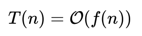
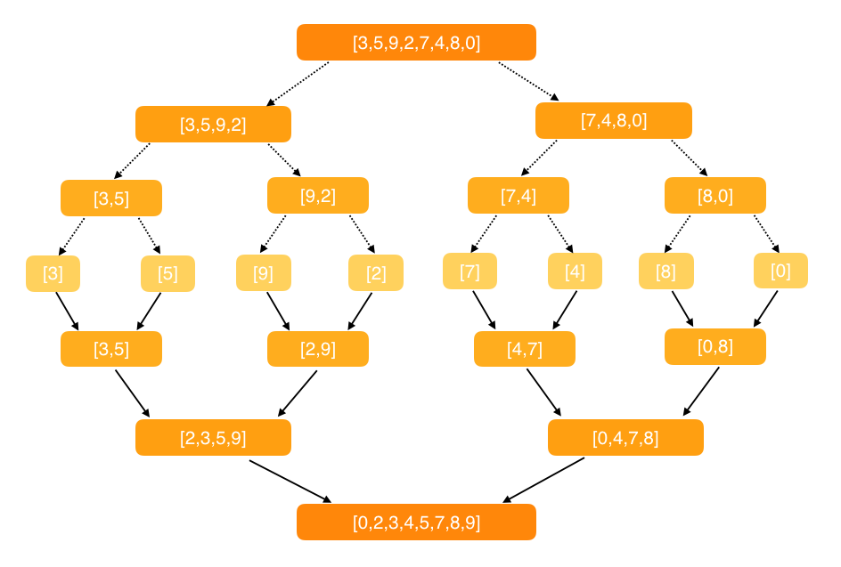
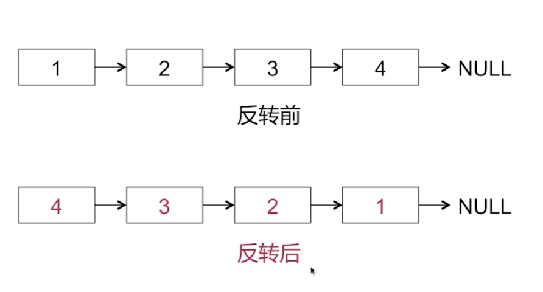
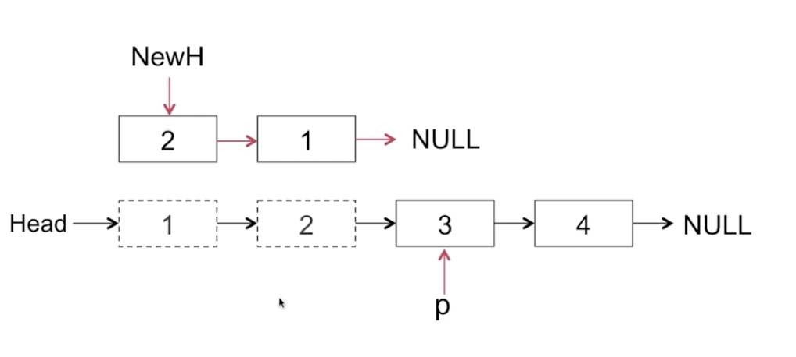
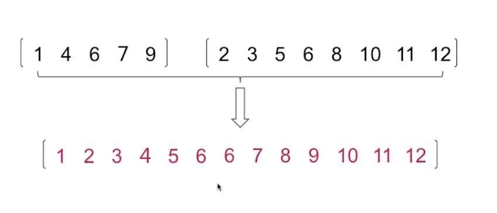
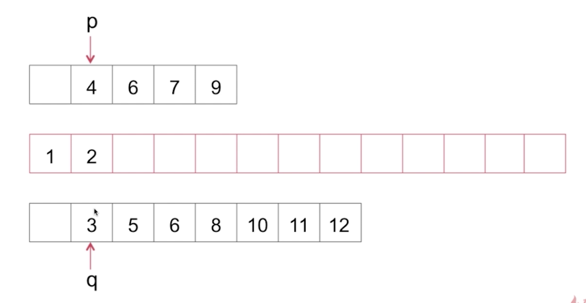
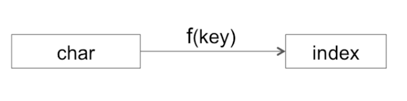
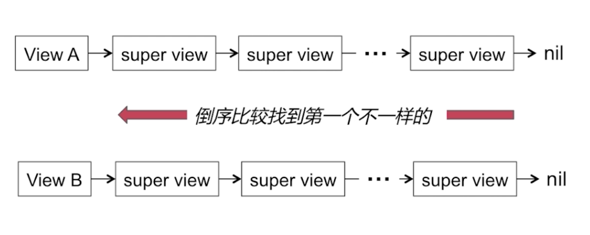
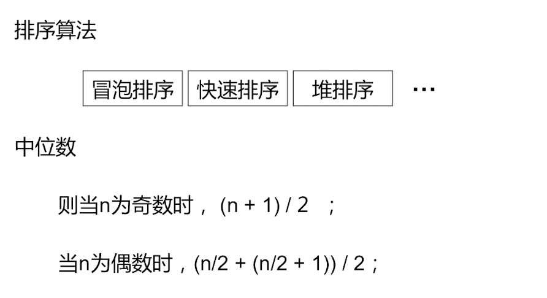
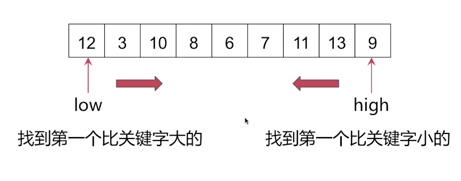

# iOS Algorithm

# 前言
此篇文章是对数据结构和常见算法的整理，根据日常知识的积累会不断的更新与完善。  
有理解不对的地方还请指正，互相学习。  
**重点理解排序算法和优化时间复杂度的问题还有实战题，面试会经常提问**

# 目录

<span id="jump-1">[<h2>一. 算法基础</h2>](#1)</span>

<span id="jump-2">[<h2>二. 简单算法</h2>](#2)</span>
[1. 计算从1到100数字的总和](#2-1)  
[2. 给出一个整型数组和一个目标值，判断数组中是否有两个数之和等于目标值](#2-2)  
[3. 给出一个整型数组和目标值，且数组中有且仅有两个数之和等于目标值，求这两个数在数组中的index](#2-3)  
[4. 实现阶乘n!的算法 n！= n * (n-1) * ... * 1](#2-4)  
[5. 不用中间变量，交换A和B的值](#2-5)  
[6. 最大公约数](#2-6)  
[7. 最小公倍数](#2-7)  
[8. 判断质数](#2-8)  

<span id="jump-3">[<h2>三. 排序算法</h2>](#3)</span>
[1. 冒泡排序](#3-1)  
[2. 选择排序](#3-2)  
[3. 插入排序](#3-3)  
[4. 归并排序](#3-4)  
[5. 快速排序](#3-5)  
[6. 堆排序](#3-6)  
[7. 桶排序](#3-7)  


<span id="jump-4">[<h2>四. 实战</h2>](#4)</span>
[1. 反转字符串](#4-1)  
[2. 反转单链表[※※※※※]](#4-2)  
[3. 有序数组的合并](#4-3)  
[4. 在一个字符串中找到第一个只出现一次的字符(hash算法)](#4-4)  
[5. 查找两个子视图的共同父视图[※※※※※]](#4-5)   
[6. 求无序数组当中的中位数](#4-6)   

# 正文
<h2 id="1">一. 算法基础</h2>

### 时间复杂度
算法的时间复杂度是指算法需要消耗的时间资源。  
一般来说，计算机算法是问题规模!n的函数f(n)，算法的时间复杂度也因此记做：  
<!--  -->


常见的时间复杂度有：
- 常数阶O(1)
- 对数阶O(log n）
- 线性阶 O(n)
- 线性对数阶O(nlog n)
- 平方阶O(n^{2})
- 立方阶O(n^{3})
- !k次方阶O(n^{k})
- 指数阶 O(2^{n})}

随着问题规模n的不断增大，上述时间复杂度不断增大，算法的执行效率越低。

### 空间复杂度

算法的空间复杂度是指算法需要消耗的空间资源。其计算和表示方法与时间复杂度类似，一般都用复杂度的渐近性来表示。同时间复杂度相比，空间复杂度的分析要简单得多。而且控件复杂度不属于本文讨论的重点，因此在这里不展开介绍了。

[回到目录](#jump-1)

<h2 id="2">二. 简单算法</h2>

<h3 id="2-1">1. 计算从1到100数字的总和</h3>

法1. 1到100循环遍历逐步相加  
时间复杂度：O(n)
```
static func sum1(_ n: Int) -> Int {
    var sum = 0
    for i in 1...n {
        sum += i
    }
    return sum
}
```
法2. 等差数列求和  
时间复杂度：O(1)
```  
static func sum2(_ n: Int) -> Int {
    return (n + 1) * n / 2
}
```
[回到目录](#jump-2)

<h3 id="2-2">2. 给出一个整型数组和一个目标值，判断数组中是否有两个数之和等于目标值</h3>

时间复杂度：O(n)
```
static func twoSumEqualTarget(nums: [Int], _ target: Int) -> Bool {
    // 初始化集合
    var set = Set<Int>()
    // 遍历整型数组
    for num in nums {
        // 判断集合中是否包含[目标值-当前值]的结果
        if set.contains(target - num) {
            // 包含 返回true
            return true
        }
        // 不包含 将当前值存进集合 用作下次判断
        set.insert(num)
    }
    // 都不包含 返回false
    return false
}
```
[回到目录](#jump-2)

<h3 id="2-3">3. 给出一个整型数组和目标值，且数组中有且仅有两个数之和等于目标值，求这两个数在数组中的index</h3>

巧妙的用到了字典的特性，用key表示数组的值，通过判断字典中是否含有目标值的key来取出索引。  
时间复杂度：O(n)
```
static func twoSumEqualTarget(nums: [Int], _ target: Int) -> [Int] {
    // 初始化字典
    var dict = [Int: Int]()
    // 通过索引i和对应的num进行判断
    for (i, num) in nums.enumerated() {
        // 从dict字典中取出之前保存的索引，判断是否存在索引
        if let lastIndex = dict[target - num] {
            // 返回之前存的索引和当前索引
            return [lastIndex, i]
        } else {
            // 保存当前索引，用于后续判断
            dict[num] = i
        }
    }
    // 致命错误来终止程序
    fatalError("No valid output!")
}
```
[回到目录](#jump-2)

<h3 id="2-4">4. 实现阶乘n!的算法 3！= 3 * 2 * 1 = 6</h3>

使用递归
```
static func factorial(_ n: Int) -> Int {
    return n < 2 ? 1: n * factorial(n-1)
}
```
[回到目录](#jump-2)

<h3 id="2-5">5. 不用中间变量，交换A和B的值</h3>

#### Swift可以利用元组特性直接交换  
```
func swap(a: inout Int, b: inout Int) -> (Int, Int) {
    (a, b) = (b, a)
    return (a, b) 
}
```
```
var x = 1, y = 2
swap(a: &x, b: &y)
x　// 2
y　// 1
```

#### ~~方法1. 中间变量~~
```
func swap1(a: inout Int, b: inout Int) -> (Int, Int) {
    let temp = a
    a = b
    b = temp
    return (a, b)
}
```

#### 方法2. 加法
```
func swap2(a: inout Int, b: inout Int) -> (Int, Int) {
    a = a + b
    b = a - b
    a = a - b
    return (a, b)
}
```

#### 方法3. 异或（相同为0，不同为1。可以理解为不进位加法）
```
func swap3(a: inout Int, b: inout Int) -> (Int, Int) {
    a = a ^ b
    b = a ^ b
    a = a ^ b
    return (a, b)
}
```

[回到目录](#jump-2)


<h3 id="2-6">6. 最大公约数</h3>

比如：20和4的最大公约数为4；18和27的最大公约数为9  

#### 方法1. 直接遍历法
```
func maxCommonDivisor1(a: Int, b: Int) -> Int {
    var max = 0
    for i in 1...b {
        if (a % i == 0 && b % i == 0) {
            max = i
        }
    }
    return max
}
```

#### 方法2. 辗转相除法：其中规定a为大数，b为小数
```
func maxCommonDivisor2(a: inout Int, b: inout Int) -> Int {
    var r: Int
    while (a % b > 0) {
        r = a % b
        a = b
        b = r
    }
    return b
}
```

[回到目录](#jump-2)


<h3 id="2-7">7. 最小公倍数</h3>

公式：最小公倍数 = (a * b)/最大公约数  

#### 方法1. 直接遍历法
```
func minimumCommonMultiple1(a: Int, b: Int) -> Int {
    var max = 0
    for i in 1...b {
        if (a % i == 0 && b % i == 0) {
            max = i
        }
    }
    return (a * b) / max
}
```

#### 方法2. 辗转相除法：其中a为大数，b为小数
```
func minimumCommonMultiple2(a: inout Int, b: inout Int) -> Int {
    var r: Int
    let aa = a, bb = b
    while (a % b > 0) {
        r = a % b
        a = b
        b = r
    }
    return (aa * bb) / b
}
```
[回到目录](#jump-2)

<h3 id="2-8">8. 判断质数</h3>

比如：2、3、5、7、11、13、19等只能被1和自身整除的数叫质数  
直接判断：一个个除，看余数是否为零，如果不为零，则是质数。
```
func isPrime(n: Int) -> Int {
    for i in 2...Int(sqrt(Double(n))) { // sqrt(n) 返回n的平方根 比如sqrt(100.0) = 10
        if (n % i == 0) {
            return 0
        }
    }
    return 1
}
```
[回到目录](#jump-2)

<h2 id="3">三. 排序算法</h2>
关于排序的介绍，常见的主要有7种：  
冒泡排序、选择排序、插入排序、归并排序、快速排序、堆排序、桶排序   
关于这7种排序算法的时间复杂度依次为：  
冒泡排序 = 选择排序 = 插入排序  >  归并排序 = 快速排序 = 堆排序 > 桶排序
>时间复杂度：在计算机科学中，算法的时间复杂度是一个函数，它定性描述了该算法的运行时间，通常用大O符号表示。

以下排序算法基于Swift语言的实现。

<h3 id="3-1">1. 冒泡排序</h3>

相邻元素两两比较，比较完一趟，最值出现在末尾。  
第1趟：依次比较相邻的两个数，不断交换(举例：小数放前，大数放后)逐个推进，最大值最后出现在第n个元素位置。  
第2趟：依次比较相邻的两个数，不断交换(举例：小数放前，大数放后)逐个推进，最大值最后出现在第n-1个元素位置。  
...  
第n-1趟：依次比较相邻的两个数，不断交换(举例：小数放前，大数放后)逐个推进，最大值最后出现在第2个元素位置。

时间复杂度-平均：O(n^2)  
时间复杂度-最优：O(n)  
时间复杂度-最差：O(n^2)  
稳定性：稳定  

#### 1.1 冒泡排序的基础写法
```
static func bubbleSort(_ array: inout [Int]) -> [Int] {
    guard array.count > 1 else {
        return array
    }
    for i in 0..<array.count - 1 {
        for j in 0..<array.count - 1 - i {
            if array[j] > array[j+1] {
                // let temp = array[j]
                // array[j] = array[j+1]
                // array[j+1] = temp
                // 或者
                array.swapAt(j, j+1)
            }
        }
    }
    return array
}
```
#### 1.2 冒泡排序的优化
设置一个布尔值的变量来标记“该数组是否有序”：
```
static func bubbleSortAdvanced(_ array: inout [Int]) -> [Int] {
    guard array.count > 1 else {
        return array
    }
    for i in 0..<array.count - 1 {
        var swapped = false
        for j in 0..<array.count - 1 - i {
            if array[j] > array[j+1] {
                array.swapAt(j, j+1)
                swapped = true
            }
        }
        // if there is no swapping in inner loop, it means the the part looped is already sorted,
        // so it's time to break
        if swapped == false {
            break
        }
    }
    return array
}
```
#### 1.3 冒泡排序的超级优化
对已经排好序的元素进行边界限定，来减少判断：
```
static func bubbleSortAdvancedSuper(_ array: inout [Int]) -> [Int] {
    guard array.count > 1 else {
        return array
    }
    var arrayBorder = array.count - 1
    for _ in 0..<array.count - 1 {
        var swapped = false
        for j in 0..<arrayBorder {
            if array[j] > array[j+1] {
                array.swapAt(j, j+1)
                swapped = true
                // 记录最后一次交换的位置
                arrayBorder = j
            }
        }
        if swapped == false {
            break
        }
    }
    return array
}
```
#### 1.4 冒泡排序的究极优化

鸡尾酒排序(定向冒泡排序)：是冒泡排序的一种变形，以双向在序列中进行排序。  
思想：  
将之前完整的一轮循环拆分为从左->右和从右->左两个子循环，这就保证了排序的双向进行，效率较单向循环来说更高。  
与此同时在这两个循环中加入了之前两个版本的特性isSorted和有序边界，使得排序更加高效。
```
static func bubbleSortAdvancedFinal(_ array: inout [Int]) -> [Int] {
    guard array.count > 1 else {
        return array
    }
    // 数组左边界
    var arrayLeftBorder = 0
    // 数组右边界
    var arrayRightBorder = array.count - 1
    for _ in 0..<array.count/2 {
        // 第一轮循环 左->右
        var swapped = false
        for j in arrayLeftBorder..<arrayRightBorder {
            if array[j] > array[j+1] {
                array.swapAt(j, j+1)
                swapped = true
                arrayRightBorder = j
            }
        }
        if swapped == false {
            break
        }
            
        // 第二轮循环 右->左
        swapped = false
        for j in (arrayLeftBorder+1...arrayRightBorder).reversed() {
            if array[j] < array[j-1] {
                array.swapAt(j, j-1)
                swapped = true
                arrayLeftBorder = j
            }
        }
        if swapped == false {
            break
        }
    }
    return array
}
```
[回到目录](#jump-3)

<h3 id="3-2">2. 选择排序</h3>

选择排序  
第1趟：在n个数中找到最小(大)数与第一个数交换位置。  
第2趟：在剩下n-1个数中找到最小(大)数与第二个数交换位置。  
...  
第n-1趟：最终可实现数据的升序(降序)排列。  

时间复杂度-平均：O(n^2)  
时间复杂度-最优：O(n^2)  
时间复杂度-最差：O(n^2)  
稳定性：不稳定  

```
static func selectSort(_ array: inout [Int]) -> [Int] {
    guard array.count > 1 else {
        return array
    }
    for i in 0..<array.count - 1 {
        var min = i
        for j in i + 1..<array.count {
            if array[j] < array[min] {
                min = j
            }
        }
        // if min has changed, it means there is value smaller than array[min]
        // if min has not changed, it means there is no value smallter than array[min]
        if i != min {
            array.swapAt(i, min)
        }
    }
    return array
}
```
[回到目录](#jump-3)

<h3 id="3-3">3. 插入排序</h3>

选择排序  
从数组中拿出一个元素（通常就是第一个元素）以后，再从数组中按顺序拿出其他元素。  
如果拿出来的这个元素比这个元素小，就放在这个元素左侧；反之，则放在右侧。  

时间复杂度-平均：O(n^2)  
时间复杂度-最优：O(n)  
时间复杂度-最差：O(n^2)  
稳定性：稳定  

```
static func insertSort(_ array: inout [Int]) -> [Int] {
    guard array.count > 1 else {
        return array
    }
    for i in 1..<array.count {
        var j = i
        while j > 0 && array[j] < array[j-1] {
            array.swapAt(j-1, j)
            j -= 1
        }
    }
    return array
}
```
[回到目录](#jump-3)

<h3 id="3-4">4. 归并排序</h3>

<!--  -->


归并操作(采用分治思想)是建立在归并操作的排序算法，是将需要排序的序列进行拆分，拆分成每一个单一元素。  
这时再按每个元素进行比较排序，两两合并，生成新的有序序列。再对新的有序序列进行两两合并操作，直到整个序列有序。  
     
归并操作的实现步骤是：  
新建空数组，初始化两个传入数组的index为0  
两两比较两个数组index上的值，较小的放在新建数组里面并且index+1。  
最后检查是否有剩余元素，如果有则添加到新建数组里面。  

时间复杂度-平均：O(nlogn)  
时间复杂度-最优：O(nlogn)  
时间复杂度-最差：O(nlogn)  
稳定性：稳定

```
static func mergeSort(_ array: [Int]) -> [Int] {
    guard array.count > 1 else {
        return array
    }
    let middleIndex = array.count/2
    // recursively split left part of original array
    let leftArray = mergeSort(Array(array[0..<middleIndex]))
    // recursively split right part of original array
    let rightArray = mergeSort(Array(array[middleIndex..<array.count]))
    // merge left part and right part
    return _merge(leftPile: leftArray, rightPile: rightArray)
}

static func _merge(leftPile: [Int], rightPile: [Int]) -> [Int] {
    // left pile index, start from 0
    var leftIndex = 0
    // right pile index, start from 0
    var rightIndex = 0
    // sorted pile, empty in the first place
    var sortedPile = [Int]()
        
    while leftIndex < leftPile.count && rightIndex < rightPile.count {
        // append the smaller value into sortedPile
        if leftPile[leftIndex] < rightPile[rightIndex] {
            sortedPile.append(leftPile[leftIndex])
            leftIndex += 1
        } else if leftPile[leftIndex] > rightPile[rightIndex] {
            sortedPile.append(rightPile[rightIndex])
            rightIndex += 1
        } else {
            // same value, append both of them and move the corresponding index
            sortedPile.append(leftPile[leftIndex])
            leftIndex += 1
            sortedPile.append(rightPile[rightIndex])
            rightIndex += 1
        }
    }
    // left pile is not empty
    while leftIndex < leftPile.count {
        sortedPile.append(leftPile[leftIndex])
        leftIndex += 1
    }
    // right pile is not empty
    while rightIndex < rightPile.count {
        sortedPile.append(rightPile[rightIndex])
        rightIndex += 1
    }
    return sortedPile
}
```
[回到目录](#jump-3)

<h3 id="3-5">5. 快速排序</h3>

快速排序是一种高效的排序方法，它利用了归并排序的思想，
将需要排列的数组拆分成每一小部分，然后让每一小部分进行排序、合并，最后得到完整的排序序列。

时间复杂度-平均：O(nlogn)  
时间复杂度-最优：O(nlogn)  
时间复杂度-最差：O(n^2)  
稳定性：不稳定

```
static func quickSort(_ array: [Int]) -> [Int] {
    guard array.count > 1 else {
        return array
    }
    // 取出数组中间下标元素
    let pivot = array[array.count/2]
    // 用到了函数式方法filter，过滤元素
    let left = array.filter{ $0 < pivot }
    let middle = array.filter{ $0 == pivot }
    let right = array.filter{ $0 > pivot }
    // 递归 对新数组进行合并
    return quickSort(left) + middle + quickSort(right)
}
```
[回到目录](#jump-3)

<h3 id="3-6">6. 堆排序</h3>

堆排序：  
利用堆这种数据结构而设计的一种排序算法，是选择排序的一种。  
通过调整堆结构，将堆的顶部元素（即数组第0位元素）与末尾的元素进行交换，调整后将末尾元素固定，  
然后继续调整新的堆结构，每次调整固定一个元素，遍历结束后从而达到排序的效果。  

时间复杂度-平均：O(nlogn)  
时间复杂度-最优：O(nlogn)  
时间复杂度-最差：O(nlogn)  
稳定性：不稳定

```
static func heapSort(_ array: inout [Int]) -> [Int] {
    // 构建大顶堆 从最后一个非叶子结点倒序遍历
    for i in (0...(array.count/2-1)).reversed() {
        // 从第一个非叶子结点从下至上，从右至左调整结构
        adjustHeap(&array, i: i, length: array.count)
    }
    // 上面已将输入数组调整成堆结构
    for j in (1...(array.count - 1)).reversed() {
        // 堆顶元素与末尾元素进行交换
        array.swapAt(0, j)
        adjustHeap(&array, i:0, length:j)
    }
    return array
}

static func adjustHeap(_ array: inout [Int], i: Int, length: Int) {
    var j = i
    // 取出当前元素i
    let tmp = array[j]
    var k = 2*i+1
    while k < length {
        // 左子节点小于右子节点
        if(k+1 < length && array[k] < array[k+1]) {
            //取到右子节点下标
            k+=1
        }
        if(array[k] > tmp){
            // 如果子节点大于父节点，将子节点值赋给父节点（不用进行交换）
            array[j] = array[k]
            j = k
        } else {
            break
        }
        k = k*2 + 1
    }
    // 将tmp值放到最终的位置
    array[j] = tmp
}
```
[回到目录](#jump-3)

<h3 id="3-7">7. 桶排序</h3>

桶排序：  
将数组分到n个相同的大小的子区间，每个子区间就是一个桶，然后将输入数组中的元素一一对应，放入对应子区间内的桶中。  
最后遍历每个桶，依次输入每个桶中对应装的数据即可。  
因为桶的顺序是有序的，所以只要从第一个桶开始遍历，得到的结果也就是有序的数组。  

```
static func bucketSort(_ array: inout [Int]) -> [Int] {
    guard array.count > 1 else {
        return array
    }
    // 求出桶的数量
    let max = array.max()
    let min = array.min()
    let bucketCount = max! - min!
    // 创建桶数组，桶个数=最大值-最小值+1，默认初值都为0。
    var bucket = Array(repeating: 0, count: bucketCount + 1)
    // 遍历入参数组元素，并给桶做上标记
    for num in array {
        // 数组元素减去最小值，指向桶数组下标
        let index = num - min!
        // 将元素出现次数打上标记，每次+1
        bucket[index] += 1
    }
    // 记录新数组下标
    var arrayIndex = 0
    // 对桶内元素进行遍历
    for i in 0..<bucket.count {
        // 取出每个桶的标记值
        var j = bucket[i]
        // 当桶内有值，根据标记的次数依次减1，添加到数组中
        while j > 0 {
            array[arrayIndex] = i + min!
            j-=1
            arrayIndex+=1
        }
    }
    return array
}
```
[回到目录](#jump-3)


### 代码完整实例请参照：[Algorithm工程](https://github.com/mickychiang/iOSInterviewMemo/blob/master/Algorithm)


<h2 id="4">四. 实战</h2>

<h3 id="4-1">1. 反转字符串</h3>

反转字符串，要求将其按照字符顺序进行反转。举例："Hello World" -> "dlroW olleH"  
```
func reverseString(s: String) -> String {
        
    // 将待反转字符串分割成字符数组
    var chars = Array(s)
    // 初始化指向第一个字符的索引值
    var start = 0
    // 初始化指向最后一个字符的索引值
    var end = chars.count - 1
        
    // 判断反转字符串的位置
    while start < end {
        // start、end位置的字符互换
        (chars[start], chars[end]) = (chars[end], chars[start])
        // 前、后索引值 往中间位置靠拢
        start += 1
        end -= 1
    }
        
    return String(chars)
}
```

[回到目录](#jump-4)

<h3 id="4-2">2. 反转单链表[※※※※※]</h3>

<!-- 
   -->
  
  

ReverseList.h
```
// 定义一个链表
struct Node {
    int data; // 结点数据
    struct Node *next; // 链表的下一个节点
};

@interface ReverseList : NSObject

// 反转列表
struct Node* reverseList(struct Node *head);

// 构造一个链表
struct Node* constructList(void);

// 打印链表中的数据
void printList(struct Node *head);

@end
```

ReverseList.m
```
// 反转链表
// 参数为 - 原链表的头结点
// 返回值为 - 新链表的头结点
struct Node* reverseList(struct Node *head) {
    // 定义遍历指针，初始化为原链表的头结点
    struct Node *p = head;
    // 定义反转后的新链表头部
    struct Node *newH = NULL;
    
    // 遍历链表
    while (p != NULL) {
        // 记录下一个结点
        struct Node *temp = p->next;
        // 当前结点的next指向新链表的头部
        p->next = newH;
        // 更改新链表的头部为当前结点
        newH = p;
        // 移动p指针
        p = temp;
    }
    
    // 返回反转后的链表头结点
    return newH;
}

// 构造一个链表
struct Node* constructList(void) {
    // 定义头结点
    struct Node *head = NULL;
    // 定义当前结点
    struct Node *cur = NULL;
    
    for (int i = 0; i < 5; i++) {
        // 创建结点
        struct Node *node = malloc(sizeof(struct Node));
        node->data = i;
        node->next = NULL;
        
        if (head == NULL) {
            // 头结点为空，新结点即为头结点
            head = node;
        } else {
            // 当前结点的next为新结点
            cur->next = node;
        }
        
        // 设置当前结点为新结点
        cur = node;
    }
    
    return head;
}

// 打印链表中的数据
void printList(struct Node *head) {
    struct Node *temp = head;
    while (temp != NULL) {
        printf("node is %d \n", temp->data);
        temp = temp->next;
    }
}
```

具体调用并实现
```
printf("-----单链表反转-----\n");
struct Node *head = constructList();
printList(head);
printf("----------\n");
struct Node *newHead = reverseList(head);
printList(newHead);
```

输出
```
-----单链表反转-----
node is 0 
node is 1 
node is 2 
node is 3 
node is 4 
----------
node is 4 
node is 3 
node is 2 
node is 1 
node is 0 
```

[回到目录](#jump-4)


<h3 id="4-3">3. 有序数组的合并</h3>

<!-- 
   -->
  
  

```
// MARK: - 有序数组的合并
// 将有序数组a和b的值合并到一个数组result当中，且仍然保持有序。
func mergeOrderedList(arrayA: [Int], arrayB: [Int]) -> [Int] {
        
    var result: [Int] = []
    // 遍历数组a的指针、遍历数组b的指针、记录当前存储位置
    var p = 0, q = 0, i = 0
        
    // 任一数组没有到达边界 则进行遍历
    while p < arrayA.count && q < arrayB.count {
        // 如果数组a对应位置的值小于数组b对应位置的值
        if arrayA[p] <= arrayB[q] {
            // 存储数组a的值
            result.insert(arrayA[p], at: i)
            // 移动数组a的遍历指针
            p += 1
        } else {
            // 存储数组b的值
            result.insert(arrayB[q], at: i)
            // 移动数组b的遍历指针
            q += 1
        }
        // 指向合并结果的下一个存储位置
        i += 1
    }
        
    // 如果数组a有剩余
    while p < arrayA.count {
        // 将数组a剩余的部分拼接到合并结果的后面
        result.insert(arrayA[p], at: i)
        p += 1
        i += 1
    }        
    // 如果数组b有剩余
    while q < arrayB.count {
        // 将数组b剩余的部分拼接到合并结果的后面
        result.insert(arrayB[q], at: i)
        q += 1
        i += 1
    }
        
    return result
}
```

具体调用并实现

```
print("有序数组的合并")
print(mergeOrderedList(arrayA: [1,4,6,7,9], arrayB: [2,3,5,6,8,10,11,12]))
```

输出
```
有序数组的合并
[1, 2, 3, 4, 5, 6, 6, 7, 8, 9, 10, 11, 12]
```

[回到目录](#jump-4)


<h3 id="4-4">4. 在一个字符串中找到第一个只出现一次的字符(hash算法)</h3>

在一个字符串中找到第一个只出现一次的字符。  
比如：输入 abaccdeff 则输出 b

思路：
- 字符char是一个长度为8的数据类型，2的8次方=256，因此总共有256种可能。
- 每个字母根据其ASCII码值作为数组的下标对应数组的一个数字。
- 数组中存储的是每个字符出现的次数。

例如：给定值是a，对应的ASCII码值是97，数组索引下标为97。  
<!--      -->
  
f(key) = key
**存储和查找都通过该函数，有效提高查找效率。**

```
char findFirstChar(char* cha) {
    char result = '\0';
    
    // 定义一个数组，用来存储各个字母出现的次数
    // 字符char是一个长度为8的数据类型，2的8次方=256，因此总共有256种可能。
    int array[256];
    // 对数组进行初始化操作
    for (int i = 0; i < 256; i++) {
        array[i] = 0;
    }
    // 定义一个指针，指向当前字符串头部
    char* p = cha;
    // 遍历每个字符
    while (*p != '\0') {
        // 在字母对应的存储位置 进行出现次数+1操作
        array[*(p++)]++;
    }
    
    // 将p指针重新指向字符串头部
    p = cha;
    // 遍历每个字母的出现次数
    while (*p != '\0') {
        // 遇到第一个出现次数为1的字符，打印结果
        if (array[*p] == 1) {
            result = *p;
            break;
        }
        // 反之继续向后遍历
        p++;
    }
    
    return result;
}
```

具体调用并实现  
```
// 查找第一个只出现一次的字符
char cha[] = "a11baccdeff";
char fc = findFirstChar(cha);
printf("this char is %c \n", fc);
```

输出  
```
this char is b 
```

[回到目录](#jump-4)


<h3 id="4-5">5. 查找两个子视图的共同父视图[※※※※※]</h3>

<!--  -->
  

```
/// 查找两个视图的共同父视图
- (NSArray<UIView *> *)findCommonSuperView:(UIView *)viewOne other:(UIView *)viewOther {
    
    NSMutableArray *result = [NSMutableArray array];
    
    // 查找第一个视图的所有父视图
    NSArray *arrayOne = [self findSuperViews:viewOne];
    // 查找第二个视图的所有父视图
    NSArray *arrayOther = [self findSuperViews:viewOther];
    
    int i = 0;
    // 越界限制条件
    while (i < MIN((int)arrayOne.count, (int)arrayOther.count)) {
        // 倒序方式获取各个视图的父视图
        UIView *superOne = [arrayOne objectAtIndex:arrayOne.count - i -1];
        UIView *superOther = [arrayOther objectAtIndex:arrayOther.count - i - 1];
        
        if (superOne == superOther) {
            // 如果相等 则为共同父视图
            [result addObject:superOne];
            i++;
        } else {
            // 如果不相等 则结束遍历
            break;
        }
    }
    
    return result;
}

/// 返回当前视图的所有父视图
- (NSArray<UIView *> *)findSuperViews:(UIView *)view {
    // 初始化当前视图的第一父视图
    UIView *tempSuperView = view.superview;
    // 保存所有父视图的数组
    NSMutableArray *result = [NSMutableArray array];
    while (tempSuperView) {
        [result addObject:tempSuperView];
        // 顺着superview指针一直向上查找
        tempSuperView = tempSuperView.superview;
    }
    return result;
}
```

[回到目录](#jump-4)


<h3 id="4-6">6. 求无序数组当中的中位数</h3>

思路：
- 排序算法 + 中位数
- 分治思想(快排思想)

#### 排序算法 + 中位数

<!--    -->
  

#### 分治思想(快排思想)
选取关键字，高低交替扫描

- 任意挑一个元素，以该元素为支点，划分集合为两部分。  
- 如果左侧集合长度恰为(n-1)/2，那么支点恰为中位数。  
- 如果左侧长度<(n-1)/2，那么中位数在右侧；反之，中位数在左侧。  
- 进入相应的一侧继续寻找中位点。 

<!--  -->
  

```
// 无序数组的中位数查找
int findMedian(int a[], int aLen) {
    int low = 0;
    int high = aLen - 1;
    
    int mid = (aLen - 1) / 2;
    int div = PartSort(a, low, high);
    
    while (div != mid) {
        if (mid < div) {
            // 左区间查找
            div = PartSort(a, low, div - 1);
        } else {
            // 右区间查找
            div = PartSort(a, div + 1, high);
        }
    }
    
    return a[mid];
}

int PartSort(int a[], int start, int end) {
    
    int low = start;
    int high = end;
    
    // 选取关键字
    int key = a[end];
    
    while (low < high) {
        // 左边查找比key大的值
        while (low < high && a[low] <= key) {
            ++low;
        }
        // 右边查找比key小的值
        while (low < high && a[high] >= key) {
            --high;
        }
        
        if (low < high) {
            // 找到之后交换左右的值
            int temp = a[low];
            a[low] = a[high];
            a[high] = temp;
        }
    }
    
    int temp = a[high];
    a[high] = a[end];
    a[end] = temp;
    
    return low;
}
```

具体调用并实现  
```
int list[9] = {12, 3, 10, 8, 6, 7, 11, 13, 9};
int median = findMedian(list, 9);
printf("the median is %d \n", median);
```

输出  
```
the median is 9  
```


[回到目录](#jump-4)  


# 参考文档

[数据结构 & 算法 in Swift （一）：Swift基础和数据结构](https://juejin.im/post/5a7096fa6fb9a01cb64f163b)  
[数据结构 & 算法 in Swift （二）：算法概述和排序算法](https://juejin.im/post/5a7b4101f265da4e7071b097)  
[《iOS面试之道》算法基础学习(上)](https://juejin.im/post/5b9b811c5188255c971fc999)  
[《iOS面试之道》算法基础学习(下)](https://juejin.im/post/5b9b81676fb9a05cf22fe649)  
[iOS数据结构与算法面试题合集](https://juejin.im/post/5dd297616fb9a02023605c46)  
[iOS冒泡算法优化](https://juejin.im/post/5b9b819f6fb9a05d0c37be57)


# 其他
《iOS面试题备忘录》系列文章的github原文地址：  

[iOS面试题备忘录(一) - 属性关键字](https://github.com/mickychiang/iOSInterviewMemo/blob/master/InterviewSummary/PropertyModifier.md)    
[iOS面试题备忘录(二) - 内存管理](https://github.com/mickychiang/iOSInterviewMemo/blob/master/InterviewSummary/memoryManagement.md)   
[iOS面试题备忘录(三) - 分类和扩展](https://github.com/mickychiang/iOSInterviewMemo/blob/master/InterviewSummary/CategoryAndExtension.md)  
[iOS面试题备忘录(四) - 代理和通知](https://github.com/mickychiang/iOSInterviewMemo/blob/master/InterviewSummary/DelegateAndNSNotification.md)  
[iOS面试题备忘录(五) - KVO和KVC](https://github.com/mickychiang/iOSInterviewMemo/blob/master/InterviewSummary/KVOAndKVC.md)  
[iOS面试题备忘录(六) - runtime](https://github.com/mickychiang/iOSInterviewMemo/blob/master/InterviewSummary/runtime.md)  
[算法](https://github.com/mickychiang/iOSInterviewMemo/blob/master/Algorithm/Algorithm.md)   