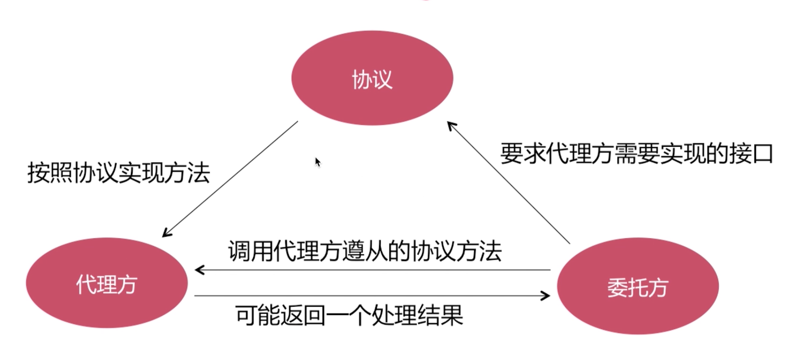
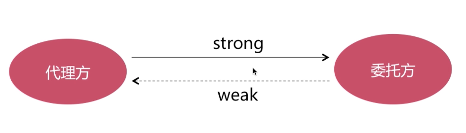
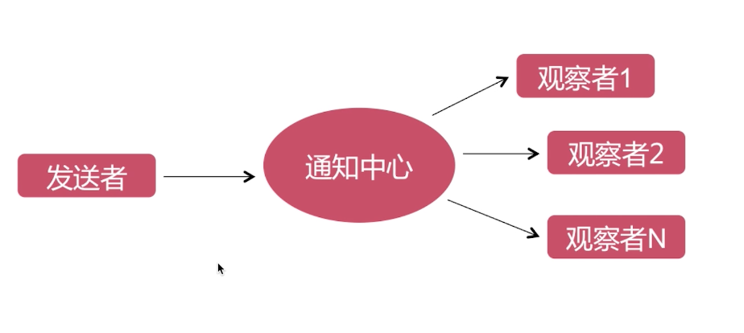
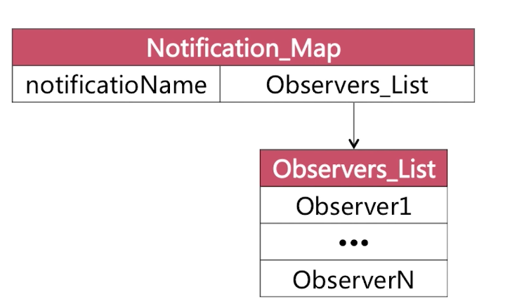

# iOS面试题备忘录(四)代理和通知
所有源码基于[objc-runtime-objc.680版本](https://opensource.apple.com/source/objc4/)  

# 前言
《iOS面试题备忘录(四)代理和通知》是关于iOS代理和通知的知识点及面试题的整理。  
本篇内容会一直持续整理并完善，有理解不正确的地方请路过的大神告知，共勉。  
[github原文地址]()

<h1>目录</h1>

[<h2>一. 代理Delegate</h2>](#1)
[1. 代理的概念和特点](#1-1)  
[2. 代理的工作流程](#1-2)  
[3. 在协议中可以定义的内容](#1-3)  
[4. 在协议中定义的内容都必须要实现吗？](#1-4)  
[5. 代理和通知的区别](#1-5)  
[6. 使用代理时可能会遇到的问题](#1-6)  

[<h2>二. 通知NSNotification</h2>](#2)
[1. 通知的概念和特点](#2-1)  
[2. 通知的作用](#2-2)  
[3. 通知是怎样实现一对多的？](#2-3)  
[4. 代理和通知的区别？](#2-4)  
[5. 如何实现通知机制？](#2-5)  
[6. 延伸：通知是同步的还是异步的？](#2-6)

# 正文

<h2 id="1">一. 代理Delegate</h2>

<h3 id="1-1">1. 代理的概念和特点</h3>

- 代理是一种软件设计模式  
- 在iOS中以@protocol形式体现  
- 传递方式是一对一  

[回到目录](#jump-1)

<h3 id="1-2">2. 代理的工作流程</h3>

<!--  -->

[回到目录](#jump-1)

<h3 id="1-3">3. 在协议中可以定义的内容</h3>

在协议中可以定义**属性**和**方法**。

[回到目录](#jump-1)

<h3 id="1-4">4. 在协议中定义的内容都必须要实现吗？</h3>

- @required：在协议中被@required标识的方法说明代理方必须要实现，否则会出现编译错误。(什么都没写，默认为@required)
- @optional：在协议中被@optional标识的方法说明代理方可以实现也可以不实现。

[回到目录](#jump-1)

<h3 id="1-5">5. 代理和通知的区别</h3>

- 设计模式不同：代理是由**代理模式**实现的，通知是由**观察者模式**实现的。
- 传递方式不同：代理的传递方式是**一对一**，通知的传递方式是**一对多**。

[回到目录](#jump-1)

<h3 id="1-6">6. 使用代理时可能会遇到的问题</h3>

6.1 循环引用  
代理方和委托方以什么样的关系存在？    
一般声明为weak以规避循环引用：在委托方以weak关键字来声明持有情况。
<!--  -->

[回到目录](#jump-1)

<h2 id="2">二. 通知NSNotification</h2>

<h3 id="2-1">1. 通知的概念和特点</h3>

- 通知是使用**观察者模式**来实现的用于**跨层传递消息**的机制。
- 传递方式是**一对多**。

[回到目录](#jump-2)

<h3 id="2-2">2. 通知的作用</h3>

用来进行跨层传递消息。(比如网络层越过数据层，直接将数据传递到UI层)

[回到目录](#jump-2)

<h3 id="2-3">3. 通知是怎样实现一对多的？</h3>

[回到目录](#jump-2)

<h3 id="2-4">4. 代理和通知的区别？</h3>

- 设计模式不同：代理是由**代理模式**实现的，通知是由**观察者模式**实现的。
- 传递方式不同：代理的传递方式是**一对一**，通知的传递方式是**一对多**。

[回到目录](#jump-2)

<h3 id="2-5">5. 如何实现通知机制？</h3>

注意：官方没有提供底层源码，按照自己的理解分析即可。

[回到目录](#jump-2)

<h3 id="2-6">6. 延伸：通知是同步的还是异步的？</h3>

和NSNotificationQueue有关。
在不使用这个类的相关作用情况下，也就是通常情况下是同步的，所谓的同步就是发送通知之后，会阻塞当前线程，直到所有observer处理完成。

[回到目录](#jump-2)

# 参考文档

暂无