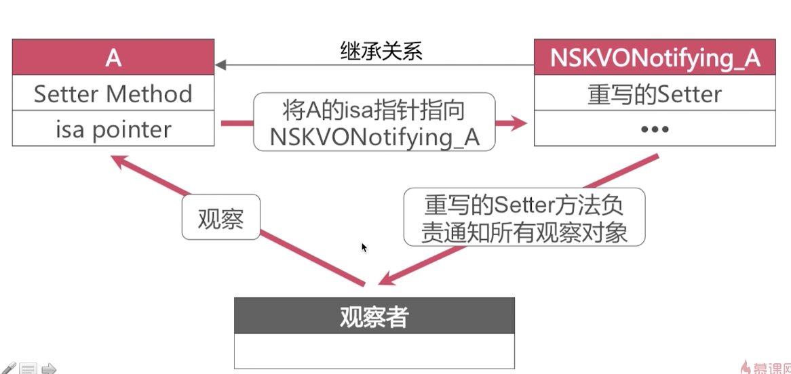
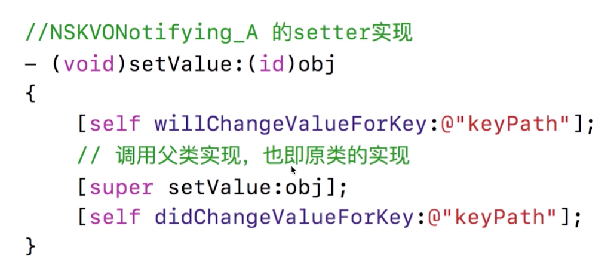
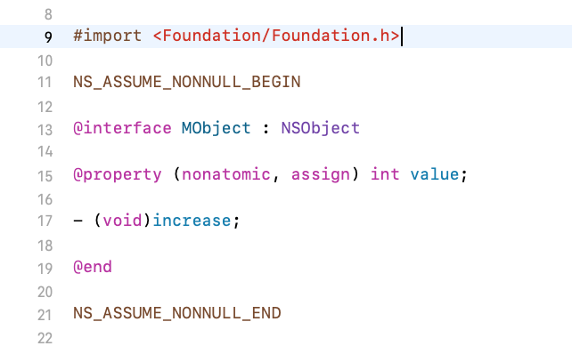
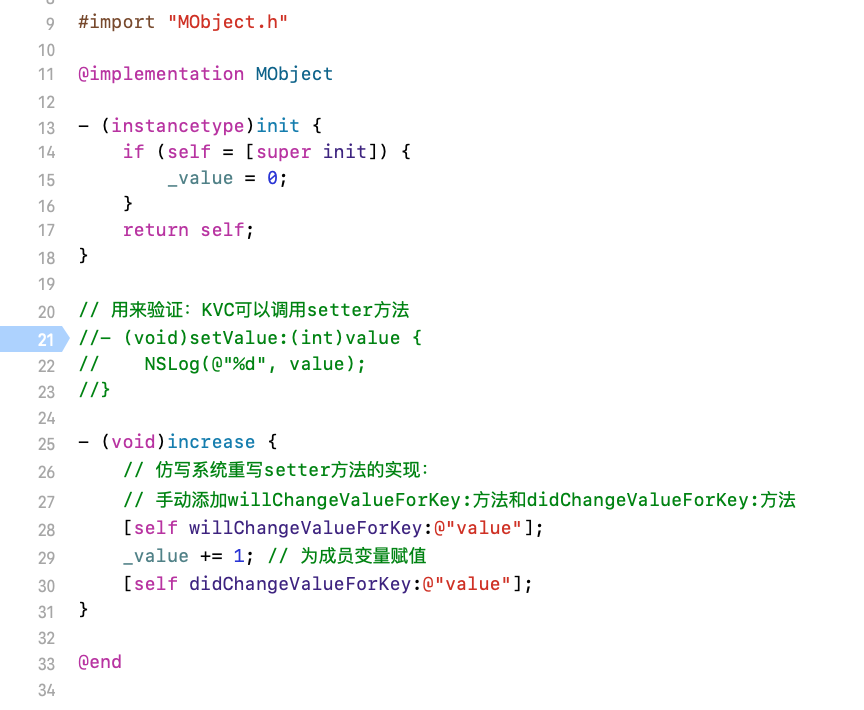
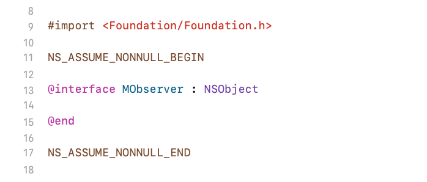
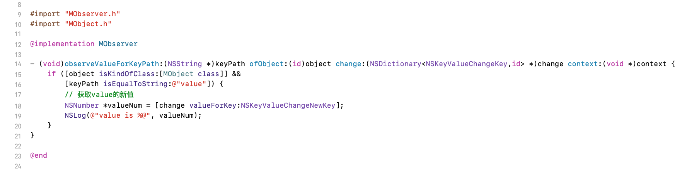
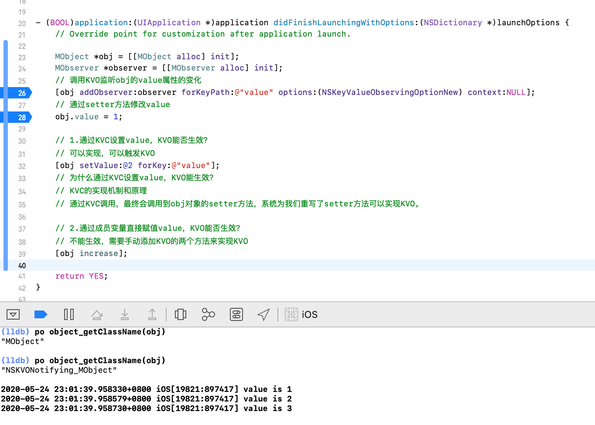
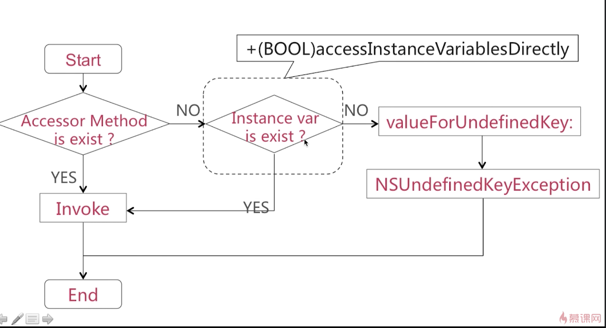
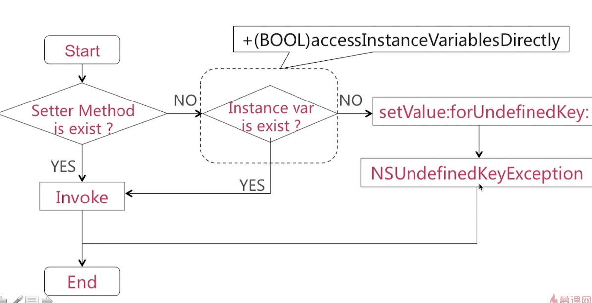

# iOS面试题备忘录(五)KVO和KVC
所有源码基于[objc-runtime-objc.680版本](https://opensource.apple.com/source/objc4/)  


# 前言
《iOS面试题备忘录(五)KVO和KVC》是关于iOS的KVO和KVC的知识点及面试题的整理。  
本篇内容会一直持续整理并完善，有理解不正确的地方请路过的大神告知，共勉。  
[github原文地址](https://github.com/mickychiang/iOSInterviewMemo/blob/master/InterviewSummary/KVOAndKVC.md)


<span id="jump"><h1>目录</h1></span>

[<span id="jump-1"><h2>一. KVO</h2></span>](#1)
[<span id="jump-1-1">1. KVO概念</span>](#1-1)  
[<span id="jump-1-2">2. KVO的实现原理</span>](#1-2)  
[<span id="jump-1-3">3. isa混写技术怎样实现KVO？</span>](#1-3)  
[<span id="jump-1-4">4. 子类重写setter方法的逻辑和具体实现</span>](#1-4)  
[<span id="jump-1-5">5. KVO具体的代码实现</span>](#1-5)  
[<span id="jump-1-6">6. 手动实现KVO</span>](#1-6)  
[<span id="jump-1-7">7. KVO总结</span>](#1-7) 


[<span id="jump-2"><h2>二. KVC</h2></span>](#2)
[<span id="jump-2-1">1. KVC概念</span>](#2-1)  
[<span id="jump-2-2">2. 我们使用KVC键值编码技术是否会破坏面向对象的编程方法？</span>](#2-2)  
[<span id="jump-2-3">3. valueForKey:的实现流程</span>](#2-3)  
[<span id="jump-2-4">4. setValue:forKey:的实现流程</span>](#2-4)  


# 正文
<h2 id="1">一. KVO</h2>

<h3 id="1-1">1. KVO概念</h3>

- KVO是Key-value observing的缩写。
- KVO是Objective-C对**观察者设计模式**的一种实现。
- 系统使用**isa混写技术**(isa-swizzling)来实现KVO。

[回到目录](#jump-1)

<h3 id="1-2">2. KVO的实现原理</h3>

KVO是系统对于观察者模式的一种实现。  
KVO运用isa混写技术在动态运行时为某一个类添加一个子类并重写子类的setter方法，同时把原有类的isa指针指向新创建的子类。

[回到目录](#jump-1)


<h3 id="1-3">3. isa混写技术怎样实现KVO？</h3>

- 当注册类A的一个对象的观察者的时候，调用了addObserver:forKeyPath:options:context:方法，系统会在运行时动态创建一个名叫NSKVONotifying_A的类，同时将A的isa指针指向NSKVONotifying_A。    
- 类NSKVONotifying_A是类A的子类，类NSKVONotifying_A继承类A是为了重写原来类A中的setter方法，重写的setter方法负责通知所有观察对象。

<!--  -->


[回到目录](#jump-1)


<h3 id="1-4">4. 子类重写setter方法的逻辑和具体实现</h3>

子类NSKVONotifying_A中重写的setter方法中添加了两个方法
```
- (void)willChangeValueForKey:(NSString *)key;
- (void)didChangeValueForKey:(NSString *)key;
```
didChangeValueForKey:方法会触发KVO的回调方法observeValueForKeyPath:ofObject:change:context:来通知观察者value发生了变化
<!--  -->


[回到目录](#jump-1)


<h3 id="1-5">5. KVO具体的代码实现</h3>

完整代码实例请查看：[InterviewSummary工程]()
##### 5.1 创建了类MObject和类MObserver
MObject
<!-- 
 -->


MObserver
<!-- 
 -->


##### 5.2 实现KVO
<!--  -->


[回到目录](#jump-1)


<h3 id="1-6">6. 手动实现KVO</h3>

在对成员变量直接赋值的时候，在它之前和之后分别添加willChangeValueForKey:方法和didChangeValueForKey:方法，就可以实现手动KVO。  
didChangeValueForKey:在系统内部实现当中会触发KVO的回调方法observeValueForKeyPath:ofObject:change:context:方法。

[回到目录](#jump-1)


<h3 id="1-7">7. KVO总结</h3>

使用setter方法改变值，KVO才会生效。  
使用setValue:forKey:改变值，KVO才会生效。  
成员变量直接修改需要**手动添加**KVO才会生效。  

[回到目录](#jump-1)


<h2 id="2">二. KVC</h2>

<h3 id="2-1">1. KVC概念</h3>

KVC是Key-value coding的缩写。键值编码技术。
```
- (nullable id)valueForKey:(NSString *)key;
- (void)setValue:(nullable id)value forKey:(NSString *)key;
```
[回到目录](#jump-2)


<h3 id="2-2">2. 我们使用KVC键值编码技术是否会破坏面向对象的编程方法？</h3>

KVC会破坏面向对象编程的封装特性。  
key没有任何限制，如果已知某个类或者实例的内部某个私有成员变量名称的话，我们在外界是可以通过已知的key来访问和设置。即破坏了面向对象的编程思想。  

[回到目录](#jump-2)


<h3 id="2-3">3. valueForKey:的实现流程</h3>

首先查找是否存在与key名称相同的get方法，在查找是否存在与key名称相同的实例变量，最后查询是否存在与key名称相同的属性 

- 访问器方法(Accessor Method)是否存在的判断规则
getKey  
key  
isKey  

- 实例变量(Instance var)是否存在的判断规则
_key  
_isKey  
key  
isKey  

<!--  -->


[回到目录](#jump-2)


<h3 id="2-4">4. setValue:forKey:的实现流程</h3>

<!--  -->


[回到目录](#jump-2)


# 参考文档

暂无