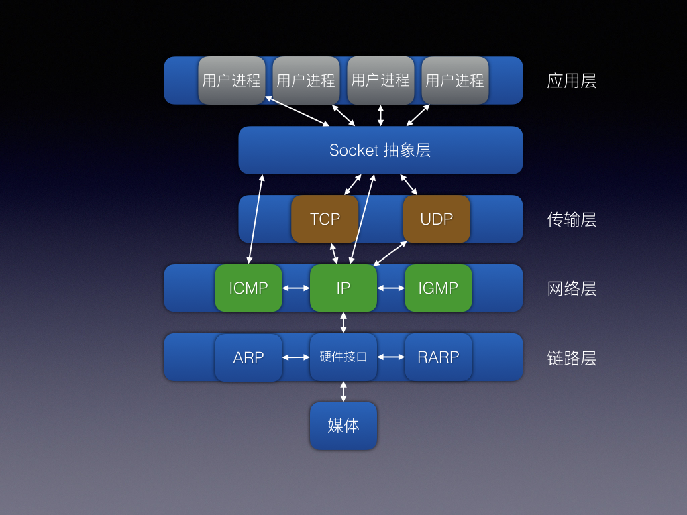

# iOS面试题备忘录(八) - 网络
所有源码基于[objc-runtime-objc.680版本](https://opensource.apple.com/source/objc4/)  

# 前言
《iOS面试题备忘录(八) - 网络》是关于iOS的网路部分的知识点及面试题的整理。  
本篇内容会一直持续整理并完善，有理解不正确的地方请路过的大神告知，共勉。  
[github原文地址](https://github.com/mickychiang/iOSInterviewMemo/blob/master/InterviewSummary/Network.md)

<h1>目录</h1>

<!-- [<h2>一. </h2>](#1)
[1. ](#1-1)  
[2. ](#1-2)  
[3. ](#1-3)  
[4. ](#1-4)  
[5. ](#1-5)  
[6. ](#1-6)  
[7. ](#1-7) 

[<h2>二. </h2>](#2)
[1. ](#2-1)  
[2. ](#2-2)  
[3. ](#2-3)  
[4. ](#2-4)   -->

# 正文

<!-- <h2 id="1">一. KVO</h2> -->

<!-- <h3 id="1-1">1. </h3>

[回到目录](#jump-2) -->

<h3 id="1-1">1. 计算机网络模型</h3>

- OSI七层模型(即网络七层协议)
- TCP/IP模型(即TCP/IP协议)

[回到目录](#jump-1)

<h3 id="1-2">2. OSI七层模型(即网络七层协议)</h3>

OSI：Open System Interconnection  
开放式系统互联：是把网络通信的工作分为7层，分别是物理层、数据链路层、网络层、传输层、会话层、表示层和应用层。  
每一层实现各自的功能和协议，并完成与相邻层的接口通信。

由高到低：
- 应用层：为应用程序提供服务
- 表示层：数据格式转化、数据加密
- 会话层：建立、管理和维护会话
- 传输层：建立、管理和维护端到端的连接
- 网络层：IP选址及路由选择
- 数据链路层：提供介质访问和链路管理
- 物理层：规定了最底层的物理连接，以及物理设备的机械、电气、功能和过程特性

注意：
- 媒体层：底下三层(物理层、数据链路层、网络层)统称为媒体层  
  是网络工程师所研究的对象
- 主机层：上面四层(传输层、会话层、表示层、应用层)被称为主机层  
  是用户所面向和关心的内容

[回到目录](#jump-1)

<h3 id="1-3">3. TCP/IP模型(即TCP/IP协议)</h3>

TCP/IP协议：是互联网相关的各类协议族的总称。  
比如：TCP、UDP、IP、FTP、HTTP、ICMP、SMTP等都属于TCP/IP族内的协议。  
也有说法认为，TCP/IP是指TCP和IP这两种协议。  
还有一种说法认为，TCP/IP是在IP协议的通信过程中，使用到的协议族的统称。

TCP/IP模型有两种：TCP/IP四层模型、TCP/IP五层模型
- TCP/IP四层模型：数据链路层、网络层、传输层、应用层。
- TCP/IP五层模型：物理层、数据链路层、网络层、传输层、应用层。

常见的协议：  
- 应用层：HTTP、HTTPS、FTP、Telnet  
- 传输层：TCP、UDP  
- 网络层：IP  

[回到目录](#jump-1)

<h3 id="1-4">4. 日常生活中所接触到的网络器材有哪些？分别处于哪个模型？</h3>

- 物理层：中继器、集线器、双绞线
- 数据链路层：以太网交换机(Modem)、网卡(网卡有一半是工作在物理层)
- 网络层：路由器、三层交换机
- 传输层：四层交换机、路由器(也有一些特殊的路由器在传输层中工作)

[回到目录](#jump-1)

<h3 id="1-5">5. TCP和UDP的比较</h3>

- 相同点
TCP连接和UDP连接都是传输层协议。

- 不同点
  - TCP：传输控制协议，使用数据流模式，面向连接(三次握手)，提供可靠的数据传输，用于传输大量数据，速度慢，建立连接时开销较大，每一条TCP连接只能是点到点。
  - UDP：用户数据报协议，使用数据报模式，非面向连接(发送数据之前不需要建立连接)，不能保证可靠的数据传输，用于传输少量数据，速度快，支持一对一，一对多，多对一和多对多的交互通信。

[回到目录](#jump-1)

<h3 id="1-6">6. Socket的含义</h3>
 

- Socket(套接字)：  
1.Socket是支持TCP/IP协议的网络通信的基本操作单元。  
Socket包含进行网络通信必须的五种信息：  
连接使用的协议、本地主机的IP地址、本地进程的协议端口、远地主机的IP地址、远地进程的协议端口。  
2.Socket是应用层与传输层中间的软件抽象层，是它的一组接口Socket API。  
3.Socket是基于TCP/IP协议上的抽象，也就是说Socket只是对TCP/IP的封装，本身是没有协议的，只有通过Socket API，我们才能够使用TCP/IP协议。  

- Socket API：    
在实际当中, 肯定是不止一个TCP/IP或者是一个应用程序进程在传输数据，为了可以区分开来，系统提供了一套API，方便TCP/IP与应用程序交互，一般把这个称为Socket API。  
作用：  
应用层可以和传输层通过这个Socket API，区分来自不同的应用程序进程或者是网络通信，使得数据可以并发传输。  

[回到目录](#jump-1)

<h3 id="1-7">7. Socket网络通信的过程</h3>

建立Socket通信至少需要一对套接字，其中一个是运行在我们的客户端上，称为Client Socket(客户端套接字)，还有一个是运行在服务器上，称为Service Socket(服务器端套接字)。

Socket套接字之间的连接过程分为三个步骤:
- 1.服务器监听：服务器端套接字实时监控网络状态，等待客户端的连接请求。
服务器端套接字并不定位具体的客户端套接字，而是处于(被动)等待连接的状态。

- 2.客户端请求：客户端套接字提出连接请求，连接的目标为服务器端套接字。
客户端套接字首先必须描述它要连接的服务器端套接字，指出服务器端套接字的地址和端口号，
然后就向服务器端套接字提出连接请求。

- 3.连接确认：当服务器端套接字监听到或者接收到客户端套接字的连接请求时，
就响应客户端套接字的请求，然后建立一个新线程，把服务器端套接字的描述发送给客户端，
一旦客户端确认了此描述，双方就正式建立连接。
服务器端套接字继续处于监听状态，继续接收其他客户端套接字的连接请求。

注意：  
Socket同时支持TCP和UDP两种传输协议  
当Socket使用TCP协议通信，Socket就是一个TCP连接  
当Socket使用UDP协议通信，Socket就是一个UDP连接  

[回到目录](#jump-1)

<h3 id="1-8">8. TCP相关的状态解释</h3>

- 同步SYN：建立连接时用于同步序号。  
当SYN=1，ACK=0时，这是一个连接请求报文段。  
若同意连接，在响应报文段中使得SYN=1，ACK=1，表示接受报文。  
因此，SYN=1表示这是一个连接请求，或者连接接受报文。  
SYN这个标志位只有在TCP建产连接时才会被置1，握手完成后SYN标志位被置0。  

- 确认ACK：  
当ACK=1时，确认号字段有效。  
当ACK=0时，确认号字段无效。  

- 终止FIN：用来释放一个连接。  
当FIN=1时，此报文段的发送方的数据已经发送完毕，并要求释放运输连接。  

- 序列号seq：用来标记数据段的顺序  
TCP把连接中发送的所有数据字节都编上一个序号，第一个字节的编号由本地随机产生；  
给字节编上序号后，就给每一个报文段指派一个序号；  
序列号seq就是这个报文段中的第一个字节的数据编号。  

- 确认号ack：期待收到对方下一个报文段的第一个数据字节的序号；  
序列号表示报文段携带数据的第一个字节的编号；  
而确认号指的是期望接收到下一个字节的编号；  
因此当前报文段最后一个字节的编号+1即为确认号。  

[回到目录](#jump-1)

<h3 id="1-9">9. 建立TCP连接的三次握手</h3>

建立一个TCP连接，需要通过三次验证，我们称为三次握手：

- 第一次握手：  
客户端向服务器发起一个连接请求报文【SYN=1且客户端随机生成序列号seq=x】，且进入SYN_SEND状态。  

- 第二次握手：  
服务器接收到客户端发送的连接请求报文，确认连接并向客户端发送一个确认报文【SYN=1，ACK=1和确认号ack=x+1，且服务器随机生成序列号seq=y】，进入SYN_RECV状态。  

- 第三次握手：  
客户端接收到服务器发送的确认报文，然后向服务器发送确认报文【ACK=1，确认号ack=y+1】，客户端进入到ESTABLISHED状态；  
服务端收到客户端发送过来的确认报文后，也进入到ESTABLISHED状态，完成三次握手。  

握手过程中传送的报文不包含数据，三次握手之后，客户端和服务器才会正式开始传输数据。  
理想状态下，TCP连接一旦建立，都将被一直保持下去。除非通信双方中的任何一方主动关闭TCP连接或有其他干扰因素导致TCP连接断开。  
比如我们的微信，QQ等即时聊天APP。  

[回到目录](#jump-1)

<h3 id="1-10">10. 关闭TCP连接的四次挥手</h3>

客户端和服务器都可以发起关闭TCP连接的请求，但是需要通过四次验证，我们称为四次挥手。
这里，我们演示由客户端发起关闭TCP连接：

- 第一次挥手：  
客户端向服务器发起一个连接释放报文【FIN=1】，并停止发送数据。  

- 第二次挥手：  
服务器收到客户端发送的连接释放报文后，向客户端发送一个确认报文，并停止接收数据。  

- 第三次挥手：  
服务器发送其他数据结束之后，向客户端发起一个连接释放报文，并停止发送数据。  

- 第四次挥手：  
客户端收到服务器发送的连接释放报文时，向服务器发送一个确认报文，并停止接收数据。  

[回到目录](#jump-1)

<h3 id="1-11">11. TCP三次握手和四次挥手的原因</h3>

#### 三次握手原因
为了防止已失效的连接请求报文发送给服务端而产生错误，浪费服务器资源。

假设从客户端之前发来的报文为一个失效报文，但服务器收到此失效的连接请求报文后，误认为是客户端再次发出的一个新的连接请求。
于是，服务器就向客户端发出确认报文，同意建立连接。
假设不采用“三次握手”，那么只要服务器发出确认，新的连接就建立了。
由于现在客户端并没有发出建立连接的请求，因此不会理睬服务器的确认，也不会向服务器发送数据。
但服务器却以为新的运输连接已经建立，并一直等待客户端发来数据。这样，服务器的很多资源就白白浪费掉了。

#### 四次挥手原因
因为TCP是全双工通信的，服务器在接收到客户端发送的关闭请求时，还可能再向客户端发送着数据，因此服务器在回应客户端的关闭连接请求的时候不能同时向客户端发送关闭连接请求。

连接时，服务端收到了客户端的SYN连接请求报文后，可以直接发送SYN+ACK报文，其中的ACK报文是用来响应，SYN报文是用来同步的。
关闭连接时，服务端收到了客户端的FIN报文后，很可能并不会马上就关闭Socket连接，所以只能先回复一个ACK报文，告诉客户端，你发的FIN报文我收到了，只有等到服务器的所有报文发送完了，服务端才会发送FIN报文，所以才需要四次挥手。

[回到目录](#jump-1)

<h3 id="1-12">12.请求报文和响应报文</h3>

#### 请求报文：请求行、请求头、请求体  
- 1.请求行：请求行包含请求方法(Method)、请求统一资源标识符(URI)、HTTP版本号  
- 2.请求头：请求头主要存放对客户端想给服务端的附加信息    
Host -> 目标服务器的网络地址   
Accept -> 让服务端知道客户端所能接收的数据类型，如text/html/Content-Length: body的长度等等  
- 3.请求体：真正需要发给服务端的数据  

#### 响应报文：状态行、响应头、响应实体  
- 1.状态行：是服务端返回给客户端的状态信息，包含HTTP版本号、状态码、状态码对应的英文名称
- 2.响应头：附加信息和请求头类似  
- 3.响应体：服务器返回的真正数据  

[回到目录](#jump-1)

<h3 id="1-13">13. HTTP和HTTPS的区别</h3>

应用层协议：HTTP、HTTPS

#### HTTP：Hyper Text Transfer Protocol
HTTP是一个超文本传输协议。属于应用层协议。  
HTTP是基于TCP/IP通信协议来传递数据，该协议用于规定客户端与服务端之间的传输规则，所传输的内容不局限于文本(其实可以传输任意类型的数据)。  
HTTP是短连接，每次发送的网络请求都需要服务端的响应，在请求结束后，会主动的关闭连接。

#### HTTP如何成为长连接：
如果要保持长期在线的话，需要不停的向服务器发送请求。  
如果服务器长时间没有接收到客户端的请求，就会认为客户端下线了。  
反过来，如果客户端长时间没有接收到服务器的响应，则认为网络断开。

#### HTTP连接过程：
- 1.客户端与服务器建立连接；
- 2.建立连接后，客户端给服务端发送请求；
- 3.服务器收到消息后，给予响应操作；
- 4.客户端收到消息后，展示到屏幕上，断开连接。  
  举例：一次完整的HTTP请求过程  
  域名解析 -->   
  发起TCP的3次握手 -->   
  建立TCP连接后发起http请求 -->   
  服务器响应http请求，浏览器得到html代码 -->   
  浏览器解析html代码，并请求html代码中的资源（如js、css、图片等） -->   
  浏览器对页面进行渲染呈现给用户  

#### HTTP特点：
- 1.支持客户/服务器模式。
- 2.简单快速：客户向服务器请求服务时，只需传送请求方法和路径。  
  请求方法常用的有GET、HEAD、POST。每种方法规定了客户与服务器联系的类型不同。  
  由于HTTP协议简单，使得HTTP服务器的程序规模小，因而通信速度很快。
- 3.灵活：HTTP允许传输任意类型的数据对象。  
  正在传输的类型由Content-Type（Content-Type是HTTP包中用来表示内容类型的标识）加以标记。
- 4.无连接：无连接的含义是限制每次连接只处理一个请求。  
  服务器处理完客户的请求，并收到客户的应答后，即断开连接。采用这种方式可以节省传输时间。
- 5.无状态：HTTP协议是无状态协议。无状态是指协议对于事务处理没有记忆能力。  
  缺少状态意味着如果后续处理需要前面的信息，则它必须重传，这样可能导致每次连接传送的数据量增大。
  另一方面，在服务器不需要先前信息时它的应答就较快。

#### HTTP请求方法
HTTP1.0定义了三种请求方法：GET、POST、HEAD  
HTTP1.1新增了五种请求方法：OPTIONS、PUT、DELETE、TRACE、CONNECT
- 1.GET：请求指定的页面信息，并返回实体主体。
- 2.HEAD：类似于get请求，只不过返回的响应中没有具体的内容，用于获取报头。
- 3.POST：向指定资源提交数据进行处理请求（例如提交表单或者上传文件）。  
  数据被包含在请求体中。POST请求可能会导致新的资源的建立和/或已有资源的修改。
- 4.PUT：从客户端向服务器传送的数据取代指定的文档的内容。
- 5.DELETE：请求服务器删除指定的页面。
- 6.CONNECT：HTTP/1.1协议中预留给能够将连接改为管道方式的代理服务器。
- 7.OPTIONS：允许客户端查看服务器的性能。
- 8.TRACE：回显服务器收到的请求，主要用于测试或诊断。

#### GET和POST区别
- 1.GET一般用于从服务端获取数据，POST用于向服务端发送数据。
- 2.GET参数拼接在url地址里面，POST参数则放在其包体里，POST比GET稍安全，隐秘。
- 3.GET可以被缓存，可以存储在浏览器浏览历史中。

**************************************************************************

#### HTTPS：Hyper Text Transfer Protocol over Secure Socket Layer
HTTPS是一个安全的超文本传输协议。属于应用层协议。  
HTTPS是HTTP的安全版本。主要是在HTTP加了一层SSL，所以加密的时候就要用到SSL加密。

#### HTTPS连接过程：  
- 1.客户端向服务端发起https请求。
- 2.服务器(需要申请CA证书)返回证书(包含公钥)给客户端。
- 3.客户端使用根证书验证服务器证书的有效性，进行身份确认。
- 4.客户端生成对称密钥，通过公钥进行加密，发送给服务器。
- 5.服务器使用私钥进行解密，获取对称密钥。
- 6.双方使用对称加密的数据进行通信。服务器使用对称密钥加密数据发给客户端，客户端解密数据并解析数据呈现结果给客户。

#### HTTP和HTTPS的区别
- 1.HTTP是不加密的明文传输，HTTPS是具有安全性的SSL加密传输。
- 2.HTTP和HTTPS的连接过程不同。
- 3.HTTP的端口号是80，HTTPS的端口号是443。
- 4.HTTP不提供数据加密，容易受到攻击，不方便用来传输敏感信息；HTTPS是加密传输，有身份验证的环节，更加安全。
- 5.HTTPS需要申请CA证书，一般免费证书很少，需要交费。

#### HTTPS更安全的原因：
对网络连接进行加密处理，保障数据的完整性，更加的安全。

[回到目录](#jump-1)

<h3 id="1-14">14. Session和Cookie</h3>

- Session：是服务器用来认证，追踪用户的数据结构，通过判断客户端传来的信息确定用户，确定用户唯一标志是客户端传来的 SessionId。
- Cookie：是客户端用来保存用户信息的机制。
初次会话时，HTTP协议会在Cookie里记录一个SessionID，之后每次会话时把SessionID发给服务器。

Session一般用于用户验证，他默认存储在服务器的一个文件里，当然也可以存储在内存，数据库里。  
若是客户端禁用了Cookie，则客户端会用URL重写技术，即会话时在URL的末尾加上SessionID，发给服务器。

[回到目录](#jump-1)

<h3 id="1-15">15. DNS劫持</h3>

- DNS：域名系统(DomainNameSystem，缩写：DNS）是互联网的一项服务。  
它作为将域名和IP地址相互映射的一个分布式数据库，能够使人更方便地访问互联网。

- DNS劫持：DNS劫持又称域名劫持  
是指在劫持的网络范围内拦截域名解析的请求，分析请求的域名，把审查范围以外的请求放行，否则返回假的IP地址或者什么都不做使请求失去响应，其效果就是对特定的网络不能访问或访问的是假网址。  
解决办法：使用HTTPDNS。

[回到目录](#jump-1)

<h3 id="1-1">16. Socket与HTTP的区别</h3>

- HTTP：短连接。每次发送的网络请求都需要服务端的响应，在请求结束后，会主动的关闭连接。
- Socket：长连接。 一旦建立了Socket连接，双方就可以相互发送数据，直到双方连接断开为止。

注意：  

**导致Socket连接断连的原因：**  
1.服务器端或者客户端发生网络故障  
2.客户端到服务器之间的通信防火墙默认会关闭长时间处于非活跃状态的连接，为了维持连接需要发送心跳消息。

**什么是心跳？**   
心跳：用来检测TCP连接的双方是否可用。  
一般都是客户端发起心跳Ping，假如设置在10秒后如果没有收到回调，那么说明服务器或者客户端某一方出现问题，这时候我们需要主动断开连接。

**Ping**  
Ping：属于一个通信协议，是TCP/IP协议的一部分。利用“ping”命令可以检查网络是否连通。  
PING （Packet Internet Groper），因特网包探索器，用于测试网络连接量的程序。Ping发送一个ICMP（Internet Control Messages Protocol）即因特网信报控制协议；回声请求消息给目的地并报告是否收到所希望的ICMPecho （ICMP回声应答）。它是用来检查网络是否通畅或者网络连接速度的命令。作为一个生活在网络上的管理员或者黑客来说，ping命令是第一个必须掌握的DOS命令，它所利用的原理是这样的：利用网络上机器IP地址的唯一性，给目标IP地址发送一个数据包，再要求对方返回一个同样大小的数据包来确定两台网络机器是否连接相通，时延是多少。

[回到目录](#jump-1)

<h3 id="1-17">17. 对称加密和非对称加密的区别？分别有哪些算法的实现？</h3>

- 对称加密：又称公开密钥加密，加密和解密都会用到同一个密钥，如果密钥被攻击者获得，此时加密就失去了意义。  
常见的对称加密算法有DES、3DES、AES、Blowfish、IDEA、RC5、RC6。

- 非对称加密：又称共享密钥加密，使用一对非对称的密钥，私有密钥(需要保密)和公有密钥(可以公开)；  
公钥加密的数据只能用私钥来解密，私钥加密的数据只能用公钥来解密。  
常见的公钥加密算法有：RSA、ElGamal、背包算法、Rabin（RSA的特例）、迪菲－赫尔曼密钥交换协议中的公钥加密算法、椭圆曲线加密算法）。  

[回到目录](#jump-1)

<h3 id="1-18">18. 进行API开发选gRPC还是HTTP APIs?</h3>

[进行API开发选gRPC还是HTTP APIs?](https://www.cnblogs.com/yilezhu/p/10645804.html)

gRPC：一个基于HTTP2和Protobuf的高性能、开源、通用的RPC框架。  
具有双向流、流控、头部压缩、单TCP连接上的多复用请求等特性。  
这些特性使得其在移动设备上表现更好，更省电和节省空间占用。  

从实现和特性看来，grpc 更多的是考虑移动场景情况下客户端和服务端的通信，正如其自称的「general RPC framework that puts mobile and HTTP/2 first」。HTTP2 本身提供了连接多路复用、Body 和 Header 压缩等机制，grpc 基于此可以提供比较高效的实现。

[回到目录](#jump-1)

<h3 id="1-19">19. APP网络层有哪些优化策略？</h3>

- 优化DNS解析和缓存
- 对传输的数据进行压缩，减少传输的数据
- 使用缓存手段减少请求的发起次数
- 使用策略来减少请求的发起次数，比如在上一个请求未着地之前，不进行新的请求
- 避免网络抖动，提供重发机制

[回到目录](#jump-1)

# 参考文档

《新浪微博资深大牛全方位剖析 iOS 高级面试》   
[玩转iOS开发：iOS中的Socket编程(一)](https://juejin.im/post/5954c37b6fb9a06bc568d37d)  
[玩转iOS开发：iOS中的Socket编程(二)](https://juejin.im/post/5957b1e85188250d7c3faa5f)  
[玩转iOS开发：iOS中的Socket编程(三)](https://juejin.im/post/5958e81ef265da6c2d2c5f7f)  
[iOS | 面试知识整理 - 网络相关 (七)](https://juejin.im/post/5d89f6d8f265da03f3339499)  

# 其他
《iOS面试题备忘录》系列文章的github原文地址：  

[iOS面试题备忘录(一) - 属性关键字](https://github.com/mickychiang/iOSInterviewMemo/blob/master/InterviewSummary/PropertyModifier.md)    
[iOS面试题备忘录(二) - 内存管理](https://github.com/mickychiang/iOSInterviewMemo/blob/master/InterviewSummary/memoryManagement.md)   
[iOS面试题备忘录(三) - 分类和扩展](https://github.com/mickychiang/iOSInterviewMemo/blob/master/InterviewSummary/CategoryAndExtension.md)  
[iOS面试题备忘录(四) - 代理和通知](https://github.com/mickychiang/iOSInterviewMemo/blob/master/InterviewSummary/DelegateAndNSNotification.md)  
[iOS面试题备忘录(五) - KVO和KVC](https://github.com/mickychiang/iOSInterviewMemo/blob/master/InterviewSummary/KVOAndKVC.md)  
[iOS面试题备忘录(六) - runtime](https://github.com/mickychiang/iOSInterviewMemo/blob/master/InterviewSummary/runtime.md)  
[算法](https://github.com/mickychiang/iOSInterviewMemo/blob/master/Algorithm/Algorithm.md)  
