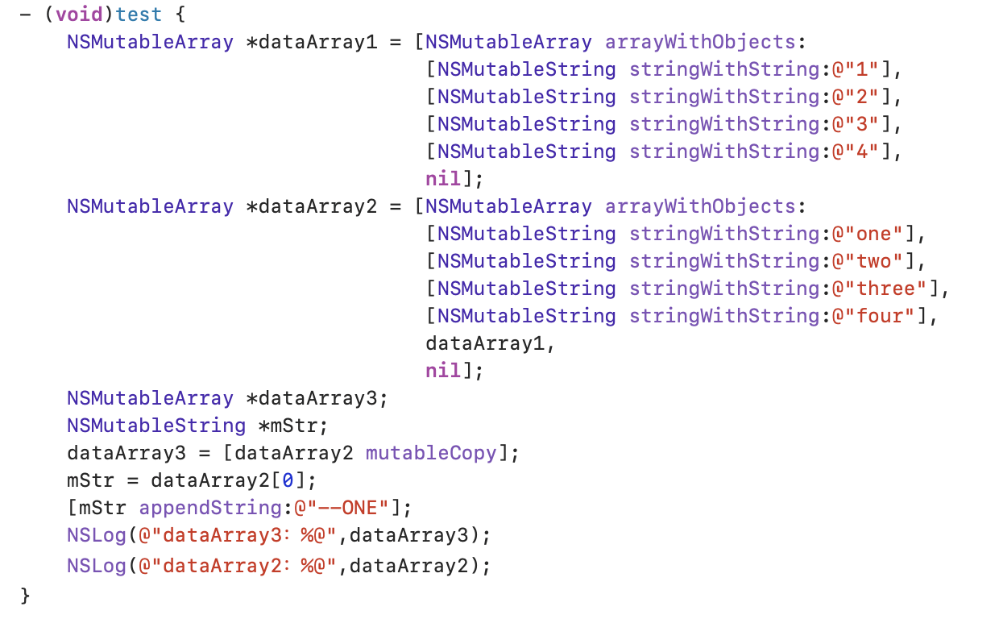
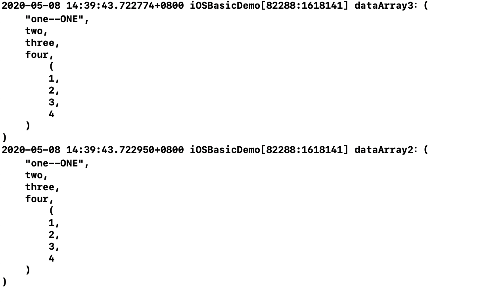
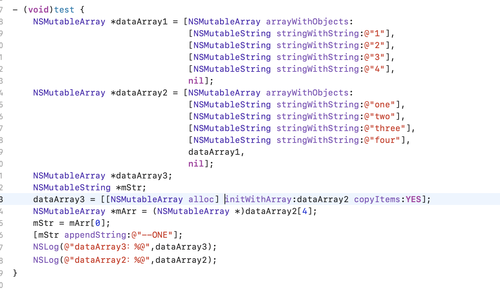
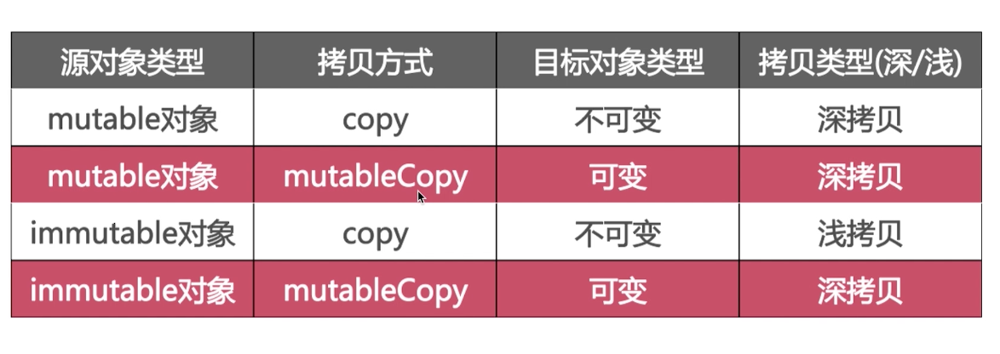
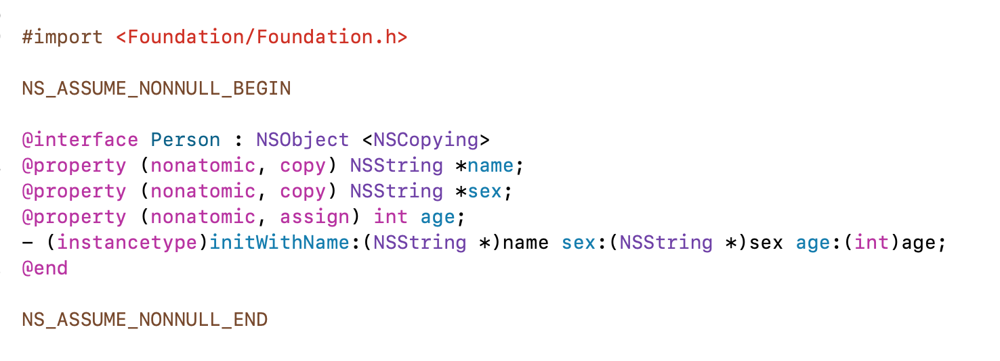
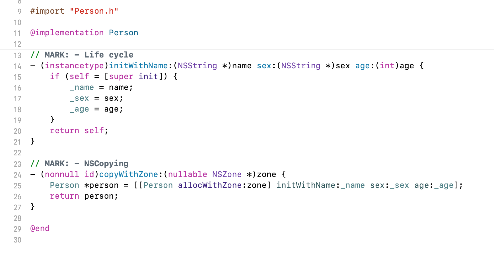

# 属性关键字
所有源码基于[objc-runtime-objc.680版本](https://opensource.apple.com/source/objc4/)

# 前言

<span id="jump"><h1>目录</h1></span>

[<span id="jump-1"><h2>一. 深拷⻉和浅拷⻉</h2></span>](#1)
[<span id="jump-1-1">1. OC对象的拷贝方式有哪些？(浅拷贝和深拷贝是什么？)</span>](#1-1)   
[<span id="jump-1-2">2. OC对象实现的copy和mutableCopy分别为浅拷贝还是深拷贝？</span>](#1-2)  
[<span id="jump-1-3">3. 自定义对象实现的copy和mutableCopy分别为浅拷贝还是深拷贝？</span>](#1-3)  
[<span id="jump-1-4">4. 判断当前的深拷贝的类型？(区别是单层深拷贝还是完全深拷贝)，2种深拷贝类型的相互转换？</span>](#1-4)  
[<span id="jump-1-5">5. 代码如下所示：既然对象的mutableCopy是深拷贝，那为什么更改dataArray2，dataArray3也发生了改变？如何解决这个问题？</span>](#1-5) 

   
[<span id="jump-1-6">6. 代码如下图所示：initWithArray:copyItems:YES 仅仅能进行一层深拷贝，对于第二层或者更多层的就无效了。如果想要对象每层都是深拷贝，该怎么做？</span>](#1-6)



# 正文
<h2 id="1">一. 深拷⻉和浅拷⻉</h2>

<h3 id="1-1">1. OC对象的拷贝方式有哪些？(浅拷贝和深拷贝是什么？)</h3>

OC对象(集合类型和非集合类型)有2种拷贝方式，分别为浅拷贝和深拷贝。


- 浅拷贝：指针拷贝，即源对象和副本对象的指针指向了同一个区域。  
- 深拷贝：内容拷贝，即源对象和副本对象的指针分别指向不同的两块区域。  
**深拷贝包括了单层深拷贝和完全深拷贝。**(具体内容参考面试题4、5、6)  
    - 单层深拷贝：对于副本对象本身这一层是深拷贝，它里面的所有对象都是浅拷贝。  
    - 完全深拷贝：对于副本对象本身以及它里面的所有对象都是深拷贝。 

[回到目录](#jump-1)


<h3 id="1-2">2. OC对象实现的copy和mutableCopy分别为浅拷贝还是深拷贝？</h3>

- 可变对象(集合类型/非集合类型)的copy和mutableCopy都是深拷贝。
- 不可变对象(集合类型/非集合类型)的copy是浅拷贝，mutableCopy是深拷贝。
- copy方法返回的都是不可变对象。



**具体实现如下：**  
1). 可变对象(集合类型/非集合类型)的copy和mutableCopy都是深拷贝。


2). 不可变对象(集合类型/非集合类型)的copy是浅拷贝，mutableCopy是深拷贝。


[回到目录](#jump-1)


<h3 id="1-3">3. 自定义对象实现的copy和mutableCopy分别为浅拷贝还是深拷贝？</h3>

自定义对象实现的copy和mutableCopy，都是深拷贝。  
自定义对象遵守NSCopying和NSMutableCopying协议，来实现copyWithZone:和mutableCopyWithZone:两个方法。  

**具体实现如下：**   
1). **自定义对象的copy是深拷贝：自定义对象实现的copy，要遵守NSCopying协议，且实现copyWithZone:方法。**
- 遵守NSCopying协议


- 实现CopyWithZone⽅法


- 自定义对象实现的copy，是深拷⻉。


2). **自定义对象的mutableCopy是深拷贝：⾃定义对象实现的mutableCopy，要遵守NSMutableCopying协议，且实现mutableCopyWithZone:方法。**

- 遵守NSMutableCopying协议


- 实现mutableCopyWithZone⽅法


- ⾃定义对象实现的mutableCopy，是深拷贝。


[回到目录](#jump-1)


<h3 id="1-4">4. 判断当前的深拷贝的类型？(区别是单层深拷贝还是完全深拷贝)，2种深拷贝类型的相互转换？</h3>

- 单层深拷贝：对于副本对象本身这一层是深拷贝，它里面的所有对象都是浅拷贝。
- 完全深拷贝：对于副本对象本身以及它里面的所有对象都是深拷贝。  

**实现方式：**
- 单层深拷贝：使用**initWithArray:copyItems:方法(第二个参数设置为YES)**。
- 完全深拷贝：**归档和解档**来实现完全深拷贝。  
举例：dataArray3 = [NSKeyedUnarchiver unarchiveObjectWithData:[NSKeyedArchiver archivedDataWithRootObject:dataArray2]];

[回到目录](#jump-1)


<h3 id="1-5">5. 代码如下所示：既然对象的mutableCopy是深拷贝，那为什么更改dataArray2，dataArray3也发生了改变？如何解决这个问题？</h3>


问题(1). 对象的mutableCopy是深拷贝，那为什么更改dataArray2，dataArray3也发生了改变？
```  
dataArray3 = [dataArray2 mutableCopy];  
mutableCopy只是对数组dataArray2本身进行了内容拷贝，但是里面的字符串对象却没有进行内容拷贝，而是浅拷贝。  
即dataArray2和dataArray3里面的字符串对象是共享同一份的，所以才会出现上面的情况。  
```
问题(2). 如何解决这个问题？
> 使用initWithArray:copyItems:方法，第二个参数设置为YES。
如果以这种方式创建集合的深层副本，则会向集合中的每个对象发送copyWithZone:消息。
如果集合中的对象已采用NSCopying协议，则这些对象将被深深复制到新集合中，而新集合则是复制对象的唯一所有者。
如果对象不采用NSCopying协议，尝试以这种方式复制它们会导致运行时错误。但是，copyWithZone:生成浅拷贝。
这种拷贝只能产生一层深拷贝，对于第二层或者更多层的就无效了。
```
dataArray3 = [[NSMutableArray alloc] initWithArray:dataArray2 copyItems:YES];
因为dataArray2里面的字符串对象已经遵守了NSCopying协议，所以这些字符串对象将被深深复制到dataArray3中，而dataArray3则是复制对象的唯一所有者。
即dataArray2和dataArray3里面的字符串对象是不同的。
```

[回到目录](#jump-1)


<h3 id="1-6">6. 代码如下图所示：initWithArray:copyItems:YES 仅仅能进行一层深拷贝，对于第二层或者更多层的就无效了。如果想要对象每层都是深拷贝，该怎么做？</h3>


使用**归档和解档**来实现对象的**完全深拷贝。**
```
dataArray3 = [NSKeyedUnarchiver unarchiveObjectWithData:[NSKeyedArchiver archivedDataWithRootObject:dataArray2]];
```

[回到目录](#jump-1)


<!-- ## 属性关键字
- 读写权限
- 原子性
- 引用计数

### 读写权限
- readonly
- readwrite(默认)

### 原子性
- atomic(默认)

- nonatomic

#### atomic修饰的属性会有什么效果呢？
atomic修饰的属性可以保证赋值和获取是线程安全的。赋值和获取并不代表操作和访问。


### 引用计数
- retain/strong:修饰对象
- assign/unsafe_unretained:

- weak
- copy


#### assign
- 修饰基本数据类型，比如int、bool等
- 修饰对象类型，不改变其引用计数
- 会产生野指针

#### weak
- 修饰对象类型，不改变其引用计数
大多用来解决循环引用问题
- 所指对象被释放后悔自动置为nil

#### assign和weak

#### weak所指对象被释放后悔自动置为nil？
内存管理去看


### copy关键字的使用

#### 浅拷贝和深拷贝
- 是否开辟了新的内存空间
- 是否影响了引用计数


- 可变对象的copy和mutableCopy都是深拷贝。
- 不可变对象的copy是浅拷贝，mutableCopy是深拷贝。
- copy方法返回的都是不可变对象。 -->


# 参考文档
[苹果官网 拷贝集合-Copying Collections](https://developer.apple.com/library/archive/documentation/Cocoa/Conceptual/Collections/Articles/Copying.html#//apple_ref/doc/uid/TP40010162-SW3)  
[iOS深浅拷贝](http://www.cocoachina.com/articles/17275)