# iOS面试题备忘录(七) - block
所有源码基于[objc-runtime-objc.680版本](https://opensource.apple.com/source/objc4/) 

# 前言
《iOS面试题备忘录(七) - block》是关于iOS的block的相关知识点及面试题的整理，难易程度没做区分，即默认是必须掌握的内容。  
本篇内容会持续整理并不断更新完善，如果哪里有理解不正确的地方请路过的大神告知，共勉。  
**可通过目录自行检测掌握程度**   
[github原文地址](https://github.com/mickychiang/iOSInterviewMemo/blob/master/InterviewSummary/block.md)  
本篇代码详细内容请至[Block工程](https://github.com/mickychiang/iOSInterviewMemo/blob/master/InterviewSummary/BlockDemo)  

<!-- 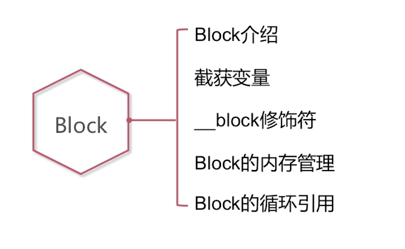   -->


# 目录

[<span id="jump-1"><h2>一. Block的本质</h2></span>](#1)
[1. 什么是Block？什么是Block调用？](#1-1)  

[<span id="jump-2"><h2>二. Block特性：截获变量</h2></span>](#2)
[1. 是否了解Block的截获变量的特性？/ Block的截获变量的特性是怎样的？](#2-1)  
[2. 以下代码分别输出什么结果？](#2-2)  
    
  

[<span id="jump-3"><h2>三. __block修饰符</h2></span>](#3)
[1. 什么场景下使用__block修饰符？](#3-1)  
[2. 以下的两个场景中，是否需要添加__block修饰符？](#3-2)   
  
  
[3. 对变量进行赋值时，__block修饰符的具体使用特点？](#3-3)  
[4. 以下代码输出什么结果？](#3-4)
   

[<span id="jump-4"><h2>四. Block内存管理</h2></span>](#4)
[1. Block的种类以及内存分配？](#4-1)   
[2. 什么时候需要对Block进行copy操作？/ 对Block的copy操作的理解？](#4-2)   
[3. 对栈上的Block进行了copy操作之后，在MRC环境下是否会引起内存泄露？](#4-3)   
[4. __forwarding指针的存在有什么意义？](#4-4)   
[5. 以下的代码输出什么结果？](#4-5)  


[<span id="jump-5"><h2>五. Block的循环引用</h2></span>](#5)
[1. 以下代码有什么问题？怎么解决？](#5-1)  
  
[2. 以下代码有什么问题？怎么解决？](#5-2)  
  
[3. 为什么Block会产生循环引用？](#5-3)  
[4. 你都遇到过哪些循环引用？你又是怎么解决的？](#5-4)   

# 正文

<h2 id="1">一. Block的本质</h2>

<h3 id="1-1">1. 什么是Block？什么是Block调用？</h3>

- Block是一个**对象**，这个对象封装了**函数**和**函数的执行上下文**。  
- Block调用即是**函数的调用**。

源码解析  
使用如下命令，可以查看编译之后的文件内容    
```
clang -rewrite-objc file.m
```  
<!-- 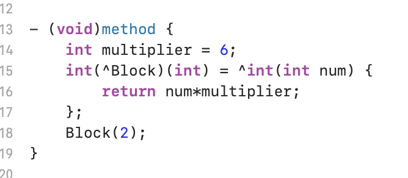    
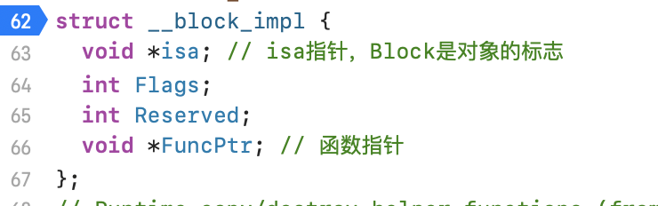    
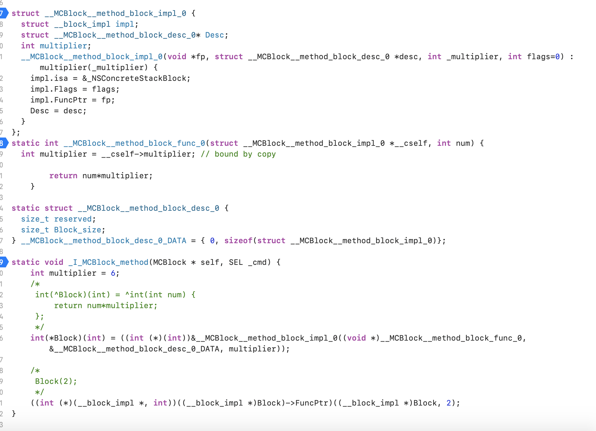   -->

MCBlock.m  
   

MCBlock.cpp  


  

[回到目录](#jump-1)


<h2 id="2">二. Block特性：截获变量</h2>

<h3 id="2-1">1. 是否了解Block的截获变量的特性？/ Block的截获变量的特性是怎样的？</h3>

Block的截获变量的特性对于不同的变量是不同的。

- 局部变量的截获：
    - 基本数据类型的局部变量的截获：截获其值。
    - 对象类型的局部变量的截获：**连同所有权修饰符**一起截获。
- 静态局部变量的截获：以指针形式截获。
- 全局变量的截获：不截获。
- 静态全局变量的截获：不截获。

源码解析  
使用如下命令，可以查看编译之后的文件内容  
```
clang -rewrite-objc -fobjc-arc file.m
```  
<!-- 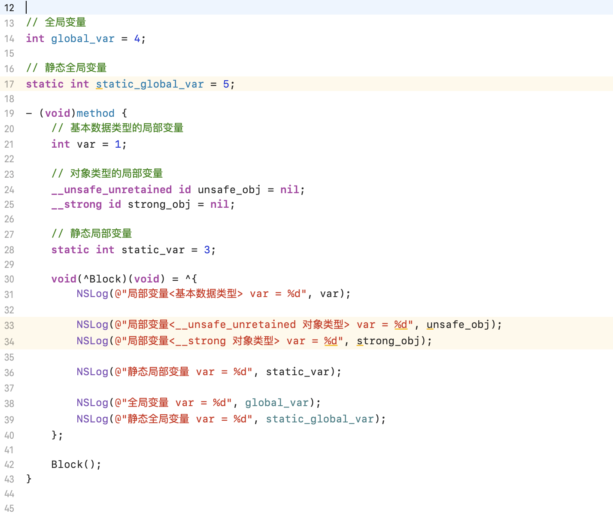  
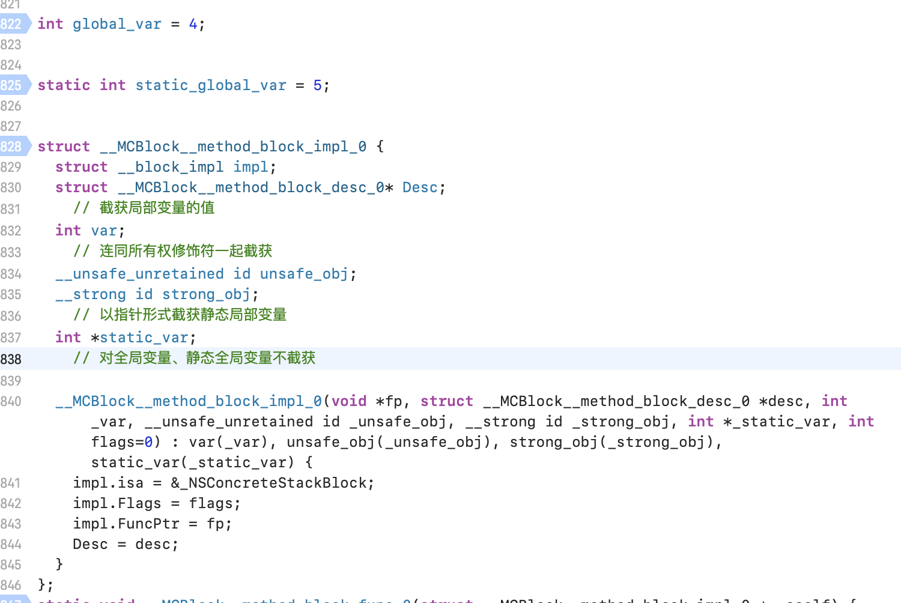   -->

MCBlock.m  


MCBlock.cpp  
  

[回到目录](#jump-2)


<h3 id="2-2">2. 以下代码分别输出什么结果？</h3>

<!-- 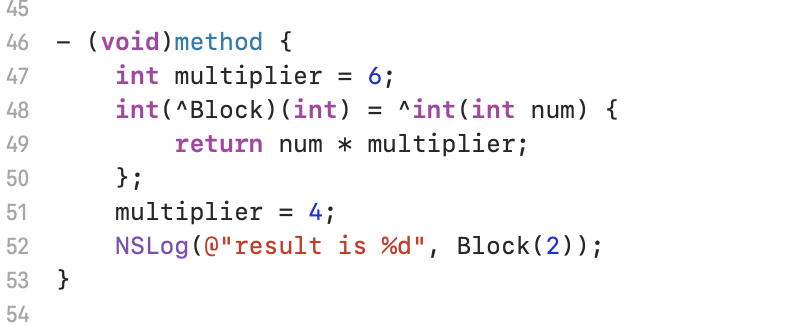   -->
### 代码1
 

输出  
```
result is 12
```
因为block对于基本数据类型的局部变量的截获是获取其值的。

<!-- 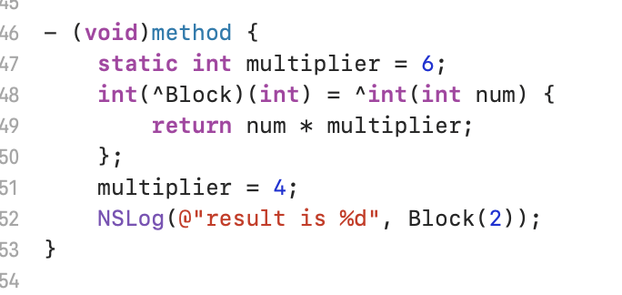   -->
### 代码2
  

输出  
```
result is 8
```
因为block对于静态局部变量的截获是获取其指针的。当指针指向的内容从6变成了4，那么输出的就是4x2=8。

[回到目录](#jump-2)


<h2 id="3">三. __block修饰符</h2>

<h3 id="3-1">1. 什么场景下使用__block修饰符？</h3>

一般情况下，对**被截获变量**进行**赋值**操作时需要添**加__block修饰符**。  

注意：赋值操作 不等于 使用操作  

[回到目录](#jump-3)


<h3 id="3-2">2. 以下的两个场景中，是否需要添加__block修饰符？</h3>

**赋值操作 不等于 使用操作。**

### 场景1
<!-- 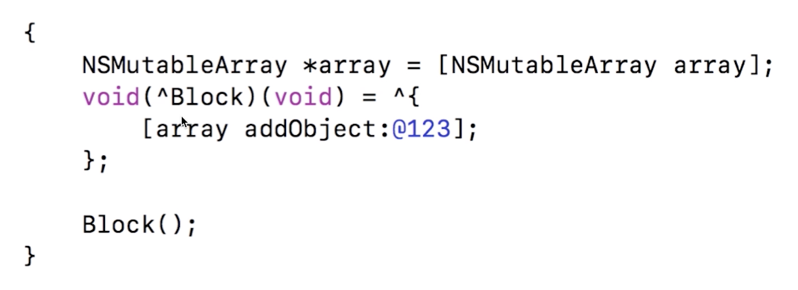   -->


不需要。  
在block内部只是对array进行了使用操作。

### 场景2
<!-- 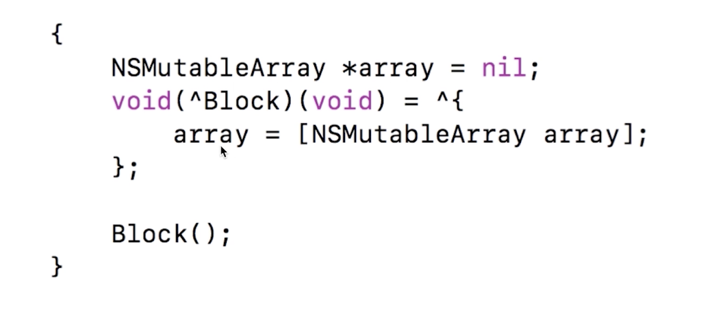   -->


需要在array的声明处添加__block修饰符。  
因为在block内部，对array进行了赋值操作。

[回到目录](#jump-3)


<h3 id="3-3">3. 对变量进行赋值时，__block修饰符的具体使用特点？</h3>

__block修饰的变量最终会变成对象。

- 需要__block修饰符  
局部变量（基本数据类型 + 对象类型）

- 不需要__block修饰符  
静态局部变量、全局变量、静态全局变量

[回到目录](#jump-3)


<h3 id="3-4">4. 以下代码输出什么结果？</h3>

<!-- 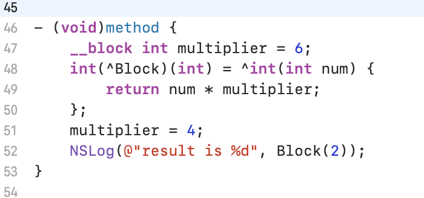 -->


输出  
```
result is 8
```

__block修饰的变量最终会变成对象。

<!-- 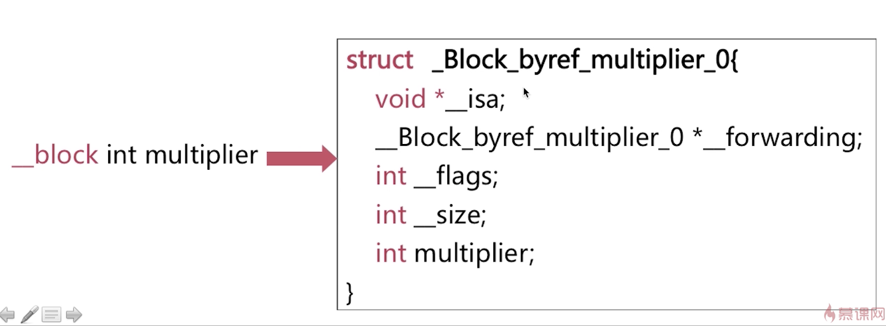
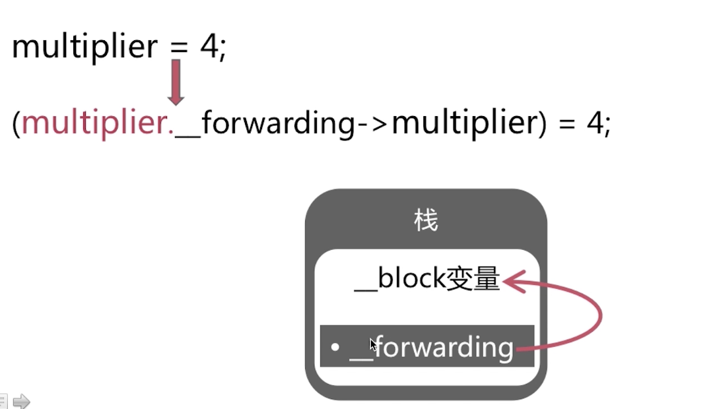 -->


[回到目录](#jump-3)


<h2 id="4">四. Block内存管理</h2>

<h3 id="4-1">1. Block的种类以及内存分配？</h3>

- 栈Block：存放在栈上。
- 堆Block：存放在堆上。
- 全局Block：存放在已初始化数据区中。

#### Block的种类  
<!-- 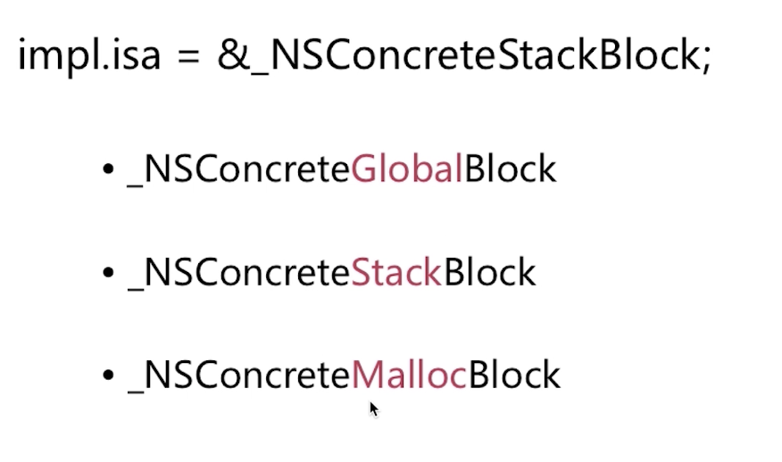   -->


#### Block的内存分配  
<!-- 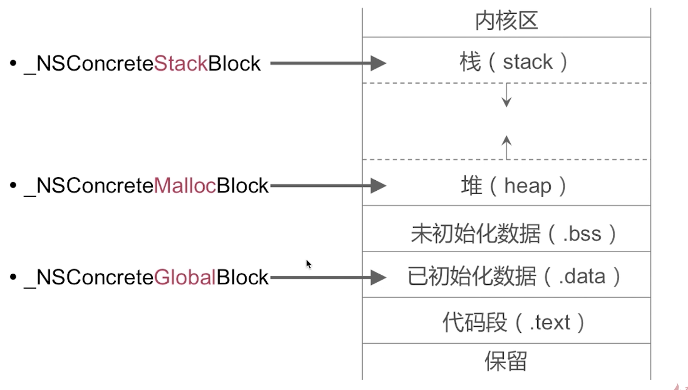   -->


[回到目录](#jump-4)


<h3 id="4-2">2. 什么时候需要对Block进行copy操作？/ 对Block的copy操作的理解？</h3>

对于不同类型的Block进行copy操作的结果不同。

- 栈Block的copy操作：在堆上产生了一个block。
- 堆Block的copy操作：增加了引用计数。
- 全局Block的copy操作：没有变化。

声明一个对象的成员变量是一个block。  
在栈上创建一个block，同时将这个block赋值给成员变量(block)。  
如果成员变量(block)没有使用copy关键字的话(比如使用了assign)，当我们通过成员变量去访问block时，可能会由于栈所对应的函数退出之后在内存中销毁掉而产生了crash。

<!-- 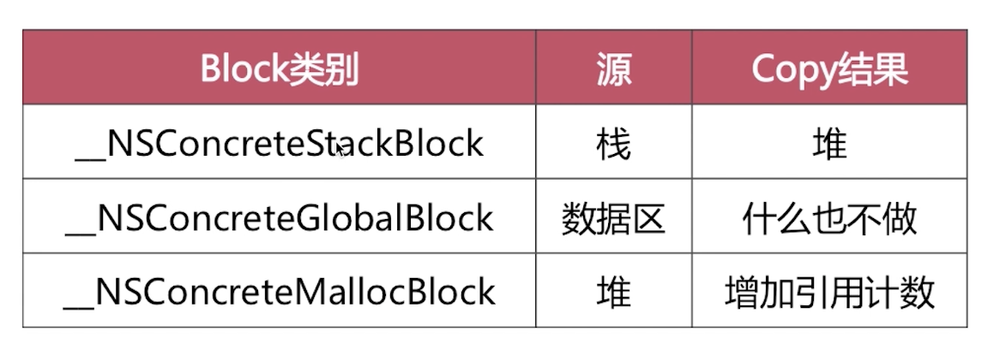   -->


[回到目录](#jump-4)


<h3 id="4-3">3. 对栈上的Block进行了copy操作之后，在MRC环境下是否会引起内存泄露？</h3>

会。

栈上Block的copy之后会在堆上产生一个一样的block。  
在变量作用域结束之后，栈上的Block和__block变量会被销毁。  
而堆上的Block和__block变量仍然存在。 
即没有对应的release操作，会产生内存泄露的问题。

#### 栈上Block的销毁
栈上的Block和__block变量会在变量作用域结束之后，系统自动销毁。

<!-- 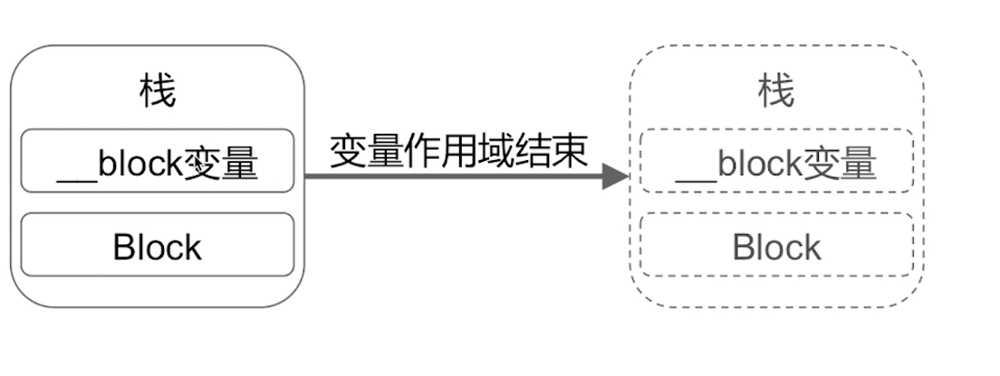 -->


#### 栈上Block的copy
<!-- 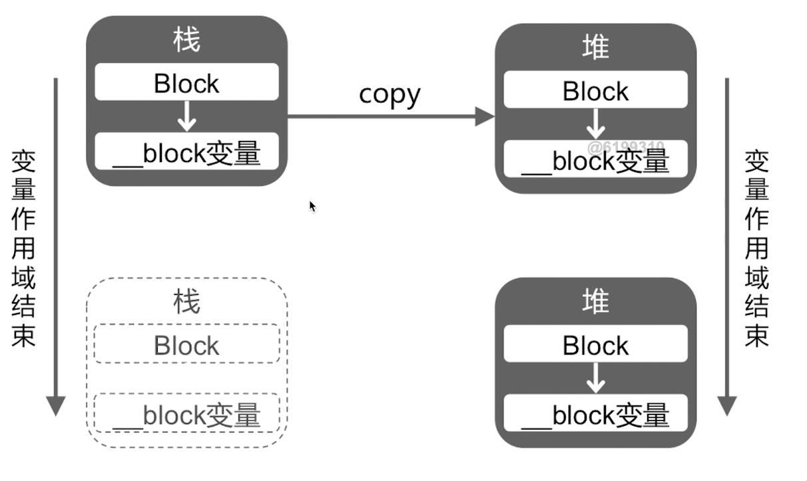 -->


栈上Block的copy之后会在堆上产生一个一样的block。  
在变量作用域结束之后，栈上的Block和__block变量会被销毁。  
而堆上的Block和__block变量仍然存在。  

[回到目录](#jump-4)


<h3 id="4-4">4. __forwarding指针的存在有什么意义？</h3>

<!-- 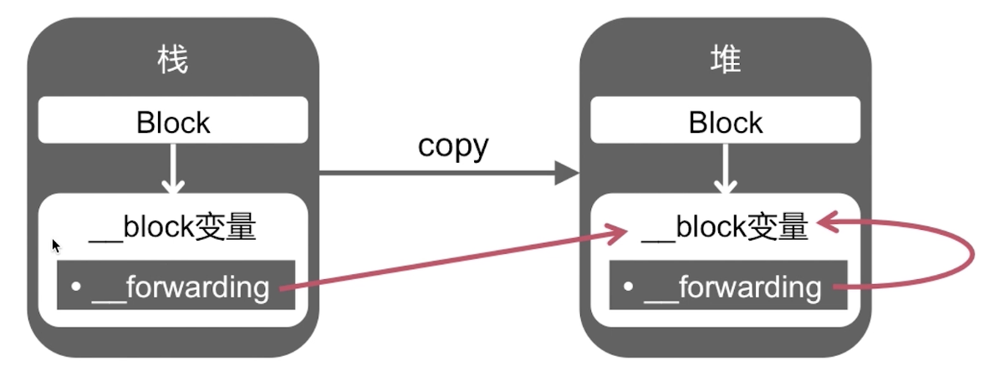  -->


对栈上的__block变量进行copy操作之后，栈上的__block变量的__forwarding指针指向了堆上的__block变量。而堆上的__block变量的__forwarding指针指向其自身。

**不论在任何内存位置，都可以通过__forwarding指针顺利的访问同一个__block变量。**  
- 如果没有对栈上__block变量进行copy的话，实际的操作就是对栈上的__block变量。  
- 如果对栈上__block变量进行了copy操作之后，无论是在栈还是在堆，我们对__block变量的赋值操作都是对堆上的__block变量的操作。同时栈上的__block变量的使用也是使用了堆上的__block变量。

[回到目录](#jump-4)


<h3 id="4-5">5. 以下的代码输出什么结果？</h3>


输出
```
result is 24
```

[回到目录](#jump-4)


<h2 id="5">五. Block的循环引用</h2>

<h3 id="5-1">1. 以下代码有什么问题？怎么解决？</h3>

<!-- 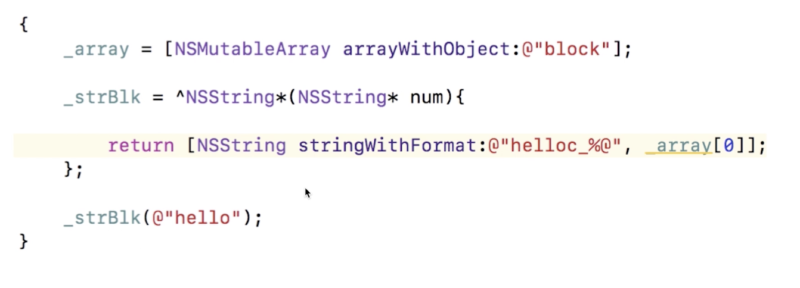 -->


会产生一个自循环引用。  
解决方案如下：  
block截获的变量如果是一个对象类型的话，会连同其所有权修饰符一起截获。  
如果在外部定义的对象是__weak修饰的，那么在block结构体中持有的变量也是__weak，所以避免了自循环引用。  
<!-- 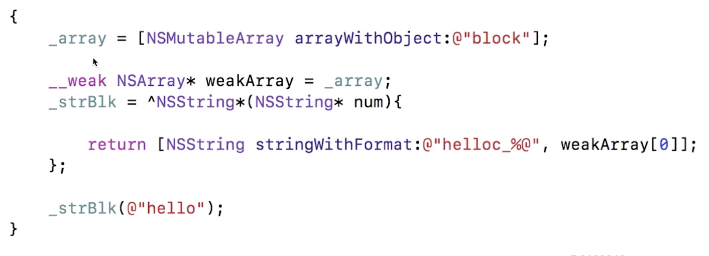 -->


[回到目录](#jump-5)


<h3 id="5-2">2. 以下代码有什么问题？怎么解决？</h3>

<!-- 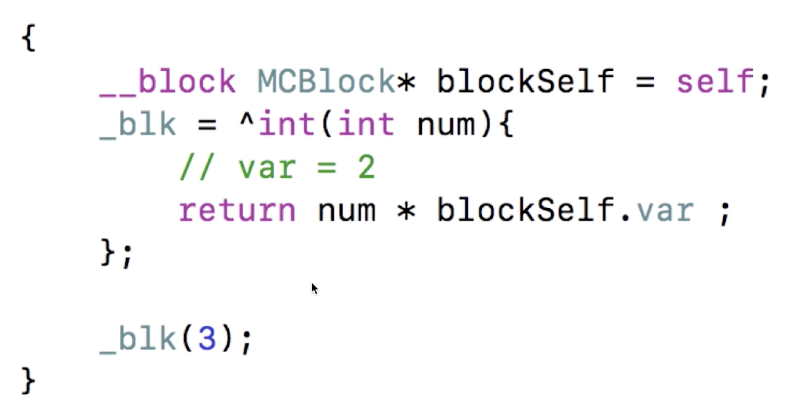 -->


- 在MRC下，不会产生循环引用。
- 在ARC下，会产生多循环引用，引起内存泄漏。  
通过断环来规避循环引用。  
<!-- 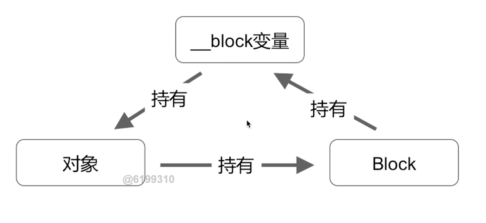 -->


解决方案如下：
<!-- 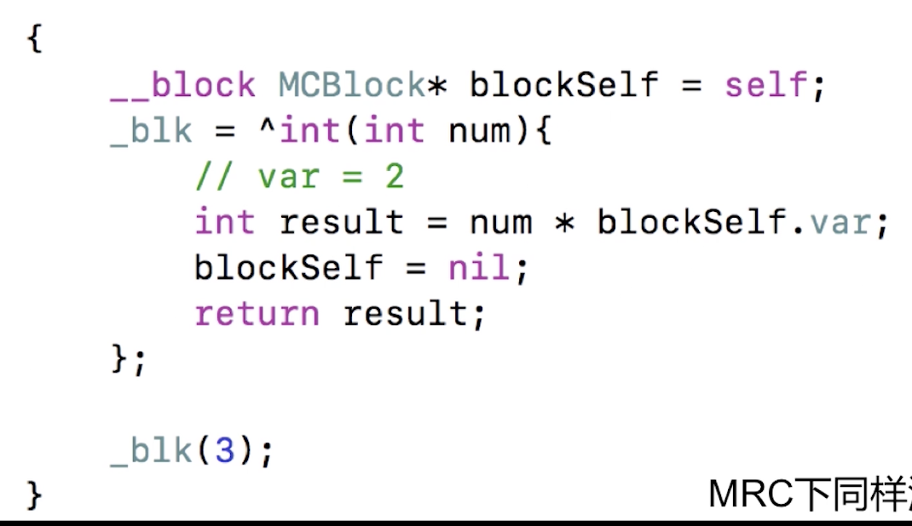 -->
  
这种解决方案有个弊端，如果我们很长时间才调用block或者永远不会调用的话，这个循环引用的环就会一直存在。

[回到目录](#jump-5)


<h3 id="5-3">3. 为什么Block会产生循环引用？</h3>

- 如果block截获了当前对象的一个变量，就会对这个变量有个强引用。    
而当前对象对block也有一个强引用，这样就会造成自循环引用。  
可以使用__weak修饰变量。
- 如果__block修饰变量，在MRC下，不会产生循环引用；在ARC下，会产生多循环引用，引起内存泄漏，可以通过断环的方式解决。  

[回到目录](#jump-5)


<h3 id="5-4">4. 你都遇到过哪些循环引用？你又是怎么解决的？</h3>

- block
根据面试题1和2来回答。  

- NSTimer


[回到目录](#jump-5)


# 参考文档
《新浪微博资深大牛全方位剖析 iOS 高级面试》  


# 其他
《iOS面试题备忘录》系列文章的github原文地址：  

[iOS面试题备忘录(一) - 属性关键字](https://github.com/mickychiang/iOSInterviewMemo/blob/master/InterviewSummary/PropertyModifier.md)    
[iOS面试题备忘录(二) - 内存管理](https://github.com/mickychiang/iOSInterviewMemo/blob/master/InterviewSummary/memoryManagement.md)   
[iOS面试题备忘录(三) - 分类和扩展](https://github.com/mickychiang/iOSInterviewMemo/blob/master/InterviewSummary/CategoryAndExtension.md)  
[iOS面试题备忘录(四) - 代理和通知](https://github.com/mickychiang/iOSInterviewMemo/blob/master/InterviewSummary/DelegateAndNSNotification.md)  
[iOS面试题备忘录(五) - KVO和KVC](https://github.com/mickychiang/iOSInterviewMemo/blob/master/InterviewSummary/KVOAndKVC.md)  
[iOS面试题备忘录(六) - runtime](https://github.com/mickychiang/iOSInterviewMemo/blob/master/InterviewSummary/runtime.md)  
[iOS面试题备忘录(七) - block](https://github.com/mickychiang/iOSInterviewMemo/blob/master/InterviewSummary/block.md)   
[算法](https://github.com/mickychiang/iOSInterviewMemo/blob/master/Algorithm/Algorithm.md)  