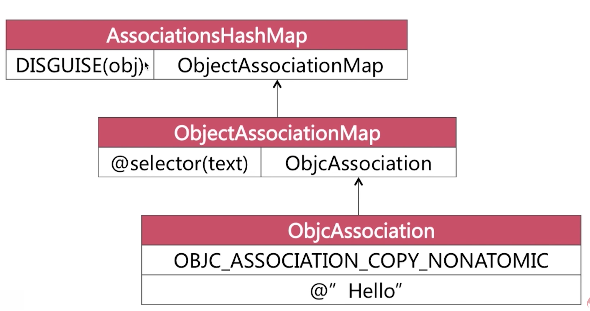
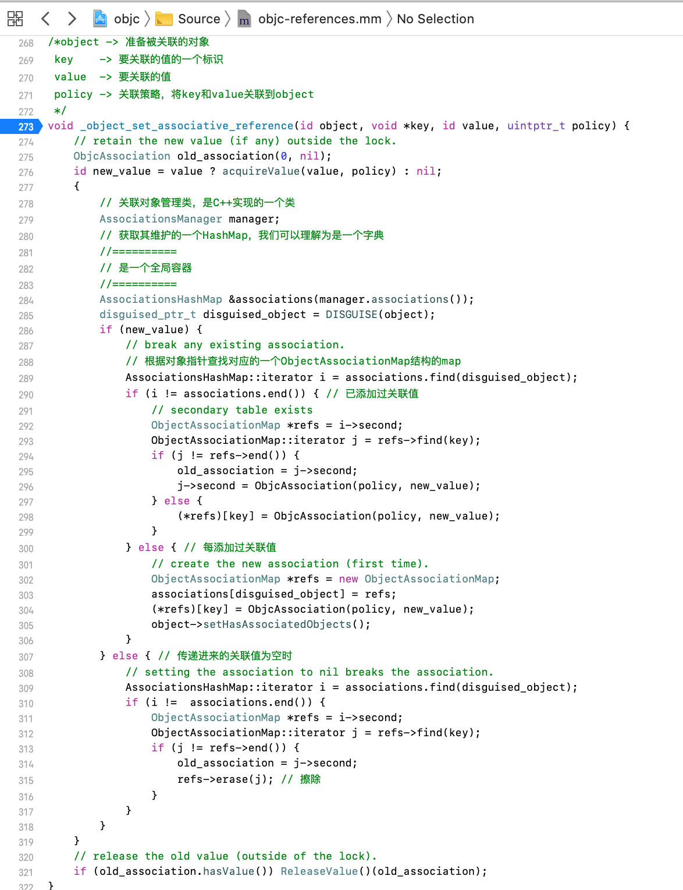
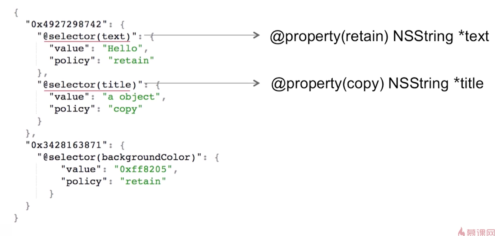

# iOS Interview Summary
所有源码基于[objc-runtime-objc.680版本](https://opensource.apple.com/source/objc4/)  

## 代理Delegate
### 1. 代理的概念和特点
- 代理是一种软件设计模式  
- 在iOS中以@protocol形式体现  
- 传递方式是一对一  

### 2. 代理的工作流程
<!--  -->


### 3. 在协议中可以定义的内容
在协议中可以定义**属性**和**方法**。

### 4. 在协议中定义的内容都必须要实现吗？
- @required：在协议中被@required标识的方法说明代理方必须要实现，否则会出现编译错误。(什么都没写，默认为@required)
- @optional：在协议中被@optional标识的方法说明代理方可以实现也可以不实现。

### 5. 代理和通知的区别
- 设计模式不同：代理是由**代理模式**实现的，通知是由**观察者模式**实现的。
- 传递方式不同：代理的传递方式是**一对一**，通知的传递方式是**一对多**。

### 6. 使用代理时可能会遇到的问题
#### 6.1 循环引用
代理方和委托方以什么样的关系存在？  
一般声明为weak以规避循环引用：在委托方以weak关键字来声明持有情况。
<!--  -->


## 通知NSNotification
### 1. 通知的概念和特点
- 通知是使用**观察者模式**来实现的用于**跨层传递消息**的机制。
- 传递方式是**一对多**。

### 2. 通知的作用
用来进行跨层传递消息。(比如网络层越过数据层，直接将数据传递到UI层)

### 3. 通知是怎样实现一对多的？


### 4. 代理和通知的区别？
- 设计模式不同：代理是由**代理模式**实现的，通知是由**观察者模式**实现的。
- 传递方式不同：代理的传递方式是**一对一**，通知的传递方式是**一对多**。

### 5. 如何实现通知机制？
注意：官方没有提供底层源码，按照自己的理解分析即可。


### 6. 延伸：通知是同步的还是异步的？
和NSNotificationQueue有关。
在不使用这个类的相关作用情况下，也就是通常情况下是同步的，所谓的同步就是发送通知之后，会阻塞当前线程，直到所有observer处理完成。


# iOS runtime

## 关联对象的本质
```
void objc_setAssociatedObject(id _Nonnull object, const void * _Nonnull key, id _Nullable value, objc_AssociationPolicy policy)

id _Nullable objc_getAssociatedObject(id _Nonnull object, const void * _Nonnull key)

void objc_removeAssociatedObjects(id _Nonnull object)
```
关联对象由**AssociationsManager管理**并在**AssociationsHashMap存储**。  
所有对象的关联内容都在**同一个全局容器**中。 
 
1.传递进来的value和policy封装成一个ObjcAssociation结构。
2.通过ObjcAssociation和key建立一个映射结构ObjectAssociationMap。
3.ObjectAssociationMap作为object的一个value放到全局容器AssociationsHashMap中。

设置关联对象的源码分析：  



## 如何删除已经被关联到对象的值？
可以把value传为nil来实现。(源码中通过擦除来解决这个场景)

## 关联进去的数据结构



## 扩展Extension
### 一般用扩展做什么？
1.声明私有属性：不对子类暴露  
2.声明私有方法：方便阅读  
3.声明私有成员变量  
平日开发中，一般把扩展放到宿主类的.m文件中
### 扩展的特点
1.编译时决议  
2.只以声明的形式存在(没有具体实现)，多数情况下寄生于宿主类的.m文件中  
3.不能为系统类添加扩展
### 分类和扩展的区别？
1.分类是运行时决议，扩展是编译时决议。  
2.分类有声明和实现，扩展只有声明，扩展的实现是写在宿主类中。  
3.可以为系统类添加分类，但是不能添加扩展。


## KVO

### 1. KVO概念
- KVO是Key-value observing的缩写。
- KVO是Objective-C对**观察者设计模式**的一种实现。
- 系统使用**isa混写技术**(isa-swizzling)来实现KVO。


### 2. KVO的实现机制和原理/isa混写技术怎样实现KVO

#### 2.1 KVO的实现机制和原理/isa混写技术(isa-swizzling)
- 当注册类A的一个对象的观察者的时候，调用了addObserver:forKeyPath:options:context:方法，系统会在运行时动态创建一个名叫NSKVONotifying_A的类，同时将A的isa指针指向NSKVONotifying_A。  
- 类NSKVONotifying_A是类A的子类，类NSKVONotifying_A继承类A是为了重写原来类A中的setter方法，重写的setter方法负责通知所有观察对象。


#### 2.2 子类重写setter方法的逻辑和具体实现
子类NSKVONotifying_A中重写的setter方法中添加了两个方法
```
- (void)willChangeValueForKey:(NSString *)key;
- (void)didChangeValueForKey:(NSString *)key;
```
didChangeValueForKey:方法会触发KVO的回调方法observeValueForKeyPath:ofObject:change:context:来通知观察者value发生了变化


<!-- 在运行时为某一个类动态创建一个子类，isa指针会指向这个继承的子类，在子类中重写setter方法，从而达到通知所有类的目的。 -->
#### 3. KVO具体的代码实现
完整代码实例请查看：[InterviewSummary工程]()
##### 3.1 创建了类MObject和类MObserver
MObject


MObserver


##### 3.2 实现KVO


### 4. 手动实现KVO
在对成员变量直接赋值的时候，在它之前和之后分别添加willChangeValueForKey:方法和didChangeValueForKey:方法，就可以实现手动KVO。  
didChangeValueForKey:在系统内部实现当中会触发KVO的回调方法observeValueForKeyPath:ofObject:change:context:方法。


### 5. 总结
使用setter方法改变值，KVO才会生效。
使用setValue:forKey:改变值，KVO才会生效。
成员变量直接修改需要**手动添加**KVO才会生效。


## KVC
### KVC概念
KVC是Key-value coding的缩写。键值编码技术。
```
- (nullable id)valueForKey:(NSString *)key;
- (void)setValue:(nullable id)value forKey:(NSString *)key;
```

### 我们使用KVC键值编码技术是否会破坏面向对象的编程方法？
KVC会破坏面向对象编程的封装特性。
key没有任何限制，如果已知某个类或者实例的内部某个私有成员变量名称的话，我们在外界是可以通过已知的key来访问和设置。即破坏了面向对象的编程思想。

### valueForKey:的实现流程

首先查找是否存在与key名称相同的get方法，在查找是否存在与key名称相同的实例变量，最后查询是否存在与key名称相同的属性

- 访问器方法(Accessor Method)是否存在的判断规则
getKey
key
isKey

- 实例变量(Instance var)是否存在的判断规则
_key
_isKey
key
isKey


### setValue:forKey:的实现流程


？？？？？KVO和KVC需要再学习一遍！！！！


## OC笔试题
### MRC下如何重写retain修饰变量的setter方法？**************很重要！！！！！
```
@property (nonatomic, retain) id obj;

// setter方法
- (void)setObj:(id)obj {
    if (_obj != obj) { // 不等判断的目的：防止异常所做的处理， 
        [_obj release];
        _obj = [obj retain];
    }
}

// 不等判断的目的：防止异常所做的处理，
如果传递进来的obj对象恰好就是原来的_obj对象，
没有不等判断的话，
先对原来的对象进行release操作，实际上也是对传递进来的obj对象进行release操作，
很有可能obj对象被我们无辜的释放了，如果这个时候再通过obj指针去访问被释放的对象就会导致程序crash。
```
### 请简述分类的实现原理。
分类的实现原理由运行时决议。
不同分类当中含有同名分类方法，谁最终生效取决于谁最后参与编译。最后编译的分类中的同名方法会最终生效。
如果分类中添加的方法恰好是宿主类中的某个方法，分类方法会“覆盖”同名的宿主类方法。
这里的“覆盖”指的是由于消息传递的过程当中优先查找数组靠前的元素，如果找到同名方法就进行调用，但是宿主类的同名方法仍然存在。


### KVO的实现原理
KVO是系统对于观察者模式的一种实现。
KVO运用isa混写技术在动态运行时为某一个类添加一个子类并重写子类的setter方法，同时把原有类的isa指针指向新创建的子类。

### 能否为分类添加实例变量
通过关联对象来为分来添加实例变量。

