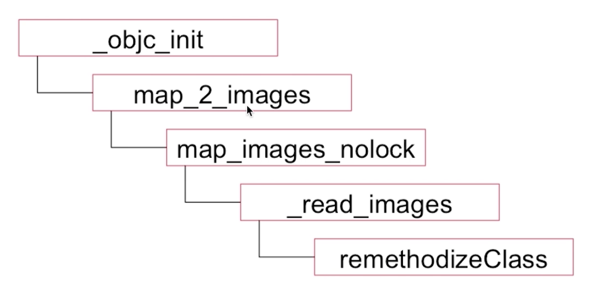

# iOS Category
所有源码基于[objc-runtime-objc.680版本](https://opensource.apple.com/source/objc4/)


## 书写规则
```
// .h文件
@interface 宿主类类名（分类名）

@end

// .m文件
@implementation 宿主类类名（分类名）

@end
```

## 分类的应用场景
- 声明私有方法  
定义一个分类，只把他的头文件放到宿主文件的.m当中，可以满足私有方法的声明和使用，对外不暴露。
- 分解体积庞大的类文件  
比如：这个类的功能复杂，可以按照功能对类中的一些方法进行分类。把同一功能的方法放到对应的一个分类文件中。 
- 把Framework的私有方法公开


## 分类的特点
- 运行时决议  
编写好分类文件之后，系统并没有把分类中添加的内容附加到相应的宿主类中，即宿主类中没有分类添加的内容，而是在运行时通过runtime把分类中添加的内容真实的添加到对应的宿主类中。
- 可以为系统类添加分类  
比如会经常使用分类为UI控件封装一些常用方法。


## 分类中都可以添加哪些内容
- 实例方法  
- 类方法  
- 协议  
- 属性：在分类中定义属性，实际上只声明了setter方法和getter方法，并没有生成对应的实例变量。可以通过**runtime关联对象**来添加实例变量。


## 分类结构体的源码：
```
struct category_t {
    const char *name; // 分类的名称
    classref_t cls; // 分类的宿主类
    struct method_list_t *instanceMethods; // 实例方法列表
    struct method_list_t *classMethods; // 类方法列表
    struct protocol_list_t *protocols; // 协议列表
    struct property_list_t *instanceProperties; // 实例属性列表

    method_list_t *methodsForMeta(bool isMeta) {
        if (isMeta) return classMethods;
        else return instanceMethods;
    }

    property_list_t *propertiesForMeta(bool isMeta) {
        if (isMeta) return nil; // classProperties;
        else return instanceProperties;
    }
};
```


## 加载调用栈(底层)
images：镜像

<!--  -->

## 源码分析
**注释写在了源码里且只分析了添加实例方法的逻辑**


## 为一个类添加了分类A和分类B，两个分类中分别添加了名字相同的实例方法，那么哪个分类的方法最终会生效？
取决于分类的编译顺序。  
最后编译的分类当中的同名方法才会最终生效。前面的会被覆盖掉。


## 分类添加的方法可以"覆盖"宿主类的方法
宿主类的方法仍然存在，但是由于消息函数方法查找过程中根据选择器名称查找，一旦找到对应的实现就返回。  
由于分类方法位于宿主类的方法数组靠前的位置，如果分类中有和宿主类同名的方法，那么分类的方法会被优先实现。


## 总结
- 分类添加的方法可以"覆盖"宿主类的同名方法  
- 同名分类方法谁能生效取决于编译顺序  
- 名字相同的分类会引起编译报错  

## 能否给分类添加"实例变量"？添加的"实例变量"存在于哪里？
注意：[实例变量=成员变量]  
可以通过**runtime的关联对象机制**为分类添加"实例变量"。 
添加的"实例变量"放到了一个全局容器中，并且为不同的分类添加的关联对象的值全都放在同一个全局容器中。
```
void objc_setAssociatedObject(id _Nonnull object, const void * _Nonnull key, id _Nullable value, objc_AssociationPolicy policy)

id _Nullable objc_getAssociatedObject(id _Nonnull object, const void * _Nonnull key)

void objc_removeAssociatedObjects(id _Nonnull object)
```

