# iOS面试题备忘录(二) - 内存管理
所有源码基于[objc-runtime-objc.680版本](https://opensource.apple.com/source/objc4/) 

# 前言
《iOS面试题备忘录(二) - 内存管理》是关于iOS的内存管理的相关知识点及面试题的整理，难易程度没做区分，即默认是必须掌握的内容。  
本篇内容会持续整理并不断更新完善，如果哪里有理解不正确的地方请路过的大神告知，共勉。  
**可通过目录自行检测掌握程度**  
**本篇内容较难，所以将面试题和具体知识点解析拆分出来**   
[github原文地址](https://github.com/mickychiang/iOSInterviewMemo/blob/master/InterviewSummary/memoryManagement.md)

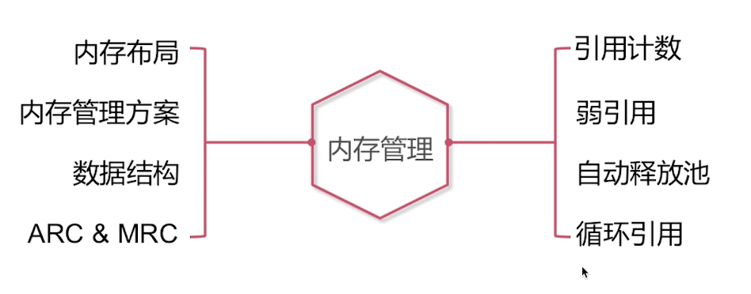

1.iOS下的内存布局是怎样的？- 👌  
2.简述一下不同场景下的内存管理方案？- 👌  
3.不同内存管理方案对应的数据结构是怎样的？- 👌  
4.ARC和MRC是什么？两者的区别？各自的实现机制和原理？- 👌  
5.什么是引用计数？内存是怎样管理的？- 👌  
6.weak修饰的变量在内存释放的时候为什么weak指针会被自动置为nil？- 👌  
7.弱引用变量的内存是如何管理的？- 👌  
8.什么是自动释放池？autoreleasepool的实现原理？ - 👌 
9.循环引用的问题和解决？- 🙅‍♂️  

<span id="jump"><h1>目录</h1></span>

[<span id="jump-1"><h2>一. 内存布局</h2></span>](#1)
[<span id="jump-1-1">1. iOS下的内存布局是怎样的？</span>](#1-1)  

[<span id="jump-2"><h2>二. 内存管理方案</h2></span>](#2)
[<span id="jump-2-1">1. iOS操作系统是怎样对内存进行管理的？</span>](#2-1)  
[<span id="jump-2-2">2. 为什么是由多个SideTable共同组成的SideTables()结构而不是只有一个SideTable？</span>](#2-2)  
[<span id="jump-2-3">3. 散列表怎样实现快速分流？即通过一个对象的指针如何快速定位到它属于哪张SideTable表？</span>](#2-3)   
[<span id="jump-2-4">4. 知识点补充</span>](#2-4)

[<span id="jump-3"><h2>三. 散列表的数据结构</h2></span>](#3)
[<span id="jump-3-1">1. 你是否用过自旋锁？自旋锁和普通锁的区别是什么？自旋锁适用于那些场景呢？</span>](#3-1)  
[<span id="jump-3-2">2. 散列表的引用计数表是通过什么来实现的？为什么引用计数表通过hash表来实现呢？</span>](#3-2)  
[<span id="jump-3-3">3. 知识点补充</span>](#3-3)  

[<span id="jump-4"><h2>四. ARC和MRC</h2></span>](#4)
[<span id="jump-4-1">1. ARC和MRC是什么？两者的区别？各自的实现机制和原理？</span>](#4-1)  

[<span id="jump-5"><h2>五. 引用计数</h2></span>](#5)
[<span id="jump-5-1">1. 在进行retain时，系统是怎样查找它对应的引用计数的？</span>](#5-1)   
[<span id="jump-5-2">2. 我们通过关联对象技术为一个类添加了实例变量，在对象的dealloc方法当中，是否有必要对它对关联对象进行移除操作呢？</span>](#5-2)  
[<span id="jump-5-3">3. 如果说weak指针指向一个对象，当这个对象dealloc或废弃之后，它的weak指针为何会被自动设置为nil？</span>](#5-3)  
[<span id="jump-5-4">4. 知识点补充</span>](#5-4)  

[<span id="jump-6"><h2>六. 弱引用</h2></span>](#6)
[<span id="jump-6-1">1. 一个weak变量是怎样被添加到弱引用表当中的？</span>](#6-1)  
[<span id="jump-6-2">2. 如果说weak指针指向一个对象，当这个对象dealloc或废弃之后，它的weak指针为何会被自动设置为nil？/ 当一个对象被释放或废弃，weak变量是怎样处理的呢？</span>](#6-2)  
[<span id="jump-6-3">3. 知识点补充</span>](#6-3) 

[<span id="jump-7"><h2>七. 自动释放池</h2></span>](#7)
[<span id="jump-7-1">1. 下面代码中，在viewDidLoad()方法中创建的array对象，在什么时机被释放的呢？</span>](#7-1)   
[<span id="jump-7-2">2. AutoreleasePool的实现原理是怎样的？</span>](#7-2)  
[<span id="jump-7-3">3. AutoreleasePool为何可以嵌套使用呢？</span>](#7-3)  
[<span id="jump-7-4">4. 在什么场景下需要我们手动插入autoreleasePool呢？</span>](#7-4)  
[<span id="jump-7-5">5. 知识点补充</span>](#7-5) 


[<span id="jump-8"><h2>八. 循环引用</h2></span>](#8)
[<span id="jump-8-1">1. 循环引用的种类有哪些？</span>](#8-1)   
[<span id="jump-8-2">2. 如何破除循环引用？</span>](#8-2)  
[<span id="jump-8-3">3. 破除循环引用的具体解决方案有哪些？</span>](#8-3)  
[<span id="jump-8-4">4. 平日开发中是否遇到过循环引用？你是怎么解决的？</span>](#8-4)  
[<span id="jump-8-5">5. 知识点补充</span>](#8-5)  

# 正文

<h2 id="1">一. 内存布局</h2>  

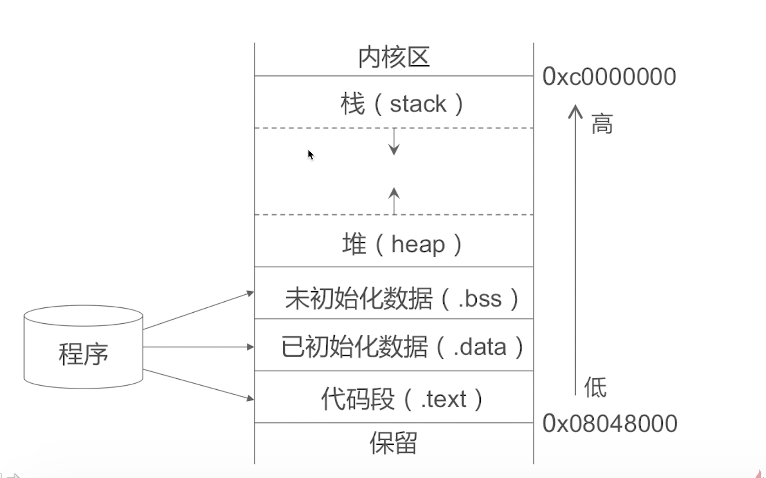

<h3 id="1-1">1. iOS下的内存布局是怎样的？</h3>

内存布局包含3块内存区域(地址从高到低) 。  
保留区和内核区中间的区域供我们使用。
- 内核区
- 中间区
    - 栈(stack)：定义的方法或函数在stack工作的。stack地址由高到低，即stack是向下扩展或增长。
    - 堆(heap)：通过alloc创建的对象或者经过copy的block都会被转移到heap中。heap地址由低到高，即heap是向上扩展或增长。
    - 未初始化数据(.bss)：未初始化的全局变量或静态变量等。
    - 已初始化数据(.data)：已初始化的全局变量或静态变量等。
    - 代码段(.text)：程序代码。
- 保留区

[回到目录](#jump-1)


<h2 id="2">二.内存管理方案</h2>

<h3 id="2-1">1. iOS操作系统是怎样对内存进行管理的？</h3>

**iOS操作系统针对不同场景会提供不同的内存管理方案。**    
- TaggedPointer：针对一些小对象(不是基本数据类型)，如NSNumber、NSData类型等。  

- NONPOINTER_ISA： 针对64位架构下的iOS应用程序。  
NONPOINTER_ISA即非指针型isa，是指在64位架构下，isa指针占64个bit位。  
实际上有32位或40位已够用，苹果为了提高内存的利用率，防止剩余的bit位浪费，在isa剩余的bit位存储了有关内存管理方面的相关数据内容。  
NONPOINTER_ISA是在64位架构下使用的一种内存管理方案，这种方案主要是高效利用64位架构下isa指针的剩余内存空间。

- 散列表：针对32位架构下的应用程序或者64位架构下isa指针存放不下的场景中使用。  
散列表是一个复杂的数据结构，包括了引用计数表、弱引用表(引用计数表和弱引用表存储的是对应对象的指针)。

注意：  
NONPOINTER_ISA(非指针型isa)在[iOS面试题备忘录(六) - runtime](https://github.com/mickychiang/iOSInterviewMemo/blob/master/InterviewSummary/runtime.md)被提及过。

[回到目录](#jump-2)


<h3 id="2-2">2. 散列表的内存管理方案为什么是由多个SideTable共同组成的SideTables()结构而不是只有一个SideTable？</h3>


假如只有一张SideTable，相当于在内存中分配的所有对象的引用计数或弱引用存储都放在一张大表中。  
如果我们要操作某一对象的引用计数值进行修改(+1或-1操作)，由于所有对象可能在不同线程中分配创建(包括调用release\retain等方法)，也可能在不同线程中进行操作，那么我们对这张表进行操作时需要进行**加锁**处理来保证**数据的安全访问**。  
这样存在了效率问题。比如用户内存空间是4GB，可能分配了成千上百万个对象。  
如果要对每一个对象进行引用计数值修改，就需要每一次对这张大表进行处理，就会出现效率慢的问题。  
如果当前有一个对象正在操作这张表，那么下一个对象就必须等待当前对象操作完把锁释放之后它才能操作这张表。  
很明显成千上百万个对象都操作这张表会出现效率问题。  
**系统为解决访问效率问题，引入了分离锁技术方案。**    

**分离锁技术**  
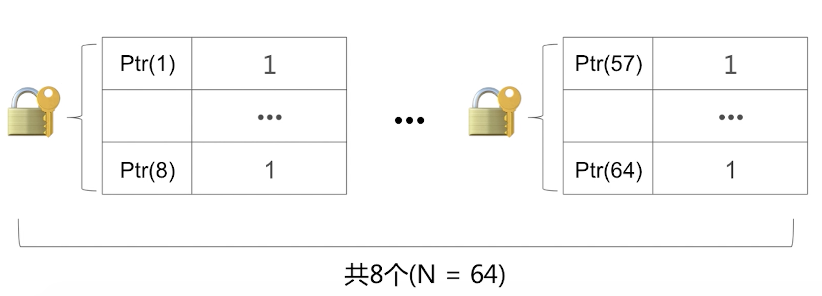
分离锁概念：把内存对象所对应的引用计数表分拆成多个部分，给分拆成的每个表都加一个锁。  
比如说对象A在拆分的第一张表中，对象B在拆分的第二张表中，当A和B同时进行引用计数操作可以并发操作；如果是在一张表中就只能顺序操作。  
很明显，分离锁的技术方案提高了访问效率。  

[回到目录](#jump-2)


<h3 id="2-3">3. 散列表怎样实现快速分流？即通过一个对象的指针如何快速定位到它属于哪张SideTable表？</h3>

SideTables本质是一张hash表。   
这张hash表可能有64个SideTable，用来存储不同对象的引用计数表和弱引用表。  
通过对象的内存地址和SideTables数组个数进行取余运算，计算出一个对象指针对应的引用计数表或弱引用表在哪张具体的SideTable表。


**扩展：**   
- hash表概念：  
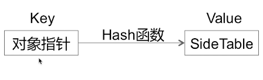  
对象指针作为一个key经过hash函数的运算来计算出一个值value来决定这个对象对应的SideTable是哪张(或在数组中的位置是哪个或者索引是哪个)。

- Hash查找：  
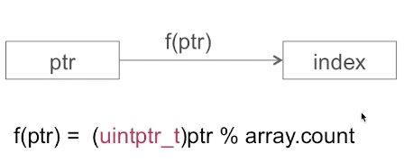  
举例：给定值是对象内存地址，目标值是数组下标索引。  
通过对象的内存地址和SideTables数组个数进行取余运算，计算出一个对象指针对应的引用计数表或弱引用表在哪张具体的SideTable表。

- 为什么通过hash查找？  
是为了提高查找效率。  
通过hash函数进行存储，比如数组个数是8，内存地址是1，取余就是1，我们就把对象存储到数组索引为1的位置；  
当我们访问这个对象时，不需要数组遍历来比较指针值，而是也通过这个函数进行一次运算。  
即根据这个函数，到索引为1的位置取出想要的内容。  
这个过程不涉及遍历，所以查找效率较高。  
内存地址的分布是一个均匀的分布，可以称这个hash函数为一个均匀的散列函数。

[回到目录](#jump-2)


<h3 id="2-4">4. 知识点补充</h3>

#### NONPOINTER_ISA内存管理方案

在arm64位架构下，isa指针有64个bit位。

##### 0~15位：
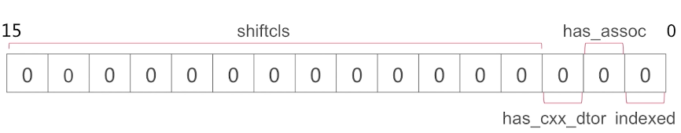

- 第0位：名叫indexed的标志位。  
如果这个位置为0，代表isa指针只是一个纯isa指针，它里面的内容是当前对象的类对象地址；  
如果这个位置为1，代表isa指针里面存储的不仅是它的类对象地址，还有一些内存管理方面的数据，也就是非指针型的isa(NONPOINTER_ISA)。 

- 第1位：has_assoc，表示当前对象是否有关联对象。  
如果是0则代表没有，如果是1则代表有。  

- 第2位：has_cxx_dtor，表示当前对象是否有使用C++相关的代码。  
在ARC可通过这个标志位来表示有些对象是通过ARC进行内存管理的。  

- 第3位~第15位：shiftcls，表示当前对象的类对象的指针地址。

##### 16~31位：
都是shiftcls，表示当前对象的类对象的指针地址。
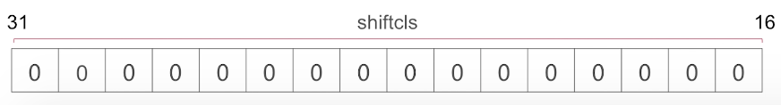

##### 32~47位：
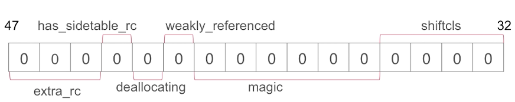

- 32~35位：shiftcls  
**一共有33位0或1的bit位来表示当前对象的类对象的指针地址。**

- 36~41位：magic，不深入讲解。

- 42位：weakly_referenced，标识当前对象是否有弱引用指针。

- 43位：deallocating，标识当前对象是否正进行着dealloc操作。

- 44位：has_sidetable_rc，当前isa指针如果存储的引用计数已达上限，需要外挂一个sidetable这种数据结构去存储相关的引用计数内容(也就是散列表)。

- 45~47位：extra_rc，额外的引用计数，当引用计数在很小的值范围内则会直接存储在isa指针当中而不是用单独的引用计数表去存储引用计数。

##### 48~63位：
都是extra_rc，额外的引用计数
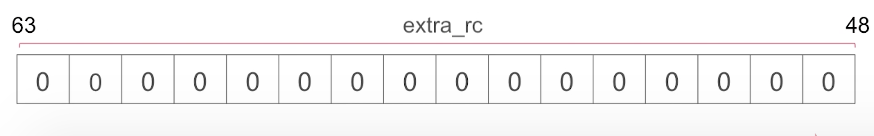

#### 散列表的内存管理方案

散列表内存管理方案是通过SideTables()结构来实现的。

##### SideTables()结构
.png)

- SideTables()里面有多个SideTable数据结构，这些数据结构在不同的架构上，个数不同。  
比如在非嵌入式系统当中，SideTable表一共有64个。

- SideTables()是一个哈希表，可以通过一个对象指针来找到它对应的引用计数表或者弱引用表在哪一个SideTable中。

##### SideTable结构
SideTable结构包括了自旋锁、引用计数表和弱引用表。
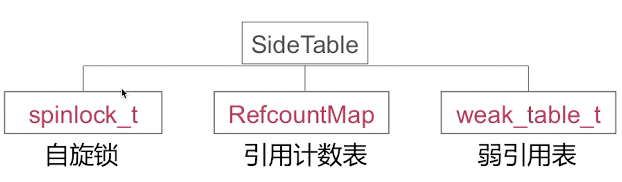

内存对象所对应的引用计数表分拆成多个部分，给分拆成的每个表都加一个锁。  
比如说对象A在拆分的第一张表中，对象B在拆分的第二张表中，当A和B同时进行引用计数操作可以并发操作；如果是在一张表中就只能顺序操作。  
很明显，分离锁的技术方案提高了访问效率。  

#### 补充 
- 关于内存管理，不仅仅是散列表，其实还有isa部分的extra_rc来存储相关的引用计数值。 
- 64位架构下才有isa非指针的部分位来记录强引用计数，一旦引用次数太多，数值太大记录不开的时候才外挂引用计数表。  
- 而32位架构下的强引用计数，就只有引用计数表这一种方式，因为32位下的isa是指针型的，没有多余的位来记录强引用数。  
- 64位架构下，在大多数情况，我们很少用到sidetable来存储引用计数；32位架构下更多的还是sidetable方式。

[回到目录](#jump-2)


<h3 id="3">三. 散列表的数据结构</h3>


<h3 id="3-1">1. 你是否用过自旋锁？自旋锁和普通锁的区别是什么？自旋锁适用于那些场景呢？</h3>

自旋锁是忙等的锁，适用于轻量访问。  
更多答案在《多线程》！！！！！答案未整理。。。。

[回到目录](#jump-3)

<h3 id="3-2">2. 散列表的引用计数表是通过什么来实现的？为什么引用计数表通过hash表来实现呢？</h3>

引用计数表是通过hash表来实现的。     
为了提高查找效率。提高效率的本质原因是插入和获取size_t(对应对象的引用计数值，是一个无符号long型的变量)是通过同一个hash函数，就避免了for循环遍历。

[回到目录](#jump-3)


<h3 id="3-3">3. 知识点补充</h3>

散列表包括了自旋锁Spinlock_t、引用计数表RefcountMap和弱引用表weak_table_t。


#### 自旋锁 Spinlock_t
- 是“忙等”的锁。  
如果当前锁已被其他线程获取，那么当前线程会不断地探测这个锁是否有被释放，如果释放掉，那么会第一时间获取这个锁。  
其他的锁，比如信号量，如果获取不到锁，会阻塞当前线程进行休眠，等到其他线程释放锁的时候来唤醒当前线程。  

- 适用于轻量访问。  
比如对一个对象的引用计数进行修改。

#### 引用计数表 RefcountMap
##### 引用计数表是hash表
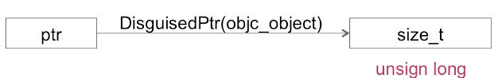

##### size_t
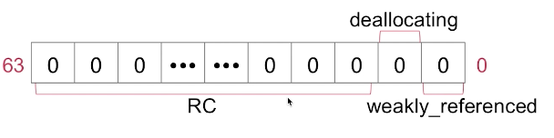  
比如引用计数是用64位来表示的。
在具体计算对象的引用计数值的时候，需要对这个值进行向右偏移2位的操作(要把0位1位去掉才可以取到真正的值)

#### 弱引用表 weak_table_t
##### 弱引用表是hash表 
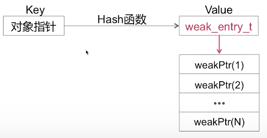

##### weak_entry_t  
是一个结构体数组，这个结构体数组当中存储的每一个对象是弱引用指针，也就是代码中的__weak id obj，obj指针就存储于weak_entry_t中。

[回到目录](#jump-3)


<h2 id="4">四. ARC和MRC</h2>

<h3 id="4-1">1. ARC和MRC是什么？两者的区别？各自的实现机制和原理？</h3>

#### MRC
MRC是手动引用计数来进行对象的内存管理。
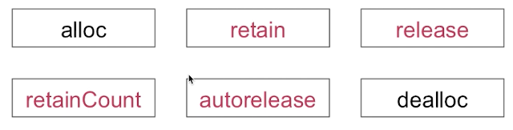

#### ARC
ARC是由LLVM编译器和Runtime共同协作来为我们实现自动引用计数的管理。

#### MRC和ARC的区别 
- MRC是手动引用计数的内存管理；ARC是由编译器和Runtime协作来进行自动引用计数的内存管理。    
- MRC当中可以调用一些引用计数相关的方法；ARC中不能调用。

[回到目录](#jump-4)


补充：  
ARC是编译器自动为我们插入retain、release操作之外，还需要Runtime的功能进行支持，然后由编译器和Runtime共同协作才能组成ARC的全部功能。 
- ARC是自动引用计数来进行对象的内存管理(系统为我们在相应的位置自动插入retain/release操作)。
- ARC是编译器LLVM和Runtime协作的结果。
- ARC中禁止手动调用retain/release/retainCount/dealloc。  
可以重写dealloc方法，但是不能显示调用[super dealloc]
- ARC中新增weak、strong属性关键字。


<h2 id="5">五. 引用计数</h2>

<h3 id="5-1">1. 在进行retain时，系统是怎样查找它对应的引用计数的？</h3>

是经过两次哈希查找来查找到它对应的引用计数值，然后进行相应的加1操作。

[回到目录](#jump-5)

<h3 id="5-2">2. 我们通过关联对象技术为一个类添加了实例变量，在对象的dealloc方法当中，是否有必要对它对关联对象进行移除操作呢？</h3>
 
通过对dealloc的内部实现的分析，可以知道在系统的dealloc的内部实现会自动判断当前对象是否有关联对象，如果有，那么系统内部就会帮我们把相关的关联对象都移除掉。

[回到目录](#jump-5)

<h3 id="5-3">3. 如果说weak指针指向一个对象，当这个对象dealloc或废弃之后，它的weak指针为何会被自动设置为nil？</h3>

在dealloc的内部实现当中，有做关于弱引用指针置为nil的操作weak_clear_no_lock()。具体的回答请看六.弱引用管理

[回到目录](#jump-5)


<h3 id="5-4">4. 知识点补充</h3>

#### alloc的实现
- 经过一系列函数封装和调用，最终调用了C函数calloc。
- 通过alloc分配之后的对象，此时并没有设置引用计数为1，但是通过retainCount看到引用计数为1。具体原因看retainCount的实现(有一个局部变量)。

#### retain的实现

- 1.哈希查找，获取SideTable。
```
SideTable& table = SideTables()[this]; 
```

- 2.哈希查找，获取SideTable的引用计数表中，对象对应的引用计数值。
```
size_t& refcntStorage = table.refcnts[this]; 
```

- 3.引用计数值进行加1操作(所谓的加1操作实际上是加一个偏移量即实际是4，前两个不是，之前讲过)
```
refcntStorage += SIDE_TABLE_RC_ONE; 
```

### release的实现

- 1.哈希查找，获取SideTable
```
SideTable& table = SideTables()[this]; 
```

- 2.哈希查找，查找对应的引用计数表。
```
RefcountMap::iterator it = table.refcnts.find(this); 
```

- 3.引用计数值进行减1操作
```
it->second -= SIDE_TABLE_RC_ONE; 
```

### retainCount的实现

- 1.哈希查找，获取SideTable
```
SideTable& table = SideTables()[this]; 
```

- 2.声明局部变量，值为1。
```
size_t refcnt_result = 1;
```

- 3.哈希查找，查找对应的引用计数表。
```
RefcountMap::iterator it = table.refcnts.find(this); 
```

- 4.查找的结果进行向右边移的操作
```
refcnt_result += it->second >> SIDE_TABLE_RC_SHIFT;
```

#### dealloc的实现(重点!!!!!)

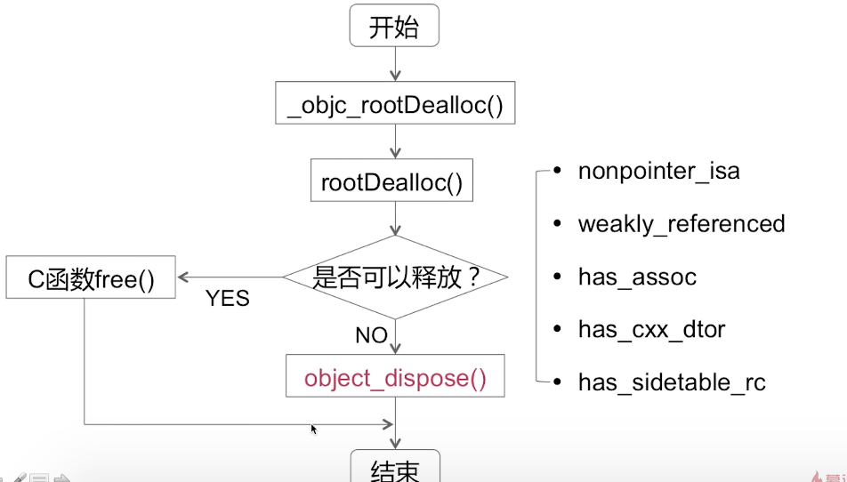

- 是否可以释放：右边5个必须同时满足为0，则YES那么直接C函数释放。
    - nonpointer_isa：判断当前对象是否使用了**非指针型isa**。
    - weakly_referenced：判断当前对象是否有**weak指针**指向它。
    - has_assoc：判断当前对象是否有**关联对象**。
    - has_cxx_dtor：判断当前对象的**内部实现是否涉及到C++**相关内容以及当前对象是否使用**ARC**管理内存。
    - has_sidetable_rc：判断当前**对象的引用计数**是否是通过**SideTable中的引用计数表**来维护的。

- object_dispose()实现  
.png)

- objc_destructInstance()实现  
.png)

- clearDeallocating()实现
.png)

[回到目录](#jump-5)


<h2 id="6">六. 弱引用管理</h2>

<h3 id="6-1">1. 一个weak变量是怎样被添加到弱引用表当中的？</h3>

弱引用对象经过hash算法的计算，查找到它对应的位置。  
一个被声明为__weak的对象指针，经过编译器编译之后会调用相应的objc_initWeak()方法，经过一系列的函数调用栈，最终在weak_register_no_lock()函数当中进行弱引用变量的添加，具体添加的位置是通过一个哈希算法来进行位置查找的，如果查找的位置已经有了当前对象所对应的弱引用数组，我们就把新的弱引用变量添加到这个数组中；如果没有就创建一个弱引用数组，第0个位置添加最新的weak指针，后面的都初始化为0或nil。

[回到目录](#jump-6)


<h3 id="6-2">2. 如果说weak指针指向一个对象，当这个对象dealloc或废弃之后，它的weak指针为何会被自动设置为nil？/ 当一个对象被释放或废弃，weak变量是怎样处理的呢？</h3>

当一个对象被dealloc废弃之后，在dealloc的内部实现当中，会去调用弱引用清除的相关函数，在这个函数的内部实现当中，会根据当前对象指针查找弱引用表，找到当前对象对应的弱引用数组，然后遍历数组当中的所有弱引用指针，分别置为nil。

[回到目录](#jump-6)


<h3 id="6-3">3. 知识点补充</h3>

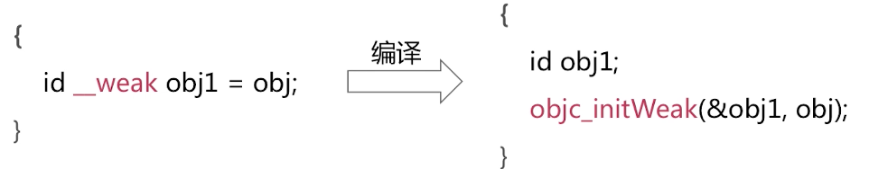

#### 添加weak变量
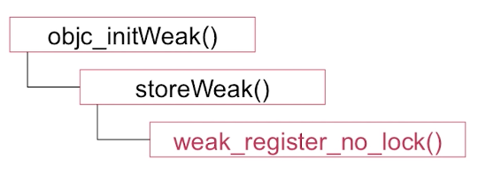

#### 清除weak变量，同时设置指向为nil。
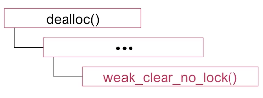

[回到目录](#jump-6)


<h2 id="7">七. 自动释放池</h2>

<h3 id="7-1">1. 下面代码中，在viewDidLoad()方法中创建的array对象，在什么时机被释放的呢？</h3>
   
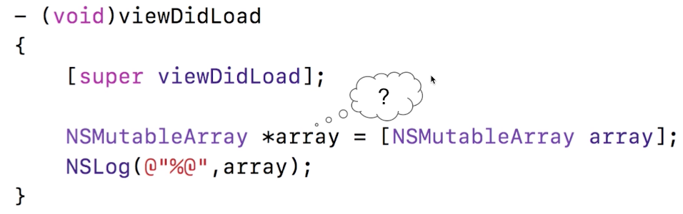  

在每一次runloop的循环当中，都会在它将要结束的时候，对前一次创建的autoreleasePool进行pop操作，同时会push进来一个新的autoreleasePool。  
所以，在viewDidLoad当中创建的array对象是在当次runloop将要结束的时候调用AutoreleasePoolPage::pop()方法，把对应的array对象调用它的release方法，然后对它进行释放。

[回到目录](#jump-7)


<h3 id="7-2">2. AutoreleasePool的实现原理是怎样的？</h3>
 
AutoreleasePool的实现原理是以栈为结点通过双向链表形式组合而成的一个数据结构。

[回到目录](#jump-7)


<h3 id="7-3">3. AutoreleasePool为何可以嵌套使用呢？</h3>

多层嵌套调用就是多次插入哨兵对象。  
比如，每次进行一个@autoreleasePool{}代码块的创建时，系统会为我们进行一个哨兵对象的插入，然后完成一个新的autoreleasePool的创建。(实际是创建了新的autoreleasePoolPage。如果当前page没有满，则不需要创建新page。)
创建一个autoreleasePool实际上底层就是插入一个哨兵对象。

[回到目录](#jump-7)


<h3 id="7-4">4. 在什么场景下需要我们手动插入autoreleasePool呢？</h3>
 
在for循环中alloc图片数据等内存消耗较大的场景手动插入autoreleasePool。  
每一次for循环都进行一次内存的释放来降低内存的峰值，防止内存消耗多大导致的一些问题。

[回到目录](#jump-7)


<h3 id="7-5">5. 知识点补充</h3>

编译器会将 **@autoreleasepool{}** 改写为：  
```
void *ctx = objc_autoreleasePoolPush();

{}中的代码

objc_autoreleasePoolPop(ctx);
```

#### objc_autoreleasePoolPush()
.png)

#### objc_autoreleasePoolPop()
.png)

**一次pop，实际上相当于一次批量的pop操作。**({}里所有的对象都进行一次release操作，所以是批量操作)

#### 自动释放池的数据结构
- 是以**栈**为结点通过**双向链表**的形式组合而成。
- 是和**线程**一一对应的。(分析C++的类AutoreleasePoolPage可得出此结论)

**面试题：什么是自动释放池？(自动释放池的实现结构是怎样的？)**  
回答：是以栈为结点通过双向链表的形式组合而成。  
**面试题：为什么说自动释放池和线程是一一对应的关系？**  
回答：根据底层C++的类AutoreleasePoolPage中有thread成员变量

#### 双向链表
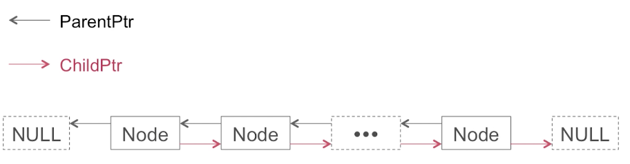

#### 栈
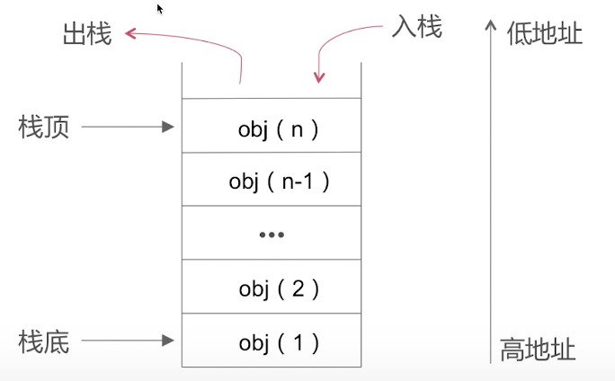

#### AutoreleasePoolPage(C++的类)
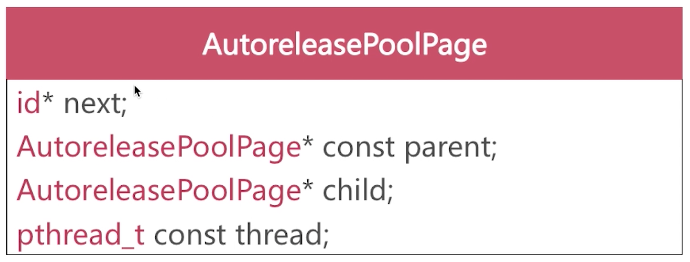  
- next：指向栈当中下一个可填充的位置。
- parent：父指针
- child：孩子指针
- thread：线程

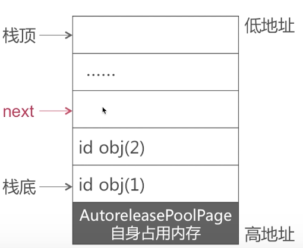 

#### AutoreleasePoolPage::push
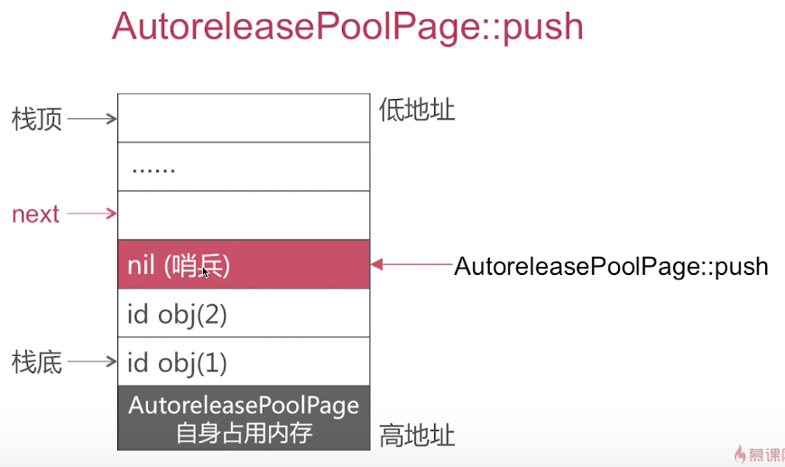

**[obj autorelease]的方法实现：**  

![[obj autorelease]的方法实现](./images/memoryManagement/[obj autorelease]的方法实现.png)

运行过程：
![[obj autorelease]的运行过程](./images/memoryManagement/[obj autorelease]的运行过程.png)

#### AutoreleasePoolPage::pop
1.根据传入的哨兵对象找到对应位置。  
2.给上次push操作之后添加的对象依次发送release消息。  
3.回退next指针到正确位置。
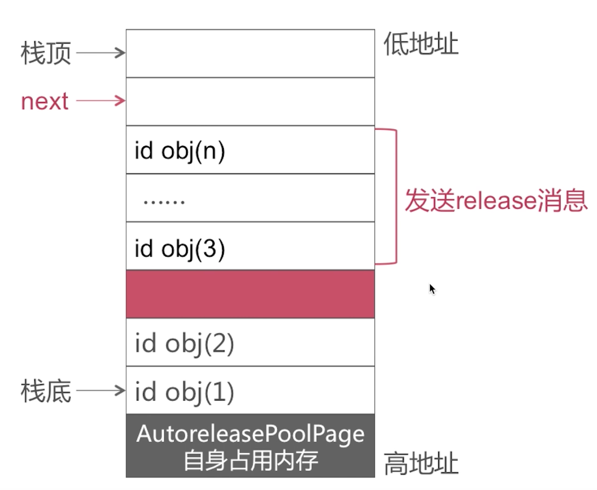 => 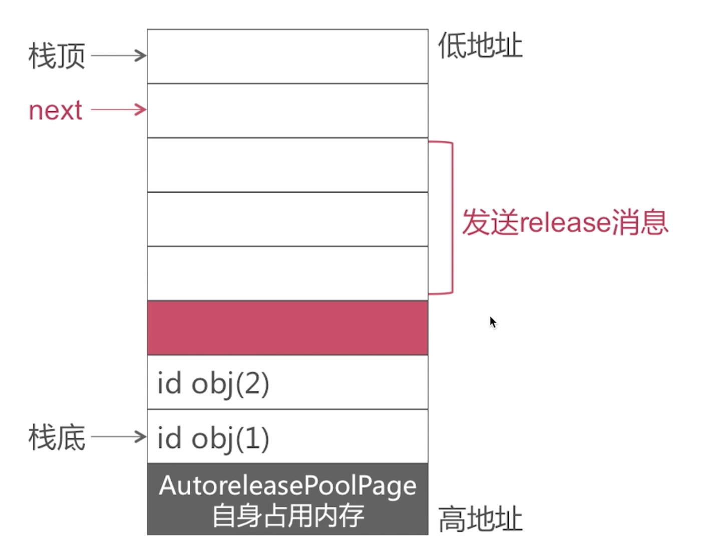 => 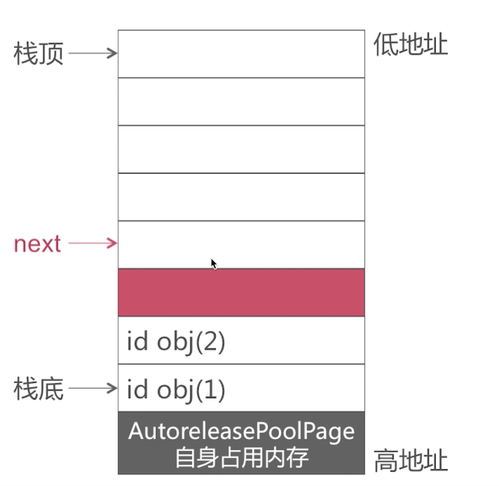

**总结：**   
1.在当次runloop将要结束的时候调用AutoreleasePoolPage::pop()方法。  
2.多层嵌套就是多次插入哨兵对象。  
3.在for循环中alloc图片数据等内存消耗较大的场景手动插入autoreleasePool。  

[回到目录](#jump-7)


<h2 id="8">八. 循环引用</h2>

<h3 id="8-1">1. 循环引用的种类有哪些？</h3>
  
自循环引用、相互循环引用、多循环引用。

[回到目录](#jump-8)


<h3 id="8-2">2. 如何破除循环引用？</h3>
 
- 避免产生循环引用  
比如在使用代理的过程中，两个对象一个是强引用，一个是弱引用，避免产生相互循环引用。  

- 在合适的时机手动断开循环引用 

[回到目录](#jump-8)


<h3 id="8-3">3. 破除循环引用的具体解决方案有哪些？</h3>

- __weak破解  
对象A和对象B都有一个id类型的成员变量obj。  
当我们把对象A中的obj声明为__weak关键字的话，就能破除一个相互循环引用。  
即对象B强持有对象A，而对象A弱引用对象B。  
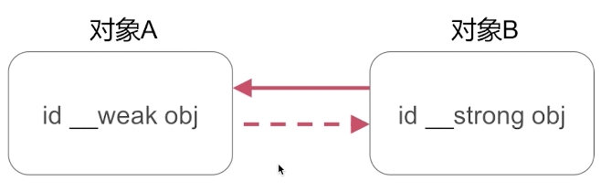

- __block破解  
    - 在MRC下，__block修饰对象不会增加其引用计数，避免了循环引用。  
    - 在ARC下，__block修饰对象会被强引用，无法避免循环引用，需手动解环。

- __unsafe_unretained破解(效果上和__weak等效)
    - 修饰对象不会增加其引用计数，避免了循环引用。  
    - 如果被修饰对象在某一时机被释放，会产生悬垂指针，导致内存泄漏。  
所以不建议使用__unsafe_unretained解除循环引用。

[回到目录](#jump-8)


<h3 id="8-4">4. 平日开发中是否遇到过循环引用？你是怎么解决的？</h3>
 
- Block的循环引用问题 ----Block章节！！！

- NSTimer的循环引用问题
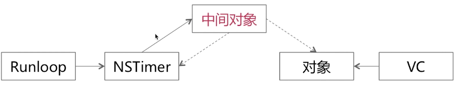
**代码实现**  
中间对象
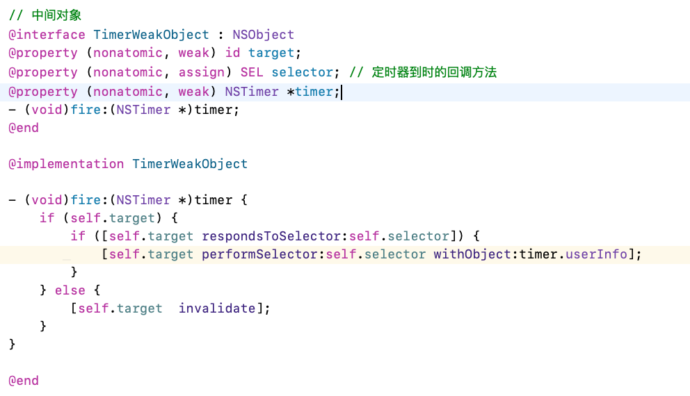
NSTimer的分类
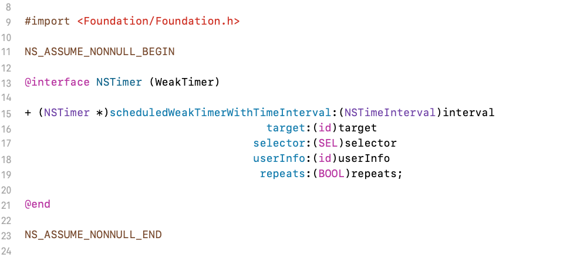
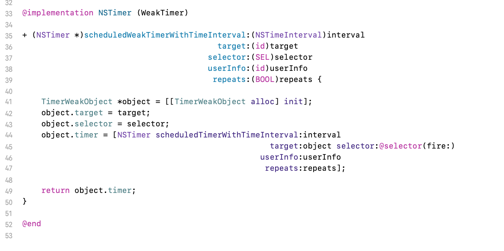
解决NSTimer的循环引用
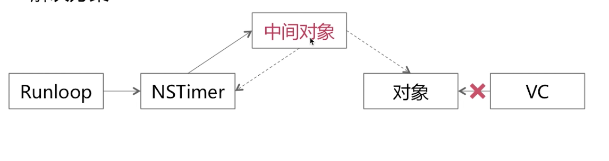
为了解决NSTimer的循环引用。  
创建一个中间对象，让中间对象持有两个弱引用变量，分别是NSTimer和对象。    
NSTimer直接分派的回调是在中间对象中实现的，在中间对象中实现的NSTimer回调方法当中对它持有的对象进行了值判断。    
如果值存在，则直接把NSTimer的回调给这个对象；    
如果值不存在，即当前对象已被释放，我们设置NSTimer为无效状态，就可以解除当前线程Runloop对NSTimer的强引用以及NSTimer对中间对象的强引用。 

[回到目录](#jump-8)


<h3 id="8-5">5. 知识点补充</h3>

#### 循环引用的种类
- 自循环引用
- 相互循环引用
- 多循环引用

#### 自循环引用
对象强持有它的成员变量obj，如果给成员变量obj赋值给源对象的话，就会造成一个自循环引用。  
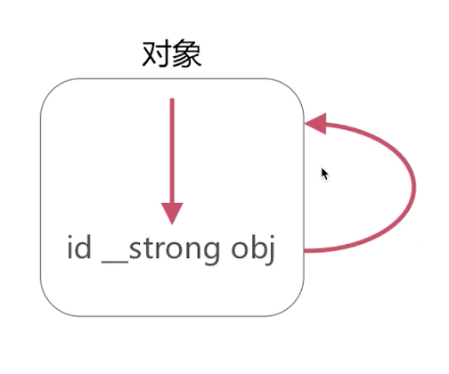 

#### 相互循环引用
对象A有一个id类型的obj，对象B有一个id类型的obj。    
如果此时对象A中的obj指向对象B，同时对象B中的obj指向对象A。
就会造成相互循环引用。  
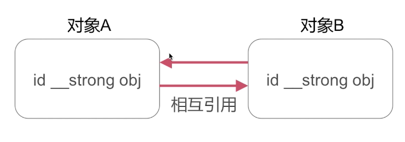

#### 多循环引用
某一个类中有N个对象分别为对象1、对象2、...、对象n。  
每个对象中都有一个id类型的obj。  
假如每个对象的obj都指向下一个对象的话，就会产生一个大环，造成多循环引用。  
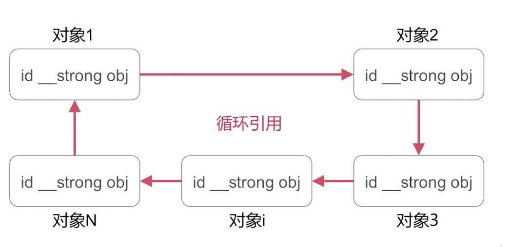

#### 考点 
- 代理 - 相互循环引用
- **Block**
- **NSTimer**
- 大环引用 - 多循环引用

[回到目录](#jump-8)


【内存管理面试题总结】
<!-- 1.什么是ARC？  
ARC是由LLVM编译器和Runtime共同协作来为我们实现自动引用计数的管理。 -->

2.为什么weak指针指向的对象在废弃之后会被自动置为nil？  
当对象被废弃时，dealloc方法的内部实现中会调用清除弱引用的方法，在清除弱引用的方法中会通过哈希算法查找被废弃对象在弱引用表中的位置来提取它所对应的弱引用指针的列表数组，对这个数组进行for循环遍历，将每一个weak指针都置为nil。

3.苹果是如何实现AutoreleasePool的？  
AutoreleasePool是以栈为结点通过双向链表形式来合成的数据结构。

4.什么是循环引用？你遇到过哪些循环引用？是怎么解决的？


# 参考文档
《新浪微博资深大牛全方位剖析 iOS 高级面试》  

# 其他
《iOS面试题备忘录》系列文章的github原文地址：  

[iOS面试题备忘录(一) - 属性关键字](https://github.com/mickychiang/iOSInterviewMemo/blob/master/InterviewSummary/PropertyModifier.md)  
[iOS面试题备忘录(二) - 内存管理](https://github.com/mickychiang/iOSInterviewMemo/blob/master/InterviewSummary/memoryManagement.md)    
[iOS面试题备忘录(三) - 分类和类别](https://github.com/mickychiang/iOSInterviewMemo/blob/master/InterviewSummary/CategoryAndExtension.md)  
[iOS面试题备忘录(四) - 代理和通知](https://github.com/mickychiang/iOSInterviewMemo/blob/master/InterviewSummary/DelegateAndNSNotification.md)  
[iOS面试题备忘录(五) - KVO和KVC](https://github.com/mickychiang/iOSInterviewMemo/blob/master/InterviewSummary/KVOAndKVC.md)  
[iOS面试题备忘录(六) - runtime](https://github.com/mickychiang/iOSInterviewMemo/blob/master/InterviewSummary/runtime.md) 