# iOS面试题备忘录(五)runtime
所有源码基于[objc-runtime-objc.680版本](https://opensource.apple.com/source/objc4/)

# 前言
《iOS面试题备忘录(五)runtime》是关于iOS的runtime机制的相关知识点及面试题的整理。  
本篇内容会一直持续整理并完善，有理解不正确的地方请路过的大神告知，共勉。  
[github原文地址](https://github.com/mickychiang/iOSInterviewMemo/blob/master/InterviewSummary/runtime.md)
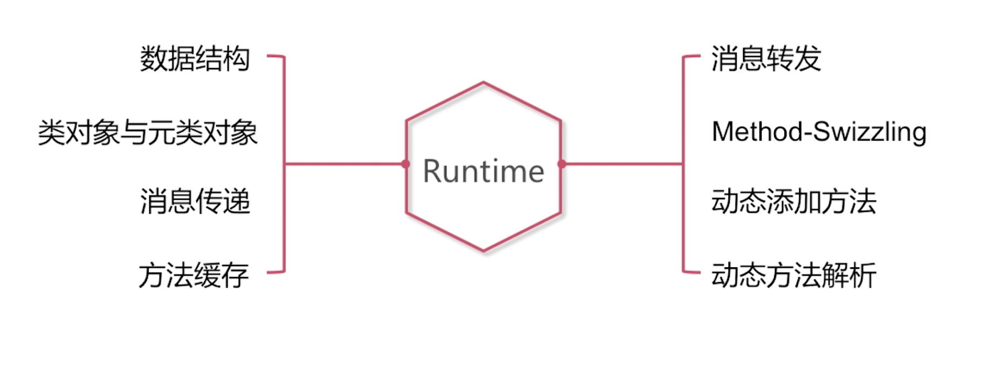

<span id="jump"><h1>目录</h1></span>

[<span id="jump-1"><h2>一. runtime的数据结构分析</h2></span>](#1)
<!-- [<span id="jump-1-1">1. OC对象的拷贝方式有哪些？(浅拷贝和深拷贝是什么？)</span>](#1-1)  -->


# 正文

1.编译时语言与OC这种运行时语言的区别？
2.消息传递与函数调用的区别？
3.当我们调用一个方法却没有实现的时候，系统是如何为我们实现消息转发过程的？
4.简述一下runtime的基础数据结构
5.类对象与元类对象分别是什么？
6.实例对象与类对象之间的关系？
7.类对象与元类对象之间的关系？
8.Objective-C语言中的消息传递机制？
9.当我们进行消息传递的过程中，如何进行缓存的方法查找？
10.消息转发流程是怎样的？
11.Method Swizzling的应用
12.动态添加方法
13.动态方法解析


<h2 id="1">一. 数据结构</h2>

<h3 id="1-1">1. 简述一下objc_object</h3>

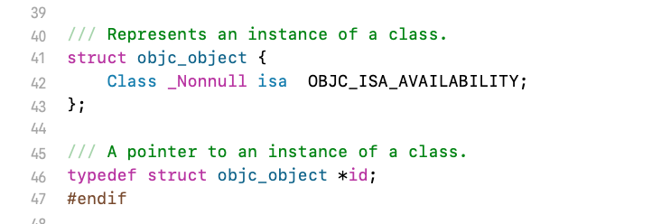

#### id类型 = objc_object结构体 
平时开发使用的所有对象都是id类型的，id类型的对象对应到runtime当中是objc_object结构体。
```
/// A pointer to an instance of a class.
typedef struct objc_object *id;
```
```
/// Represents an instance of a class.
struct objc_object {
    Class isa  OBJC_ISA_AVAILABILITY;
};
```
#### objc_object结构体主要包含以下内容：  
- isa_t：是一个共用体。
- 关于isa操作的相关方法：比如，通过objc_object的isa指针获取其指向的类对象；通过类对象的isa指针来获取其指向的元类对象等。
- 弱引用的相关方法：比如，标记一个对象它是否曾有过弱引用指针。
- 关联对象的相关方法：比如，为对象设置关联属性。
- 内存管理的相关方法：比如，MRC下的retain和release；MRC和ARC下的@autoReleasePool。

**延伸：**
内存管理的相关方法都是封装在objc_object结构体中。

[回到目录](#jump-1)


<h3 id="1-2">2. 简述一下objc_class？和objc_object有什么关系？</h3>

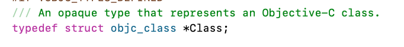

#### Class类型 = objc_class结构体 
在OC中使用到的Class是一个类，对应到runtime当中是objc_class结构体。  
**objc_class结构体继承自objc_object结构体**  
```
/// An opaque type that represents an Objective-C class.
typedef struct objc_class *Class;
```
```
struct objc_class : objc_object {
    // Class ISA;
    Class superclass;
    cache_t cache;             // formerly cache pointer and vtable
    class_data_bits_t bits;    // class_rw_t * plus custom rr/alloc flags
    ...
}
```
#### objc_class结构体主要包含以下内容： 
- superClass指针：指向Class，比如：如果是类对象，那么它的superClass指针指向的是它的父类对象。也就是类与父类之间的关系是通过objc_class中的superClass来定义的。
- cache_t：是一个方法缓存的结构体，在消息传递过程中会使用到。
- class_data_bits_t：关于类的变量、属性、方法都在class_data_bits_t结构体中。

[回到目录](#jump-1)


<h3 id="1-3">3. Class是否是对象？(什么是类对象？)</h3>

**Class是一个对象，称作类对象。**   
Class类型对应runtime底层的写法为objc_class。  
objc_class继承自objc_object。  
objc_object结构体对应着id类型，而id类型是对象，所以Class是类对象。  

[回到目录](#jump-1)


<h3 id="1-4">4. isa指针是什么含义？</h3>


isa指针包括指针型isa和非指针型isa。

[回到目录](#jump-1)


<h3 id="1-5">5. isa指针的指向？</h3>

- 关于对象，isa指向类对象。
- 关于类对象，isa指向元类对象。
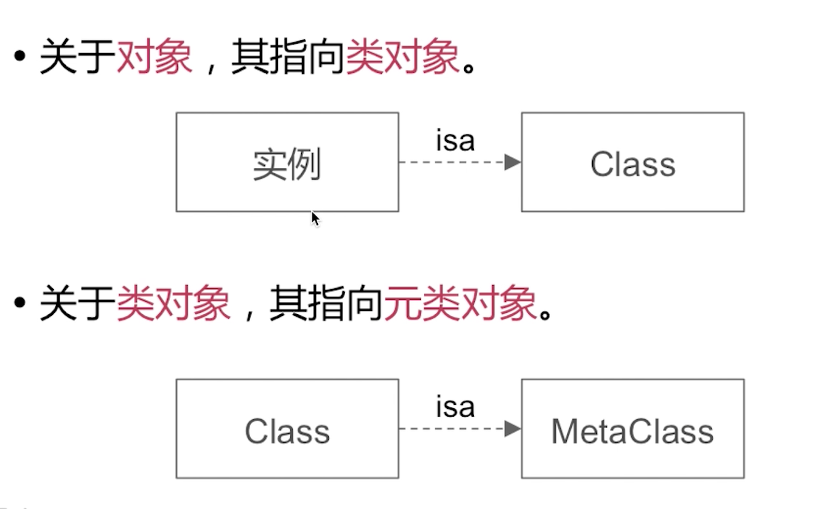

[回到目录](#jump-1)


<h3 id="1-6">6. 介绍一下objc_class结构体里的catch_t</h3>

- 用于**快速**查找方法执行函数

- 是可**增量扩展**的**哈希表**结构  
增量扩展：当存储的量在增大，它也扩展自己的内存空间来支持更多的缓存。  
哈希表：为了提高查找效率。

- 是**局部性原理**的最佳应用  
局部性原理：调用频次高的方法放在缓存里，下次的命中率会高些。

[回到目录](#jump-1)


<h3 id="1-7">7. 介绍一下objc_class结构体里的class_data_bits_t</h3>

- class_data_bits_t是对class_rw_t的封装。  
- class_rw_t：类相关的读写信息，是对class_ro_t的封装。  
- class_ro_t：类相关的只读信息。  
注意：  
rw = readwrite  
ro = readonly  

#### 7.1 class_rw_t
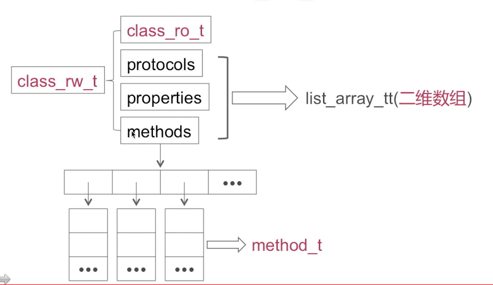

#### 7.2 class_ro_t
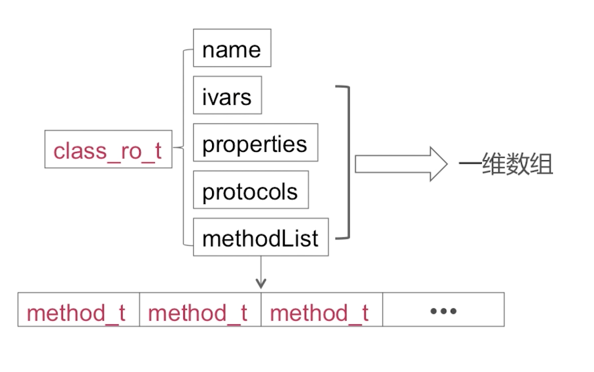

#### 7.3 method_t
**函数的四要素：**
- 名称
- 返回值
- 参数
- 函数体

**method_t是对函数四要素的封装。**
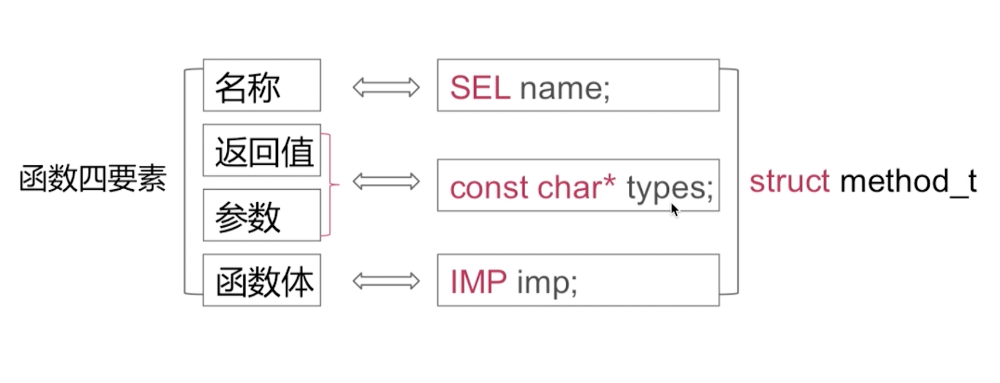

#### 7.4 Type Encodings
```
const char *types;
```
函数的返回值类型 + 参数个数(包括每个参数的类型)

举例：
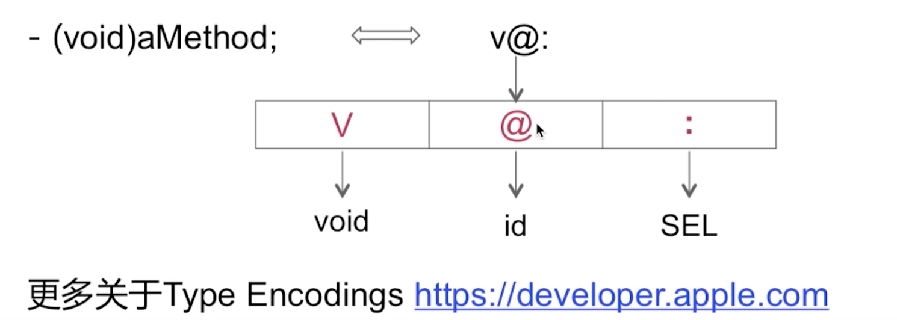

[回到目录](#jump-1)


<h3 id="1-8">8. 简述一下runtime的基础数据结构</h3>

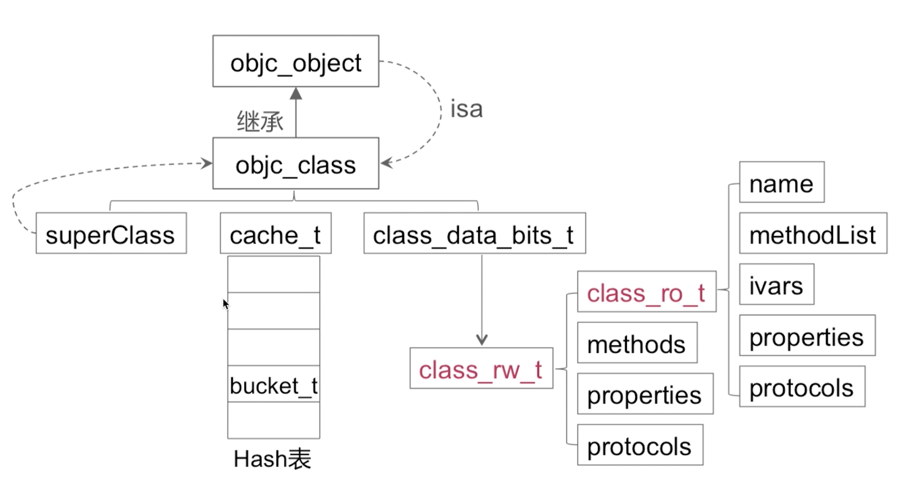

[回到目录](#jump-1)


<h2 id="2">二. 类对象和元类对象</h2>

<h3 id="2-1">1. 类对象和元类对象分别是什么？类对象和元类对象的区别和联系？</h3>

- 类对象：是一种存储实例方法列表等信息的数据结构。
- 元类对象：是一种存储类方法列表等信息的数据结构。

实例和类对象的关系：实例通过isa指针找到对应的类对象。
类对象和元类对象的关系：类对象通过isa指针指向对应的元类对象。
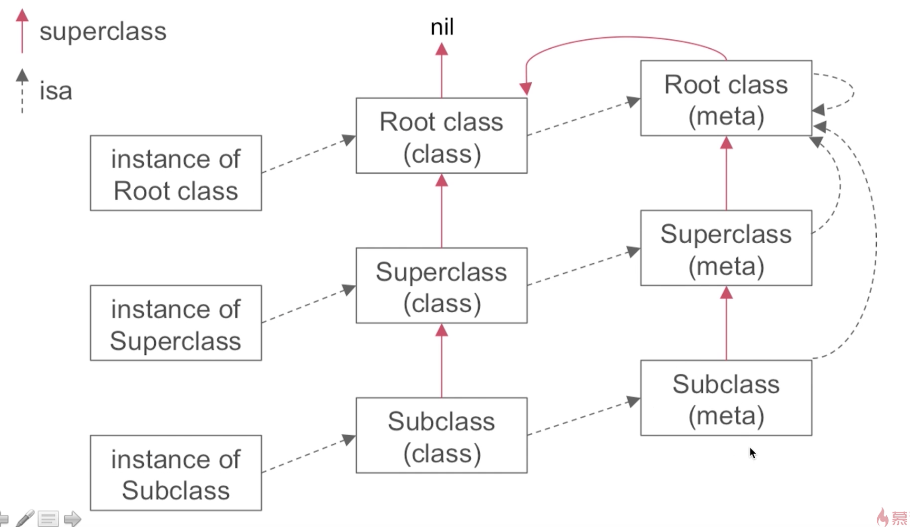

类对象和元类对象的区别和联系：
- 实例对象通过isa指针找到它的类对象，从而可以访问类对象里存储的实例方法列表等信息。
- 类对象通过isa指针找到它的元类对象，从而可以访问类方法列表等相关信息。
- 类对象和元类对象都是objc_class的数据结构，由于objc_class继承了objc_object，所以它们才有isa指针，进而才能实现上面所述的关系。
- 由于元类对象是objc_class，所以它有isa指针，那么任何一个元类的isa指针都指向了它的根元类对象。
- 根元类对象的isa指针也指向自身。
- 根元类对象它的superclass指针指向的是根类对象。当我们调用的类方法在元类的类方法列表里查找不到的时候，它就会找根类对象当中的同名的实例方法。

[回到目录](#jump-2)


<h3 id="2-2">2. 如果我们调用的类方法没有对应的实现，但是有同名的实例方法的实现，那么这时会不会发生crash？或者会不会产生实际的调用？</h3>
 
由于根元类对象的superclass指针指向了根类对象，当我们在元类对象的类方法列表中没有找到对应的类方法实现的时候，就会顺着指针去根类对象的实例方法列表中查找，如果有同名的方法，那么就会实行同名方法的实例方法调用。

[回到目录](#jump-2)


<h3 id="2-3">3. 消息传递的过程？</h3>

- 调用实例方法(实例方法的传递流程)：  
1.系统根据当前实例对象的isa指针找到它对应的类对象，在类对象中遍历实例方法列表去查找同名的方法实现。  
2.如果没有查找到，就会顺次以superclass指针的指向去查找父类的类对象的实例方法列表。  
3.如果没有查找到，再顺次查到根类对象的方法列表。  
4.如果没有，就会走到消息转发流程。  

- 调用类方法(类方法的传递流程)：  
1.通过类对象的isa指针找到对应的元类对象，顺次遍历方法列表，直到根元类对象，然后再到根类对象，再到nil。  

<h3 id="2-3">4. 代码如下图所示，[self class]和[super class]打印出来的内容是什么？</h3>
 
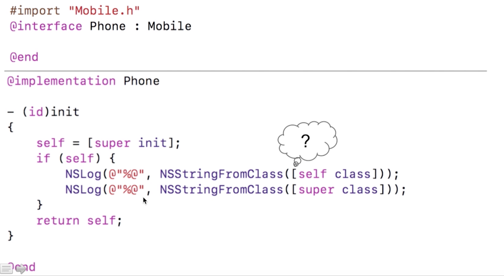
回答：  
打印结果都是：Phone  
1. [self class] => objc_msgSend(self, @selector(class))  
2. [super class] => objc_msgSendSuper(super, @selector(class))  
3. super的结构体objec_super里面有一个receiver代表着当前对象，所以无论转换成哪个函数，它的接收者都是当前对象。  

 

## 消息传递机制？

### void objc_msgSend(void /* id self, SEL op, ... */ )
```
void objc_msgSend(void /* id self, SEL op, ... */ )
```
参数1：消息传递的接收者
参数2：传递的消息名称/方法选择器

举例：
[self class]转换成：objc_msgSend(self, @selector(class))


### void objc_msgSendSuper(void /* struct objc_super *super, SEL op, ... */ )
```
void objc_msgSendSuper(void /* struct objc_super *super, SEL op, ... */ )
```

objc_super结构体
```
#ifndef OBJC_SUPER
#define OBJC_SUPER

/// Specifies the superclass of an instance. 
struct objc_super {
    /// Specifies an instance of a class. 指定类的实例。
    __unsafe_unretained id receiver; // 消息的实际接收者是当前对象

    /// Specifies the particular superclass of the instance to message. 
#if !defined(__cplusplus)  &&  !__OBJC2__
    /* For compatibility with old objc-runtime.h header */
    __unsafe_unretained Class class;
#else
    __unsafe_unretained Class super_class;
#endif
    /* super_class is the first class to search */
};
#endif
```
举例：
[super class] => objc_msgSendSuper(super, @selector(class))
注意：objc_msgSendSuper(super, @selector(class))的super里包含的receiver就是当前对象即self。

无论是调用[self class]还是[super class]，消息的实际接收者都是当前对象self。 


### 消息传递的机制？
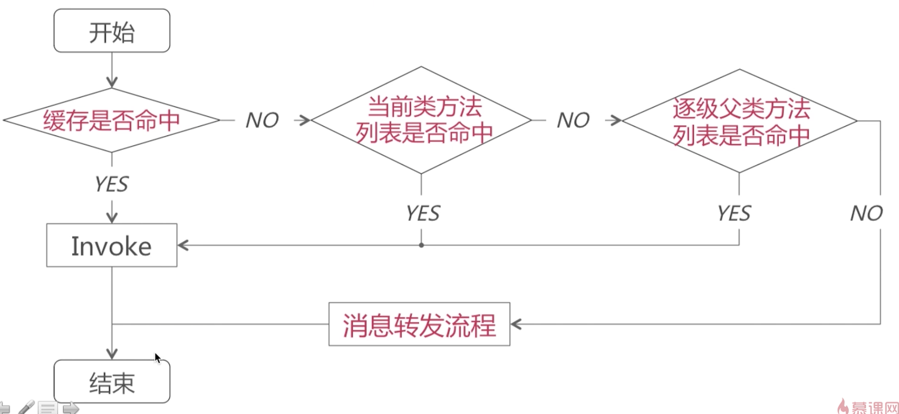

### objc_msgSend和objc_msgSendSuper方法的区别？


## 消息传递机制？
缓存是否命中 => 当前类方法列表是否命中 => 逐级父类方法列表是否命中 => 消息转发流程 

### 1. 缓存查找的具体流程
举例：给定值是SEL，目标值是对应bucket_t中的IMP。
注意：bucket_t是方法选择器和方法实现的封装。

**根据给定的方法选择器，来查找它对应的方法实现。**
根据选择器因子到cache_t把对应的bucket_t查找出来。

缓存查找是一个哈希查找。  
根据给定的方法选择器通过一个函数来映射出对应的bucket_t在数组中的索引位置。
作用：利用哈希查找来提高查找效率。
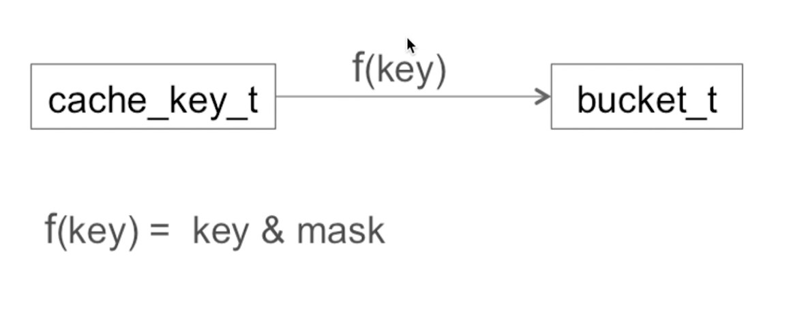

### 2. 当前类中查找
- 对于**已排序**的列表，采用**二分查找算法**来查找方法对应的执行函数实现。
- 对于**没有排序**的列表，采用**一般遍历**来查找方法对应的执行函数实现。

### 3. 父类逐级查找
父类缓存 => 父类类方法列表 逐级向上。


## 消息转发流程？


详细请看代码~


## Method Swizzling

具体代码实现~
### 平日开发的使用场景？


## 动态添加方法
### 1.你是否使用过performSelector:方法？实际应用场景？
实际应用场景：一个类在编译时没有方法，在运行时才产生方法。

### 2.如何为类动态添加方法？
查看代码实现~

## 动态方法解析@dynamic
- 动态运行时语言：将函数决议推迟到运行时。
在运行时为方法添加具体的执行函数。
当@dynamic修饰属性的时候，表示不需要编译器在编译时为我们生成属性的getter和setter方法的具体实现，而是在运行时调用了getter和setter时再去为它们添加具体的实现。

- 编译时语言：在编译期进行函数决议。
在编译期，我们就确定了一个方法名称所对应的函数执行体是哪个，在运行时是无法修改的。


## runtime实战
### 1.[obj foo]和objc_msgSend()函数之间有什么关系？
[obj foo]经过编译就变成了objc_msgSend(obj, @selector(foo))，对应关系如下：  
[obj foo] => objc_msgSend(obj, @selector(foo))  
runtime消息传递过程

### 2. runtime是如何通过selector找到对应的IMP地址的？
消息传递机制  
1.查找当前实例所对应的类对象的缓存是否有selector对应的缓存的IMP实现。  
如果缓存有命中，将缓存中的函数返还给调用方。  
2.如果缓存没有命中，则在当前类的方法列表查找selector对应的具体的IMP实现。  
3.如果当前类没有命中，则在当前类的superclass逐级查找父类的方法列表，查找selector对应的具体的IMP实现。  

### 3. 能否向编译后的类中添加实例变量？
1.runtime支持运行时动态添加类。
**不能向编译后的类中添加实例变量**

### 4. 能否向动态添加的类中添加实例变量？
**可以向动态添加的类中添加实例变量**


# 参考文档
《新浪微博资深大牛全方位剖析 iOS 高级面试》